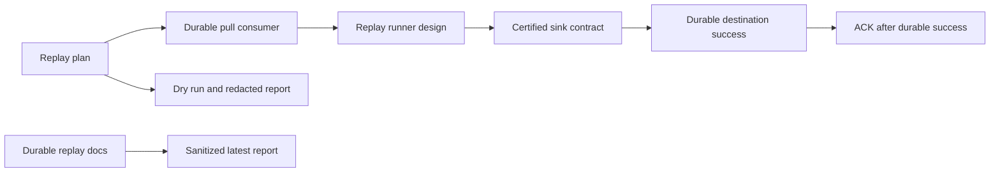

# Latest Test Report

This file is the canonical test report for the repository. It is intentionally
stored at a stable path and should be overwritten when a newer validation run is
performed. Do not create or commit timestamped copies of this report.

The report is sanitized. It must never contain server addresses, usernames,
passwords, tokens, certificate contents, private keys, Oracle wallet material,
full connection strings, sensitive subjects, sensitive payloads, container IDs,
generated database passwords, or full raw logs from live systems.

## Report Summary

| Field | Value |
| --- | --- |
| Overall result | Pass |
| Report generated | 2026-05-26 issue `#120` validation for upcoming `v0.4.2` development |
| Project version | `0.4.1` package metadata with `v0.4.2` development changes |
| Python version | 3.12.4 |
| Git revision checked | Branch `issue-120-durable-replay-guidance` based on `release-v0.4.2` |
| Live NATS details | Environment-gated live tests skipped unless explicitly enabled |
| Live Oracle Database details | Environment-gated live tests skipped unless explicitly enabled |
| Live Oracle MySQL details | Environment-gated live tests skipped unless explicitly enabled |

This refresh covered durable replay-to-sinks guidance and tooling design for
issue `#120`, plus a full local regression cycle for the current development
branch. The new documentation guardrail tests prove the replay guidance remains
discoverable, separates ordered inspection from write-capable replay, requires
durable pull consumers and commit-then-ACK behavior, documents explicit replay
boundaries, and names dry-run, redacted-report, idempotency, no-early-ACK, and
future replay test expectations.

## Core And Repository Validation

| Check | Result |
| --- | --- |
| Ruff format | Pass, `235 files already formatted` |
| Ruff lint | Pass |
| Mypy | Pass, no issues in `93` source files |
| Version metadata consistency | Pass for `0.4.1` |
| Dependency manifests | Pass, manifest files up to date |
| Backlog item validation | Pass |
| Bug report validation | Pass, `89` bug report item(s) |
| PyPI-facing Markdown links | Pass |
| Secret scan | Pass, no high-confidence secret material found |
| Bandit | Pass with reviewed `nosec` annotations for validated SQL identifier builders |
| Package build | Pass, sdist and wheel built |
| SBOM generation | Pass, CycloneDX JSON and XML generated |
| Checksum generation | Pass, `dist/SHA256SUMS` generated |
| Twine metadata check | Pass for retained distributions |

## Test Results

| Test Area | Command | Result |
| --- | --- | --- |
| Durable replay guidance subset | `python -m pytest tests/unit/test_durable_replay_guidance.py -q` | Pass, `5 passed` |
| Main repository test suite | `scripts/check.sh` | Pass, `1058 passed, 11 skipped` |
| Encryption and sink contract subset | `scripts/check.sh` | Pass, `123 passed` |
| Sink capability subset | `scripts/check.sh` | Pass, `117 passed` |
| Documentation builds | `scripts/check.sh` | Pass for Read the Docs and GitHub Pages MkDocs builds |
| Example validation | `nats-sink validate examples/named-multi-sink/config.json` through unit/CLI coverage | Pass |

The skipped tests are the existing environment-gated live NATS, Oracle
Database, Oracle MySQL, and push-consumer integration tests. Issue `#120` adds
the durable replay-to-sinks design boundary. Pull mode remains the production
default, ordered inspection remains read-only troubleshooting, and replay into
sinks remains a durable pull-consumer workflow with commit-then-ACK semantics.

## Durable Replay Evidence

The new focused coverage verifies:

- the durable replay page is in the public documentation tree;
- ordered-consumer evaluation, operations, testing, and sink-framework
  documentation link to the durable replay boundary;
- replay guidance requires durable pull consumers for sink writes;
- ordered consumers are explicitly excluded from production replay writes;
- no early ACK, commit-then-ACK, at-least-once delivery, and idempotency are
  named as replay invariants;
- start sequence, start time, subject scope, maximum messages, batch size,
  dry-run, and report-file boundaries are documented;
- redacted reports, least-privilege NATS permissions, and prohibited sensitive
  report content are documented;
- future tests for configuration validation, no early ACK, idempotent duplicate
  replay, DLQ-before-ACK, and bounded redacted reports are documented.

## Issues Found During Validation

No new release-blocking issues were found during the `#120` validation cycle.

## Documentation Evidence

The following public documentation was updated and built successfully:

- [README](https://github.com/ProjectCuillin/nats-sinks/blob/main/README.md)
- [Configuration](configuration.md)
- [Sink Framework](sink-framework.md)
- [Sink Certification](sink-certification.md)
- [Testing](testing.md)
- [Development](development.md)
- [Architecture](architecture.md)
- [Operations](operations.md)
- [Ordered Consumer Evaluation](ordered-consumer-evaluation.md)
- [Durable Replay To Sinks](durable-replay-to-sinks.md)
- [Metrics](metrics.md)
- [Observability](observability.md)
- [Subject-Aware Observability Evaluation](subject-aware-observability-evaluation.md)
- [Subject-Aware Observability Runbook](subject-aware-observability-runbook.md)
- [Prometheus Integration](prometheus.md)
- [Named Sinks And Routing](named-sinks.md)
- [Idempotency](idempotency.md)
- [Security](security.md)
- [File Sink](file-sink.md)
- [Oracle Sink](oracle-sink.md)
- [Named Multi-Sink Example](https://github.com/ProjectCuillin/nats-sinks/blob/main/examples/named-multi-sink/config.json)
- [Documentation Home](index.md)

The changelog, backlog metadata, operations guide, testing guide, sink
framework, roadmap, ordered-consumer evaluation, and durable replay
documentation were updated for issue `#120`.
