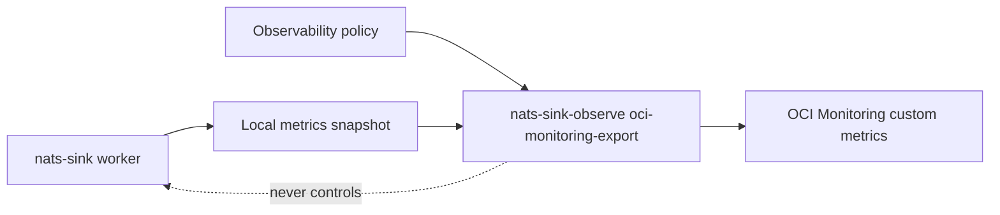

# Latest Test Report

This file is the canonical test report for the repository. It is intentionally
stored at a stable path and should be overwritten when a newer validation run is
performed. Do not create or commit timestamped copies of this report.

The report is sanitized. It must never contain server addresses, usernames,
passwords, tokens, certificate contents, private keys, Oracle wallet material,
full connection strings, sensitive subjects, sensitive payloads, container IDs,
generated database passwords, or full raw logs from live systems.

## Report Summary

| Field | Value |
| --- | --- |
| Overall result | Pass |
| Report generated | 2026-05-27 issue `#107` validation for upcoming `v0.4.2` development |
| Project version | `0.4.1` package metadata with `v0.4.2` development changes |
| Python version | 3.12.4 |
| Git revision checked | Branch `issue-107-oci-monitoring-observability` based on `release-v0.4.2` |
| Live NATS details | Environment-gated live tests skipped unless explicitly enabled |
| Live Oracle Database details | Environment-gated live tests skipped unless explicitly enabled |
| Live Oracle MySQL details | Environment-gated live tests skipped unless explicitly enabled |
| Live OCI details | No live OCI tenancy was contacted; OCI SDK behavior used local fakes |

This refresh covered the OCI Monitoring observability connector for issue
`#107`, plus a full local regression cycle for the current development branch.
The new connector is disabled by default, reads only local metrics snapshots,
uses the shared observability allow and deny policy, builds bounded OCI
`PostMetricData` requests, redacts compartment details in dry-run output, and
keeps OCI export outside JetStream delivery decisions.

## Core And Repository Validation

| Check | Result |
| --- | --- |
| Ruff format | Pass, `238 files already formatted` |
| Ruff lint | Pass |
| Mypy | Pass, no issues in `94` source files |
| Version metadata consistency | Pass for `0.4.1` |
| Dependency manifests | Pass, manifest files up to date |
| Backlog item validation | Pass, `142` backlog item(s) |
| Bug report validation | Pass, `89` bug report item(s) |
| PyPI-facing Markdown links | Pass |
| Documentation builds | Pass for Read the Docs and GitHub Pages MkDocs builds |
| Secret scan | Pass, no high-confidence secret material found |
| Bandit | Pass with reviewed `nosec` annotations for validated SQL identifier builders |
| Package build | Pass, sdist and wheel built |
| SBOM generation | Pass, CycloneDX JSON and XML generated |
| Checksum generation | Pass, `dist/SHA256SUMS` generated |
| Distribution checksum verification | Pass for retained distributions |

## Test Results

| Test Area | Command | Result |
| --- | --- | --- |
| OCI Monitoring focused subset | `python -m pytest tests/unit/test_oci_monitoring_observability.py tests/unit/test_observability_cli.py tests/unit/test_public_api.py tests/unit/test_subject_observability_certification.py -q` | Pass, `59 passed` |
| Main repository test suite | `scripts/check.sh` | Pass, `1103 passed, 11 skipped` |
| Encryption and sink contract subset | `scripts/check.sh` | Pass, `130 passed` |
| Sink capability subset | `scripts/check.sh` | Pass, `117 passed` |
| Documentation builds | `scripts/check.sh` | Pass for Read the Docs and GitHub Pages MkDocs builds |
| Example validation | `scripts/check.sh` | Pass for file and Oracle example validation paths |

The skipped tests are the existing environment-gated live NATS, Oracle
Database, Oracle MySQL, and push-consumer integration tests.

## OCI Monitoring Evidence

The new focused coverage verifies:

- OCI Monitoring export is disabled by default and does not require a metrics
  snapshot when disabled;
- only policy-approved metric names are rendered or exported;
- deny rules win over allow rules;
- timing observations are included only when the shared policy allows them;
- default static dimensions are applied when no custom dimensions are given;
- prepared `subject_family` labels become OCI dimensions only when explicitly
  enabled;
- request splitting respects `max_metrics_per_request`;
- oversized requests fail closed through `max_request_bytes`;
- dry-run output redacts compartment OCIDs and does not print region or signer
  details;
- fake OCI clients cover success, bounded retry, timeout, and rejected-metric
  response paths without contacting a live tenancy;
- unsafe namespaces, missing enabled-region or compartment settings, sensitive
  dimensions, and empty dimension sets are rejected at policy validation time.

## Issues Found During Validation

No new release-blocking issues were found during the `#107` validation cycle.

## Documentation Evidence

The following public documentation was updated and built successfully:

- [README](https://github.com/ProjectCuillin/nats-sinks/blob/main/README.md)
- [Observability](observability.md)
- [OCI Monitoring Integration](oci-monitoring.md)
- [Metrics](metrics.md)
- [CLI](cli.md)
- [Operations](operations.md)
- [Service Deployment](service-deployment.md)
- [Security](security.md)
- [Dependency Management](dependency-management.md)
- [Subject-Aware Observability Runbook](subject-aware-observability-runbook.md)
- [Future Observability Connectors](observability-connectors.md)
- [Roadmap](roadmap.md)
- [Documentation Home](index.md)

The changelog, backlog metadata, roadmap, latest test report, and public
observability documentation were updated for issue `#107`.
