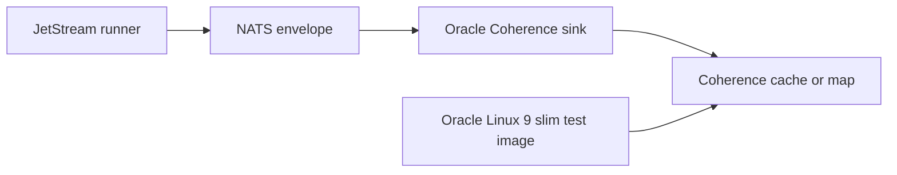

# Latest Test Report

This file is the canonical test report for the repository. It is intentionally
stored at a stable path and should be overwritten when a newer validation run is
performed. Do not create or commit timestamped copies of this report.

The report is sanitized. It must never contain server addresses, usernames,
passwords, tokens, certificate contents, private keys, Oracle wallet material,
full connection strings, sensitive subjects, sensitive payloads, container IDs,
generated database passwords, or full raw logs from live systems.

## Report Summary

| Field | Value |
| --- | --- |
| Overall result | Pass |
| Report generated | 2026-05-28 issue `#302` Oracle Coherence Community Edition sink validation for upcoming `v0.4.2` development |
| Project version | `0.4.1` package metadata with `v0.4.2` development changes |
| Python version | 3.12.4 |
| Git revision checked | Branch `issue-302-oracle-coherence-ce-sink` based on `release-v0.4.2` |
| Live NATS details | Environment-gated live tests skipped unless explicitly enabled |
| Live Oracle Database details | Environment-gated live tests skipped unless explicitly enabled |
| Live Oracle MySQL details | Environment-gated live tests skipped unless explicitly enabled |
| Live Oracle Coherence details | Local short-lived Oracle Linux 9 slim container smoke and sink e2e tests passed; no live production Coherence cluster was contacted |

This refresh covered the experimental first-party Oracle Coherence Community
Edition sink for issue `#302` and the related Oracle Coherence Community
Edition test backend assets from issue `#303`. The test backend was verified to
build from Oracle Linux 9 slim only and to resolve explicit Oracle Coherence
Community Edition runtime, gRPC proxy, and JSON modules during build.

## Core And Repository Validation

| Check | Result |
| --- | --- |
| Ruff format | Pass, `262 files already formatted` |
| Ruff lint | Pass |
| Mypy | Pass, no issues in `109` source files |
| Version metadata consistency | Pass for `0.4.1` |
| Dependency manifests | Pass, manifest files up to date |
| Backlog metadata | Pass, `145` backlog items validated |
| Bug report metadata | Pass, `90` bug reports validated |
| PyPI-facing Markdown links | Pass |
| Documentation builds | Pass for Read the Docs and GitHub Pages MkDocs builds |
| Security checks | Pass; existing reviewed `nosec` warnings remained non-blocking |
| Package build | Pass, source distribution and wheel built |
| SBOM and checksums | Pass, CycloneDX JSON/XML and checksum manifest generated |

## Test Results

| Test Area | Command | Result |
| --- | --- | --- |
| Oracle Coherence focused subset | `python -m pytest tests/unit/test_oracle_coherence_test_container.py tests/unit/test_coherence_sink.py tests/integration/test_coherence_sink_e2e.py tests/unit/test_cli.py::test_cli_registry_always_exposes_first_party_connectors tests/unit/test_public_api.py::test_documented_public_imports_remain_available tests/unit/test_public_api.py::test_public_exports_include_documented_contract tests/unit/test_public_api.py::test_public_api_smoke_imports_match_readme_examples -q` | Pass, `36 passed, 1 skipped` |
| Oracle Coherence container smoke | `python scripts/run-oracle-coherence-container-smoke.py --timeout-seconds 300` | Pass, one verified fake JSON key/value entry |
| Oracle Coherence sink e2e | `python scripts/run-coherence-sink-e2e.py --timeout-seconds 300` | Pass, `1 passed` plus sink e2e success summary |
| Oracle Coherence example validation | `nats-sink validate examples/oracle-coherence-basic/config.json` | Pass |
| Main repository test suite | run by `scripts/check.sh` | Pass, `1181 passed, 12 skipped` |
| Commit, encryption, file, and Oracle sink subset | run by `scripts/check.sh` | Pass, `130 passed` |
| Sink certification and example validation | `scripts/check-sinks.sh` via `scripts/check.sh` | Pass, `158 passed` plus file, Oracle, Oracle Coherence, Foundry, and Gotham config validation |
| Full local validation | `scripts/check.sh` | Pass |

The skipped tests are the existing environment-gated live NATS, Oracle
Database, Oracle MySQL, Oracle Coherence, and push-consumer integration tests.

## Oracle Coherence Evidence

The new focused coverage verifies:

- the Oracle Coherence Community Edition test image uses Oracle Linux 9 slim
  for every Docker build stage;
- the test image resolves explicit Oracle Coherence Community Edition runtime,
  gRPC proxy, and JSON modules;
- the smoke runner validates repository-local Dockerfile paths, bounded
  readiness timeouts, safe cache names, fixed `shell=False` subprocess calls,
  cleanup defaults, preserve behavior, and redacted command failures;
- the local container smoke test writes, reads, verifies, and removes one
  complete fake event JSON value;
- the Coherence sink validates configuration, value size limits, key
  strategies, duplicate policies, TTL behavior, optional dependency handling,
  timeout handling, and certification helper behavior;
- the sink e2e proves the connector can write through the local Oracle Linux 9
  slim Coherence backend when the optional client is available.

## Issues Found During Validation

The initial static check found that the Oracle Coherence test backend was still
documented and tested as a wrapper around an upstream Coherence image. The
Dockerfile, smoke runner, documentation, changelog, and unit tests were updated
so the backend is now Oracle Linux 9 slim based.

Full type checking also exposed three redundant casts in unrelated modules.
Those were removed and the type check now passes.

## Documentation Evidence

The following public documentation was updated and built successfully:

- [README](https://github.com/ProjectCuillin/nats-sinks/blob/main/README.md)
- [Oracle Coherence Community Edition Sink](coherence-sink.md)
- [Oracle Coherence Community Edition Test Backend](oracle-coherence-test-container.md)
- [Docker](docker.md)
- [Configuration](configuration.md)
- [Sink Framework](sink-framework.md)
- [Security](security.md)
- [Testing](testing.md)
- [Documentation Home](index.md)

The changelog, backlog metadata, latest test report, examples, and public sink
documentation were updated for issue `#302` and the Oracle Linux 9 slim
Coherence test backend correction.
