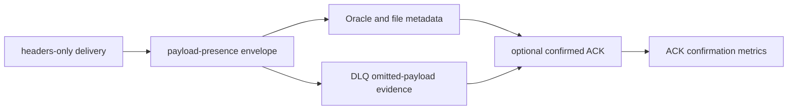

# Latest Test Report

This file is the canonical test report for the repository. It is intentionally
stored at a stable path and should be overwritten when a newer validation run is
performed. Do not create or commit timestamped copies of this report.

The report is sanitized. It must never contain server addresses, usernames,
passwords, tokens, certificate contents, private keys, Oracle wallet material,
full connection strings, sensitive subjects, sensitive payloads, container IDs,
generated database passwords, or full raw logs from live systems.

## Report Summary

| Field | Value |
| --- | --- |
| Overall result | Pass |
| Report generated | 2026-05-29 issues `#111`, `#112`, `#113`, `#114`, `#115`, and `#116` delivery-contract implementation for upcoming `v0.4.2` development |
| Project version | `0.4.1` package metadata with `v0.4.2` development changes |
| Python version | 3.12.4 |
| Git revision checked | Branch `issue-113-116-delivery-contracts`, to be merged back into `release-v0.4.2` |
| Live NATS details | Environment-gated live tests skipped unless explicitly enabled |
| Live Oracle Database details | Environment-gated live tests skipped unless explicitly enabled |
| Live Oracle MySQL details | Environment-gated live tests skipped unless explicitly enabled |
| Live Oracle NoSQL details | Environment-gated live tests skipped unless explicitly enabled |
| Live Oracle Coherence details | Environment-gated live tests skipped unless explicitly enabled |
| Container e2e details | Docker-backed container gates were not enabled for this delivery-contract run |

This refresh covered the headers-only and acknowledgement-confirmation delivery
contract work:

- issue `#111`: validated durable pull-consumer `headers_only` configuration;
- issue `#112`: sink and DLQ behavior for headers-only workflows;
- issue `#113`: payload-presence metadata on `NatsEnvelope` and standard
  metadata snapshots;
- issue `#114`: ACK confirmation metrics and operator documentation;
- issue `#115`: optional confirmed ACK after durable sink success;
- issue `#116`: confirmed ACK after successful DLQ publication and explicit
  `AckTerm` confirmation limitation.

## Core And Repository Validation

| Check | Result |
| --- | --- |
| Ruff format | Pass, `280` files already formatted |
| Ruff lint | Pass |
| Mypy | Pass, no issues in `116` source files |
| Version metadata consistency | Pass for `0.4.1` |
| Dependency manifests | Pass, manifest files up to date |
| Backlog metadata | Pass, `148` backlog items validated |
| Bug report metadata | Pass, `93` bug reports validated |
| PyPI-facing Markdown links | Pass |
| Documentation builds | Pass for Read the Docs and GitHub Pages MkDocs builds |
| Security checks | Pass; existing reviewed `nosec` warnings remained non-blocking |
| Package build | Pass, source distribution and wheel built |
| SBOM and checksums | Pass, CycloneDX JSON/XML and checksum manifest generated |

## Test Results

| Test Area | Command | Result |
| --- | --- | --- |
| Focused delivery-contract subset | `python -m pytest tests/unit/test_envelope.py tests/unit/test_file_mapping.py tests/unit/test_oracle_mapping.py tests/unit/test_config.py tests/unit/test_metrics.py tests/unit/test_metrics_cli.py tests/unit/test_commit_then_ack_contract.py tests/unit/test_public_api.py -q` | Pass, `203 passed` |
| Focused lint and typing subset | `python -m ruff check ...` and `python -m mypy src/nats_sinks/core` | Pass |
| Main repository test suite | run by `scripts/check.sh` | Pass, `1279 passed, 13 skipped` |
| Commit, encryption, file, and Oracle sink subset | run by `scripts/check.sh` | Pass, `142 passed` |
| Sink certification and example validation | run by `scripts/check.sh` | Pass, `203 passed` plus configuration validation for file, Oracle Database, Oracle NoSQL Database, Oracle Coherence Community Edition, fan-out, Foundry, and Gotham examples |
| Full local validation | `scripts/check.sh` | Pass |

The skipped tests are the existing environment-gated live NATS, Oracle
Database, Oracle MySQL, Oracle NoSQL Database, Oracle Coherence Community
Edition, and push-consumer integration tests. They were not required for this
payload-presence and ACK-confirmation change because the new behavior is
covered through deterministic unit, contract, mapping, metrics, DLQ, and
documentation checks.

## Delivery Contract Evidence

The focused suite proves:

- producer-empty payloads remain `payload_present=true`;
- headers-only omitted bodies become `payload_present=false`,
  `payload_omitted=true`, and `payload_omitted_reason="headers_only"`;
- malformed `Nats-Msg-Size` is recorded as malformed instead of guessed;
- payload-hash idempotency fallback is rejected when the body was omitted;
- file and Oracle metadata JSON include the standard payload-presence object;
- DLQ records for omitted payloads include omission evidence without a fake
  `payload_base64` body;
- normal ACK confirmation runs only after durable sink success;
- ACK confirmation timeout or failure after durable success leaves redelivery
  possible and is counted separately;
- DLQ normal ACK confirmation runs only after DLQ publication succeeds;
- DLQ publish failure does not attempt confirmed ACK;
- terminal `AckTerm` remains unconfirmed and records the unsupported
  confirmation path when confirmation is otherwise enabled;
- `nats-sink-metrics` can render ACK confirmation counters and timing
  observations in table, shell, and Prometheus-friendly forms.

## Issues Found During Validation

No new defects were found during this validation pass. The first full
`scripts/check.sh` attempt stopped because one test file needed Ruff
formatting. The file was reformatted and the full validation passed.

The security scan reported existing reviewed `nosec` annotations as warnings,
and the check remained passing. No new GitHub bug report was required.

## Documentation Evidence

The following public documentation was updated and built successfully:

- [README](https://github.com/ProjectCuillin/nats-sinks/blob/main/README.md)
- [Configuration](configuration.md)
- [Commit Then ACK](commit-then-ack.md)
- [Acknowledgement Confirmation](acknowledgement-confirmation.md)
- [Headers-Only Delivery](headers-only-delivery.md)
- [Dead Letter Queues](dead-letter-queues.md)
- [Idempotency](idempotency.md)
- [Metrics](metrics.md)
- [Operations](operations.md)
- [Architecture](architecture.md)
- [Sink Framework](sink-framework.md)
- [File Sink](file-sink.md)
- [Oracle Sink](oracle-sink.md)
- [Oracle MySQL Sink](mysql-sink.md)
- [Security](security.md)
- [Security Rule Review](security-rule-review.md)
- [NATS Feature Gap Analysis](nats-feature-gap-analysis.md)
- [Roadmap](roadmap.md)
- [Documentation Home](index.md)

The changelog, backlog metadata, latest test report, and public documentation
were updated for issues `#111`, `#112`, `#113`, `#114`, `#115`, and `#116`.
