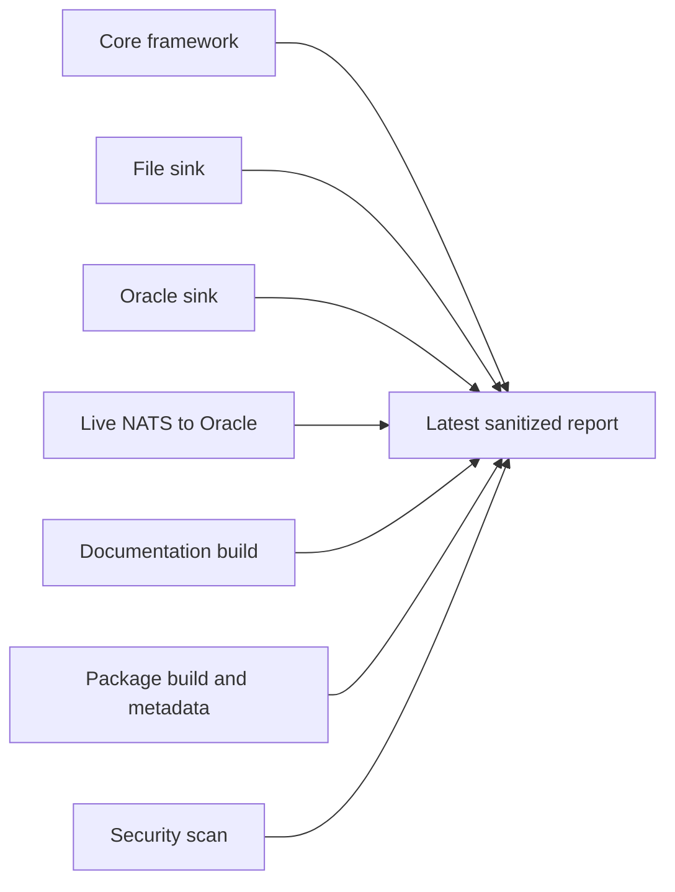
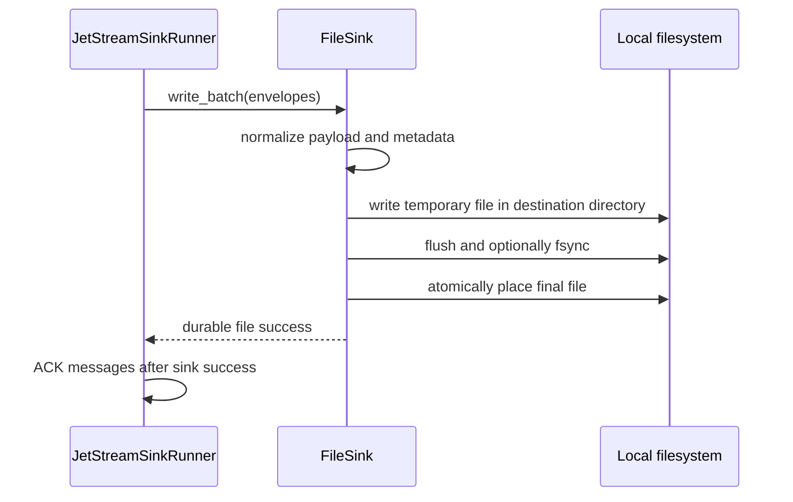
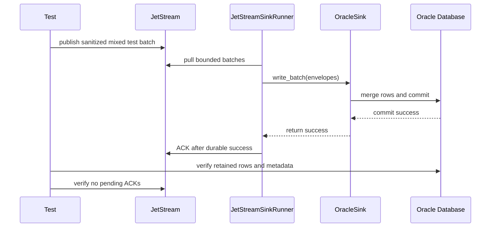
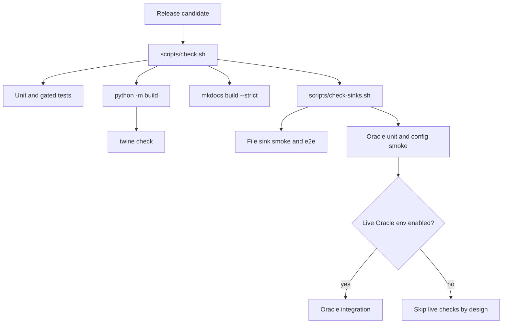

# Latest Test Report

This file is the canonical test report for the repository. It is intentionally
stored at a stable path and should be overwritten when a newer validation run is
performed. Do not create or commit timestamped copies of this report.

The report is sanitized. It must never contain server addresses, usernames,
passwords, tokens, certificate contents, private keys, Oracle wallet material,
full connection strings, sensitive subjects, sensitive payloads, or full raw
logs from live systems.

## Report Summary

| Field | Value |
| --- | --- |
| Overall result | Pass |
| Report generated | 2026-05-18 21:42:18 CEST |
| Project version | 0.2.0 |
| Python version | 3.12.4 |
| Git revision checked | `c3e0547` plus uncommitted release-candidate changes |
| Worktree state | Active `v0.2.0` release-candidate workspace with uncommitted changes |
| Live NATS details | Redacted |
| Live Oracle details | Redacted |

The validation run covered the core framework, local file sink, Oracle sink,
CLI smoke tests, documentation, package build, security scanning, live Oracle
integration, and a live NATS-to-Oracle end-to-end run.



## Report Retention Policy

Only this latest report should be preserved in the repository. Raw command
output, live environment files, CA files, Oracle wallets, connection strings,
and local service details belong under ignored `.local/` paths or in local
terminal history, not in git.

When refreshing this report:

1. Run the required checks.
2. Record only sanitized command names and summarized outcomes.
3. Replace this file in place.
4. Do not include environment variable values, connection strings, service
   endpoints, usernames, certificates, passwords, tokens, wallet contents, or
   sensitive message bodies.

## Core Framework

The core section validates package-wide behavior that must remain true for all
current and future sinks. This includes configuration parsing, secret
redaction, immutable envelope behavior, payload normalization, metadata
capture, batching, retry policy, sink registry behavior, commit-then-ACK
ordering, DLQ-before-ACK ordering, and deterministic unhappy-path handling.

| Check | Command | Result | Sanitized outcome |
| --- | --- | --- | --- |
| Formatting | `ruff format --check .` | Pass | 65 files already formatted |
| Linting | `ruff check .` | Pass | All checks passed |
| Type checking | `mypy src` | Pass | No type issues in 35 source files |
| Markdown link guard | `python scripts/check-markdown-links.py` | Pass | PyPI-facing README links use fully qualified URLs; MkDocs docs keep version-local relative links |
| Unit and gated test suite | `python -m pytest -q` | Pass | 117 passed, 8 skipped |
| Sink capability suite | `scripts/check-sinks.sh` | Pass | 50 sink-focused tests passed plus file and Oracle CLI smoke checks |
| Documentation build | `mkdocs build --strict` | Pass | Documentation built successfully |
| Security scan | `scripts/security.sh` | Pass | Bandit/Ruff security checks passed; expected targeted Oracle SQL `nosec` annotations were reported as warnings only |
| Import smoke test | Python import command | Pass | Public runner, envelope, `FileSink`, and `OracleSink` imports succeeded |
| CLI smoke test | `nats-sink --version` | Pass | CLI returned version `0.2.0` |
| Package build | `python -m build` | Pass | Source distribution and wheel built for `0.2.0` |
| Package metadata | `twine check dist/*` | Pass | Wheel and source distribution passed |
| Whitespace check | `git diff --check` | Pass | No whitespace errors |

The skipped tests in the normal pytest run are external-service integration
tests. They are intentionally guarded behind integration markers and explicit
environment variables so unit test runs stay deterministic and do not make
network calls.

### Core Failure Paths Covered

The test suite includes deterministic checks for these non-happy paths:

- malformed JSON payloads do not crash the core processing path,
- non-JSON text can be persisted through the shared JSON payload envelope,
- empty payload bodies are wrapped and persisted rather than crashing,
- non-UTF-8 bytes are base64-wrapped for JSON storage,
- sink failures do not ACK JetStream messages,
- permanent failures publish to DLQ before ACKing the original message,
- DLQ publish failures do not ACK the original message,
- invalid NATS, file sink, and Oracle configuration is rejected with clear
  framework errors,
- invalid SQL identifiers, unsafe file path components, and invalid subject
  route patterns are rejected or safely normalized,
- the global CLI `--version` option exits successfully without requiring a
  subcommand.

## File Sink

The file sink section validates the local durable sink introduced in `0.2.0`.
The sink writes one JSON document per message, uses atomic placement, supports
deterministic file names, and returns success only after the file write has
completed.



| Check | Command | Result | Sanitized outcome |
| --- | --- | --- | --- |
| File mapping unit tests | Included in `scripts/check-sinks.sh` | Pass | Filename strategies, JSON envelope records, metadata, and fuzzed path components passed |
| File sink unit tests | Included in `scripts/check-sinks.sh` | Pass | Duplicate policies, overwrite behavior, missing metadata, health check, and filesystem errors passed |
| File e2e test | `tests/integration/test_file_sink_e2e.py` | Pass | Runner processed fake JetStream messages, wrote JSON/text/empty/bytes records, and ACKed after file success |
| File CLI validation | `nats-sink validate examples/file-basic/config.json` | Pass | Configuration is valid and active sink is `file` |
| File CLI smoke | `nats-sink test-sink examples/file-basic/config.json` | Pass | Sink health check succeeded without external services |

The file sink test matrix specifically covers these production risks:

- duplicate messages are skipped, overwritten, or rejected according to policy,
- missing required stream or message-id metadata raises a clear permanent error,
- subject names that contain unsafe path characters cannot escape the root
  directory,
- non-UTF-8 payloads are preserved through base64 encoding inside the JSON
  payload envelope,
- a destination path that already exists as a file is rejected clearly,
- filesystem write errors are translated into framework sink errors.

## Oracle Sink

The Oracle section validates Oracle-specific behavior while keeping endpoint,
credential, wallet, and service-name details out of the report.

| Check | Command | Result | Sanitized outcome |
| --- | --- | --- | --- |
| Oracle-focused unit coverage | Included in `python -m pytest -q` | Pass | SQL generation, mapping, routing, payload, and sink contract tests passed |
| Live Oracle integration | `python -m pytest -q -s -m integration tests/integration/test_oracle_sink.py` | Pass | 4 passed |
| Retained Oracle integration table | `NATS_SINKS_ORACLE_TEST_EVENTS_V2` | Pass | Table recreated before the run and retained afterward for inspection |
| Cleanup flags | Explicit test run | Pass | Drop-before was enabled for schema refresh; drop-after remained disabled |

The live Oracle integration run verified these behaviors:

- table creation can be performed when enabled for the test table,
- a normal batch can be written and committed,
- duplicate redelivery is idempotent in `merge` mode,
- non-JSON text payloads are stored as JSON payload envelopes,
- empty payload bodies are stored as JSON payload envelopes,
- the retained table has the current metadata and epoch timestamp columns.

## Live NATS To Oracle End-To-End

The end-to-end section validates the complete live path from NATS JetStream to
Oracle through the core runner and Oracle sink. The report omits all live
service details.



| Check | Command | Result | Sanitized outcome |
| --- | --- | --- | --- |
| Live e2e, exact batch multiple | `scripts/run-oracle-e2e.sh --table NATS_SINKS_E2E_EVENTS_V2 --message-count 256 --batch-size 64` | Pass | 1 passed |
| Live e2e, partial final batch | `scripts/run-oracle-e2e.sh --table NATS_SINKS_E2E_EVENTS_V2 --message-count 250 --batch-size 64` | Pass | 1 passed |
| Message count | Configured test parameter | Pass | 256-message and 250-message runs published, received, written, committed, and ACKed all messages |
| Batch count | Captured timing metric | Pass | Both runs wrote 4 batches |
| Final batch behavior | Captured current-batch-size metric | Pass | 250-message run wrote a final 58-message batch instead of waiting for 64 messages |
| Backend write timing | Captured timing metric | Pass | 256-message run observed 2.773855 seconds and 92.29 messages per second; 250-message run observed 3.042089 seconds and 82.18 messages per second in this test environment |
| Retained e2e table | `NATS_SINKS_E2E_EVENTS_V2` | Pass | Table retained after the run |
| Cleanup flags | Defaults | Pass | Drop-before and drop-after remained disabled for the e2e table |

The live NATS-to-Oracle e2e run verified these behaviors:

- the runner consumed messages from a durable pull consumer,
- Oracle committed the rows before JetStream ACKs were complete,
- there were no pending ACKs on the test consumer after processing,
- the expected row count was present in Oracle,
- missing `Nats-Msg-Id` headers did not crash processing,
- present NATS-reserved headers were captured in `METADATA_JSON`,
- wildcard subscription behavior was exercised through separate subscribe and
  publish subjects,
- empty message bodies were persisted without crashing,
- non-JSON encrypted-text-style messages were persisted through the standard
  payload envelope,
- a non-multiple message count wrote and ACKed a smaller final batch,
- backend write timing was captured for the sink write path.

The timing result is a functional test observation from the current test
environment, not a production benchmark. Production throughput depends on NATS
placement, Oracle service class, Oracle wallet/TLS configuration, batch size,
payload size, table indexes, commit frequency, filesystem type for file sinks,
and network latency.

## Release Gate Coverage

The release workflow and local check scripts now require sink capability checks
before publishing. The default gate validates all production sinks without
external services where possible. Live Oracle and live NATS-to-Oracle tests are
enabled only by explicit local or CI environment variables because they require
private infrastructure.



## Known Limitations Of This Report

- Coverage percentages were not captured in this report.
- The e2e timing is not a controlled benchmark.
- Integration results depend on external services and are not reproduced by
  the default unit-test-only CI path.
- Live service details are intentionally redacted, so this report cannot be
  used to reconstruct the private test environment.
- The active development worktree had uncommitted changes when this report was
  generated.

## Refresh Checklist

Run the following local checks for a full report refresh:

```bash
ruff format --check .
ruff check .
mypy src
python scripts/check-markdown-links.py
python -m pytest -q
mkdocs build --strict
scripts/check-sinks.sh
scripts/security.sh
python -m build
twine check dist/*
```

Run the live Oracle checks only with ignored local environment files:

```bash
python -m pytest -q -s -m integration tests/integration/test_oracle_sink.py
scripts/run-oracle-e2e.sh --table NATS_SINKS_E2E_EVENTS_V2 --message-count 256 --batch-size 64
scripts/run-oracle-e2e.sh --table NATS_SINKS_E2E_EVENTS_V2 --message-count 250 --batch-size 64
```

Before committing a refreshed report, scan it for secrets and live identifiers.
The report should describe what was tested, not where or with which private
credentials it was tested.
