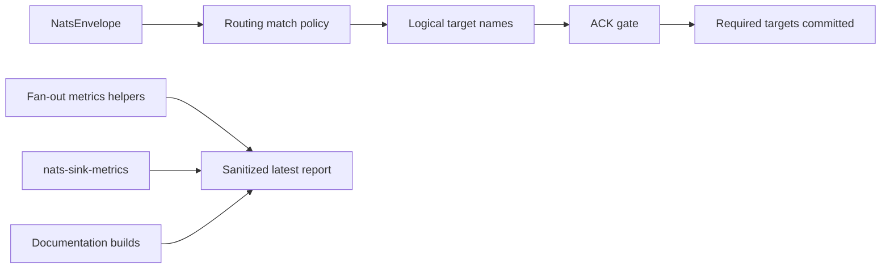

# Latest Test Report

This file is the canonical test report for the repository. It is intentionally
stored at a stable path and should be overwritten when a newer validation run is
performed. Do not create or commit timestamped copies of this report.

The report is sanitized. It must never contain server addresses, usernames,
passwords, tokens, certificate contents, private keys, Oracle wallet material,
full connection strings, sensitive subjects, sensitive payloads, container IDs,
generated database passwords, or full raw logs from live systems.

## Report Summary

| Field | Value |
| --- | --- |
| Overall result | Pass |
| Report generated | 2026-05-26 issue `#134` validation for upcoming `v0.4.2` development |
| Project version | `0.4.1` package metadata with `v0.4.2` development changes |
| Python version | 3.12.4 |
| Git revision checked | Branch `issue-134-fanout-observability` based on `release-v0.4.2` |
| Live NATS details | Environment-gated live tests skipped unless explicitly enabled |
| Live Oracle Database details | Environment-gated live tests skipped unless explicitly enabled |
| Live Oracle MySQL details | Environment-gated live tests skipped unless explicitly enabled |

This refresh covered fan-out observability metrics and sanitized logging for
issue `#134` and a full local regression cycle for the current development
branch. The new tests use synthetic route selections and ACK-gate results to
prove aggregate metrics for route matches, selected child sinks, required
success or failure, optional success, failure, or timeout, ACK eligibility,
ACK blocking, timing observations, CLI display, and payload-free logs without
contacting live infrastructure.

## Core And Repository Validation

| Check | Result |
| --- | --- |
| Ruff format | Pass, `224 files already formatted` |
| Ruff lint | Pass |
| Mypy | Pass, no issues in `89` source files |
| Version metadata consistency | Pass for `0.4.1` |
| Dependency manifests | Pass, manifest files up to date |
| Backlog item validation | Pass, `142` backlog items validated |
| Bug report validation | Pass, `87` bug report items validated |
| PyPI-facing Markdown links | Pass |
| Secret scan | Pass, no high-confidence secret material found |
| Bandit | Pass with reviewed `nosec` annotations for validated SQL identifier builders |
| Package build | Pass, sdist and wheel built |
| SBOM generation | Pass, CycloneDX JSON and XML generated |
| Checksum generation | Pass, `dist/SHA256SUMS` generated |
| Twine metadata check | Pass for retained distributions |

## Test Results

| Test Area | Command | Result |
| --- | --- | --- |
| Fan-out focused tests | `python -m pytest tests/unit/test_fanout_observability.py tests/unit/test_fanout_certification.py tests/unit/test_metrics.py tests/unit/test_metrics_cli.py tests/unit/test_public_api.py -q` | Pass, `54 passed` |
| Main repository test suite | `scripts/check.sh` | Pass, `982 passed, 10 skipped` |
| Encryption and sink contract subset | `scripts/check.sh` | Pass, `123 passed` |
| Sink capability subset | `scripts/check.sh` | Pass, `117 passed` |
| Documentation builds | `scripts/check.sh` | Pass for Read the Docs and GitHub Pages MkDocs builds |
| Example validation | `nats-sink validate examples/named-multi-sink/config.json` through unit/CLI coverage | Pass |

The skipped tests are the existing environment-gated live NATS, Oracle
Database, and Oracle MySQL integration tests. Issue `#134` adds aggregate
fan-out observability helpers and metrics contract tests only; it does not
alter live single-sink delivery code, so no new credentialed live test was
required for this specific feature.

## Fan-Out Observability Evidence

The new unit coverage verifies:

- matched route selections increment aggregate route and child sink counters;
- no-route selections increment no-route counters without logging subjects or
  target names;
- required success, required failure, optional success, optional failure, and
  optional timeout categories are counted separately;
- ACK eligibility and ACK blocking are visible as separate counters;
- ACK-gate wait time and fan-out batch duration are captured as observations;
- `nats-sink-metrics` table, shell, names, and Prometheus output can display
  the new `fanout_*` metrics;
- structured logs explain partial fan-out outcomes without payloads, sink
  names, route names, subjects, labels, or classification values;
- broken external metrics recorders do not escape from the helper and cannot
  change the delivery decision.

## Issues Found During Validation

No new product bugs were found during issue `#134` validation. The first full
check stopped on formatting for the new fan-out observability test file. Ruff
formatting was applied, then the full `scripts/check.sh` cycle passed.

## Documentation Evidence

The following public documentation was updated and built successfully:

- [README](https://github.com/ProjectCuillin/nats-sinks/blob/main/README.md)
- [Configuration](configuration.md)
- [Sink Framework](sink-framework.md)
- [Sink Certification](sink-certification.md)
- [Testing](testing.md)
- [Development](development.md)
- [Architecture](architecture.md)
- [Operations](operations.md)
- [Metrics](metrics.md)
- [Observability](observability.md)
- [Prometheus Integration](prometheus.md)
- [Named Sinks And Routing](named-sinks.md)
- [Idempotency](idempotency.md)
- [Security](security.md)
- [File Sink](file-sink.md)
- [Oracle Sink](oracle-sink.md)
- [Named Multi-Sink Example](https://github.com/ProjectCuillin/nats-sinks/blob/main/examples/named-multi-sink/config.json)
- [Documentation Home](index.md)

The changelog, backlog metadata, metrics contract tests, metrics CLI tests, and
fan-out observability tests were also updated for issue `#134`.
