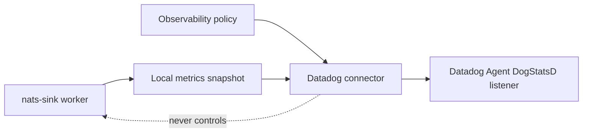

# Latest Test Report

This file is the canonical test report for the repository. It is intentionally
stored at a stable path and should be overwritten when a newer validation run is
performed. Do not create or commit timestamped copies of this report.

The report is sanitized. It must never contain server addresses, usernames,
passwords, tokens, certificate contents, private keys, Oracle wallet material,
full connection strings, sensitive subjects, sensitive payloads, container IDs,
generated database passwords, or full raw logs from live systems.

## Report Summary

| Field | Value |
| --- | --- |
| Overall result | Pass |
| Report generated | 2026-05-28 issue `#104` Datadog observability connector validation for upcoming `v0.4.2` development |
| Project version | `0.4.1` package metadata with `v0.4.2` development changes |
| Python version | 3.12.4 |
| Git revision checked | Branch `issue-104-datadog-observability-connector` based on `release-v0.4.2` |
| Live NATS details | Environment-gated live tests skipped unless explicitly enabled |
| Live Oracle Database details | Environment-gated live tests skipped unless explicitly enabled |
| Live Oracle MySQL details | Environment-gated live tests skipped unless explicitly enabled |
| Live Oracle Coherence details | Environment-gated live tests skipped unless explicitly enabled |

This refresh covered the disabled-by-default Datadog DogStatsD observability
connector for issue `#104`. The connector reads only local metrics snapshots,
applies the shared observability policy, renders bounded DogStatsD datagrams,
and keeps Datadog export outside the delivery-critical sink runner.

## Core And Repository Validation

| Check | Result |
| --- | --- |
| Ruff format | Pass, `267 files already formatted` |
| Ruff lint | Pass |
| Mypy | Pass, no issues in `111` source files |
| Version metadata consistency | Pass for `0.4.1` |
| Dependency manifests | Pass, manifest files up to date |
| Backlog metadata | Pass, `145` backlog items validated |
| Bug report metadata | Pass, `90` bug reports validated |
| PyPI-facing Markdown links | Pass |
| Documentation builds | Pass for Read the Docs and GitHub Pages MkDocs builds |
| Security checks | Pass; existing reviewed `nosec` warnings remained non-blocking |
| Package build | Pass, source distribution and wheel built |
| SBOM and checksums | Pass, CycloneDX JSON/XML and checksum manifest generated |

## Test Results

| Test Area | Command | Result |
| --- | --- | --- |
| Datadog focused subset | `python -m pytest tests/unit/test_datadog_observability.py tests/unit/test_observability_policy.py tests/unit/test_observability_cli.py tests/unit/test_public_api.py -q` | Pass, `80 passed` |
| Main repository test suite | run by `scripts/check.sh` | Pass, `1201 passed, 12 skipped` |
| Commit, encryption, file, and Oracle sink subset | run by `scripts/check.sh` | Pass, `130 passed` |
| Sink certification and example validation | `scripts/check-sinks.sh` via `scripts/check.sh` | Pass, `163 passed` plus file, Oracle, Oracle Coherence, multi-sink routing, Foundry, and Gotham config validation |
| Full local validation | `scripts/check.sh` | Pass |

The skipped tests are the existing environment-gated live NATS, Oracle
Database, Oracle MySQL, Oracle Coherence, and push-consumer integration tests.

## Datadog Connector Evidence

The new focused coverage verifies:

- Datadog export is disabled by default and returns a safe no-op summary;
- enabled export applies the shared observability allow list, deny list,
  observation, and stale-snapshot policies;
- DogStatsD dry-run output uses stable names and gauges for snapshot values;
- static Datadog tags are explicit, bounded, sorted, and screened for
  sensitive or high-cardinality names;
- prepared metric labels stay suppressed unless
  `include_metric_labels_as_tags` is explicitly enabled;
- UDP and Unix datagram transports use bounded timeouts and retries;
- datagram size limits fail closed with actionable errors;
- CLI output avoids printing Agent addresses, socket paths, tags, subjects,
  payloads, classification values, file paths, table names, or credentials.

## Issues Found During Validation

No new repository defects were found during the issue `#104` validation cycle.
The security scan reported existing reviewed `nosec` annotations as warnings,
and the check remained passing.

## Documentation Evidence

The following public documentation was updated and built successfully:

- [README](https://github.com/ProjectCuillin/nats-sinks/blob/main/README.md)
- [Datadog Integration](datadog.md)
- [Configuration](configuration.md)
- [CLI Reference](cli.md)
- [Metrics](metrics.md)
- [Observability](observability.md)
- [Observability Connector Roadmap](observability-connectors.md)
- [Operations](operations.md)
- [Security](security.md)
- [Documentation Home](index.md)

The changelog, backlog metadata, latest test report, and public documentation
were updated for issue `#104`.
