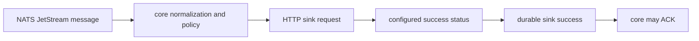

# Latest Test Report

This file is the canonical test report for the repository. It is intentionally
stored at a stable path and should be overwritten when a newer validation run is
performed. Do not create or commit timestamped copies of this report.

The report is sanitized. It must never contain server addresses, usernames,
passwords, tokens, certificate contents, private keys, Oracle wallet material,
full connection strings, sensitive subjects, sensitive payloads, container IDs,
generated database passwords, or full raw logs from live systems.

## Report Summary

| Field | Value |
| --- | --- |
| Overall result | Pass |
| Report generated | 2026-05-29 issue `#17` HTTP sink implementation for upcoming `v0.4.2` development |
| Project version | `0.4.1` package metadata with `v0.4.2` development changes |
| Python version | 3.12.4 |
| Git revision checked | Branch `issue-17-http-sink`, to be merged back into `release-v0.4.2` |
| Live NATS details | Environment-gated live tests skipped unless explicitly enabled |
| Live Oracle Database details | Environment-gated live tests skipped unless explicitly enabled |
| Live Oracle MySQL details | Environment-gated live tests skipped unless explicitly enabled |
| Live Oracle NoSQL details | Environment-gated live tests skipped unless explicitly enabled |
| Live Oracle Coherence details | Environment-gated live tests skipped unless explicitly enabled |
| Container e2e details | Docker-backed container gates were not enabled for this HTTP sink run |

This refresh covered issue `#17`, which adds the first-party HTTP sink for one
fixed operator-configured endpoint, explicit idempotency-key propagation,
bounded request and response handling, bounded retries, safe header handling,
configuration validation, public API registration, and documentation.

## Core And Repository Validation

| Check | Result |
| --- | --- |
| Ruff format | Pass, `286` files already formatted after formatting the new HTTP files |
| Ruff lint | Pass |
| Mypy | Pass, no issues in `121` source files |
| Version metadata consistency | Pass for `0.4.1` |
| Dependency manifests | Pass, manifest files up to date |
| Backlog metadata | Pass, `148` backlog items validated |
| Bug report metadata | Pass, `94` bug reports validated |
| PyPI-facing Markdown links | Pass |
| Documentation builds | Pass for Read the Docs and GitHub Pages MkDocs builds |
| Security checks | Pass; existing reviewed `nosec` warnings remained non-blocking |
| Package build | Pass, source distribution and wheel built |
| SBOM and checksums | Pass, CycloneDX JSON/XML and checksum manifest generated |

## Test Results

| Test Area | Command | Result |
| --- | --- | --- |
| Focused HTTP sink, CLI, and public API subset | `python -m pytest tests/unit/test_http_sink.py tests/unit/test_cli.py tests/unit/test_public_api.py -q` | Pass, `35 passed` |
| Focused HTTP lint and typing subset | `python -m ruff check src/nats_sinks/http ...` and `python -m mypy src/nats_sinks/http` | Pass |
| Managed bug `#323` regression subset | `python -m pytest tests/unit/test_routing_policy.py::test_route_policy_applies_sink_type_optional_ack_gate_defaults tests/unit/test_routing_policy.py::test_route_match_policy_load_config_rejects_malformed_variants -q` | Pass, `21 passed` |
| Main repository test suite | run by `scripts/check.sh` | Pass, `1294 passed, 13 skipped` |
| Commit, encryption, file, and Oracle sink subset | run by `scripts/check.sh` | Pass, `142 passed` |
| Sink certification and example validation | run by `scripts/check.sh` | Pass, `203 passed` plus configuration validation for file, Oracle Database, Oracle NoSQL Database, Oracle Coherence Community Edition, fan-out, Foundry, and Gotham examples |
| Full local validation | `scripts/check.sh` | Pass |

The skipped tests are the existing environment-gated live NATS, Oracle
Database, Oracle MySQL, Oracle NoSQL Database, Oracle Coherence Community
Edition, and push-consumer integration tests. They were not required for this
HTTP sink change because the new behavior is covered through deterministic
unit, configuration, public API, certification, documentation, and full local
repository checks.

## HTTP Sink Evidence

The focused suite proves:

- HTTP configuration requires HTTPS unless loopback-only cleartext is
  explicitly enabled for local testing;
- endpoint host allow lists, method allow lists, header names, header values,
  environment-backed header references, response status lists, timeouts,
  request sizes, response sizes, and retry settings are validated;
- sensitive direct headers are rejected and secret-bearing header values must
  come from environment references;
- malformed or ambiguous URLs are rejected before any network operation;
- normalized envelope and payload-only JSON bodies are deterministic and
  bounded;
- idempotency-key propagation supports explicit metadata, stream sequence,
  message ID, and payload hash strategies while failing closed when required
  metadata is absent;
- retryable HTTP responses and temporary client failures remain temporary sink
  failures, preserving redelivery;
- permanent HTTP responses become permanent sink failures;
- request timeout and response-size failures do not imply endpoint success;
- the HTTP sink never ACKs directly and remains behind the core
  commit-then-ACK boundary;
- public import paths and the connector registry expose the new sink
  explicitly.

## Issues Found During Validation

Validation found one managed development bug:

- `#323`: the first HTTP implementation added `http` to fan-out optional ACK
  defaults but missed the routing policy target sink-type allow list.

The bug was raised on GitHub, assigned, documented with a failing-test comment,
fixed on a bug branch, merged back into the issue branch, and verified with the
focused routing regression subset and the full `scripts/check.sh` run.

No other defects were found during this validation pass. The security scan
reported existing reviewed `nosec` annotations as warnings, and the check
remained passing.

## Documentation Evidence

The following public documentation was updated and built successfully:

- [README](https://github.com/ProjectCuillin/nats-sinks/blob/main/README.md)
- [Configuration](configuration.md)
- [HTTP Sink](http-sink.md)
- [Idempotency](idempotency.md)
- [Sink Framework](sink-framework.md)
- [Security](security.md)
- [Security Rule Review](security-rule-review.md)
- [Roadmap](roadmap.md)
- [Documentation Home](index.md)

The changelog, backlog metadata, latest test report, security control register,
roadmap, and public documentation were updated for issue `#17` and managed bug
`#323`.
