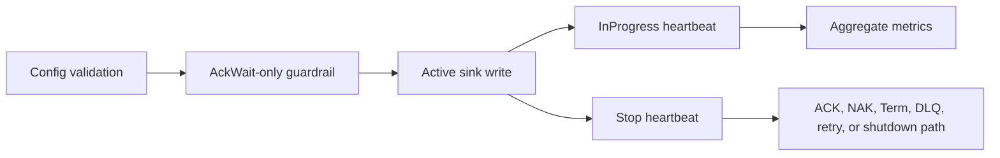

# Latest Test Report

This file is the canonical test report for the repository. It is intentionally
stored at a stable path and should be overwritten when a newer validation run is
performed. Do not create or commit timestamped copies of this report.

The report is sanitized. It must never contain server addresses, usernames,
passwords, tokens, certificate contents, private keys, Oracle wallet material,
full connection strings, sensitive subjects, sensitive payloads, container IDs,
generated database passwords, or full raw logs from live systems.

## Report Summary

| Field | Value |
| --- | --- |
| Overall result | Pass |
| Report generated | 2026-05-27 issue `#118` validation for upcoming `v0.4.2` development |
| Project version | `0.4.1` package metadata with `v0.4.2` development changes |
| Python version | 3.12.4 |
| Git revision checked | Branch `issue-118-inprogress-heartbeat` based on `release-v0.4.2` |
| Live NATS details | Environment-gated live tests skipped unless explicitly enabled |
| Live Oracle Database details | Environment-gated live tests skipped unless explicitly enabled |
| Live Oracle MySQL details | Environment-gated live tests skipped unless explicitly enabled |

This refresh covered optional JetStream `InProgress` heartbeats for issue
`#118`, plus a full local regression cycle for the current development branch.
The new tests prove the heartbeat is disabled by default, starts only during
active sink writes, stops before final ACK or failure handling, preserves
normal temporary and permanent failure behavior, handles heartbeat failures as
metrics-only events, and enforces bounded AckWait guardrails before startup.

## Core And Repository Validation

| Check | Result |
| --- | --- |
| Ruff format | Pass, `236 files already formatted` |
| Ruff lint | Pass |
| Mypy | Pass, no issues in `93` source files |
| Version metadata consistency | Pass for `0.4.1` |
| Dependency manifests | Pass, manifest files up to date |
| Backlog item validation | Pass, `142` backlog item(s) |
| Bug report validation | Pass, `89` bug report item(s) |
| PyPI-facing Markdown links | Pass |
| Secret scan | Pass, no high-confidence secret material found |
| Bandit | Pass with reviewed `nosec` annotations for validated SQL identifier builders |
| Package build | Pass, sdist and wheel built |
| SBOM generation | Pass, CycloneDX JSON and XML generated |
| Checksum generation | Pass, `dist/SHA256SUMS` generated |
| Distribution checksum verification | Pass for retained distributions |

## Test Results

| Test Area | Command | Result |
| --- | --- | --- |
| InProgress heartbeat and config subset | `python -m pytest tests/unit/test_commit_then_ack_contract.py tests/unit/test_config.py tests/unit/test_metrics.py tests/unit/test_metrics_cli.py tests/unit/test_inprogress_metrics_runbook.py -q` | Pass, `139 passed` |
| Main repository test suite | `scripts/check.sh` | Pass, `1075 passed, 11 skipped` |
| Encryption and sink contract subset | `scripts/check.sh` | Pass, `130 passed` |
| Sink capability subset | `scripts/check.sh` | Pass, `117 passed` |
| Documentation builds | `scripts/check.sh` | Pass for Read the Docs and GitHub Pages MkDocs builds |
| Example validation | `scripts/check.sh` | Pass for file and Oracle example validation paths |

The skipped tests are the existing environment-gated live NATS, Oracle
Database, Oracle MySQL, and push-consumer integration tests.

## InProgress Heartbeat Evidence

The new focused coverage verifies:

- `delivery.in_progress` is disabled by default;
- enabling the heartbeat requires explicit
  `consumer_management.ack_wait_seconds`;
- BackOff-based consumer timing is rejected while this conservative guardrail
  is in place;
- heartbeat intervals must remain below 80% of the configured AckWait window;
- the runner also enforces the guardrail when constructed directly;
- progress signals run only while `sink.write_batch(...)` is active;
- progress signals stop before durable success ACK, temporary-failure NAK, and
  permanent-failure DLQ ACK paths;
- heartbeat call failures increment InProgress metrics without causing early
  ACK or hiding the sink result;
- the heartbeat stops at the configured maximum count;
- cancellation stops the heartbeat and leaves the original message unacked.

## Issues Found During Validation

No new release-blocking issues were found during the `#118` validation cycle.

## Documentation Evidence

The following public documentation was updated and built successfully:

- [README](https://github.com/ProjectCuillin/nats-sinks/blob/main/README.md)
- [Configuration](configuration.md)
- [Commit Then Acknowledge](commit-then-ack.md)
- [Operations](operations.md)
- [Metrics](metrics.md)
- [InProgress Evaluation](in-progress-evaluation.md)
- [InProgress Metrics Runbook](inprogress-metrics-runbook.md)
- [NATS Feature Gap Analysis](nats-feature-gap-analysis.md)
- [Roadmap](roadmap.md)
- [Documentation Home](index.md)

The changelog, backlog metadata, roadmap, latest test report, and public
InProgress documentation were updated for issue `#118`.
