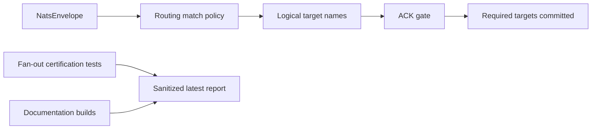

# Latest Test Report

This file is the canonical test report for the repository. It is intentionally
stored at a stable path and should be overwritten when a newer validation run is
performed. Do not create or commit timestamped copies of this report.

The report is sanitized. It must never contain server addresses, usernames,
passwords, tokens, certificate contents, private keys, Oracle wallet material,
full connection strings, sensitive subjects, sensitive payloads, container IDs,
generated database passwords, or full raw logs from live systems.

## Report Summary

| Field | Value |
| --- | --- |
| Overall result | Pass |
| Report generated | 2026-05-26 issue `#135` validation for upcoming `v0.4.2` development |
| Project version | `0.4.1` package metadata with `v0.4.2` development changes |
| Python version | 3.12.4 |
| Git revision checked | Branch `issue-135-fanout-certification-tests` based on `release-v0.4.2` |
| Live NATS details | Environment-gated live tests skipped unless explicitly enabled |
| Live Oracle Database details | Environment-gated live tests skipped unless explicitly enabled |
| Live Oracle MySQL details | Environment-gated live tests skipped unless explicitly enabled |

This refresh covered fan-out routing certification tests for issue `#135` and
a full local regression cycle for the current development branch. The new
certification helpers use synthetic envelopes and in-memory fan-out operation
plans to prove route selection, required ACK blocking, optional timeout
behavior, no-route handling, CLI validation, and redaction behavior without
contacting live infrastructure.

## Core And Repository Validation

| Check | Result |
| --- | --- |
| Ruff format | Pass, `222 files already formatted` |
| Ruff lint | Pass |
| Mypy | Pass, no issues in `88` source files |
| Version metadata consistency | Pass for `0.4.1` |
| Dependency manifests | Pass, manifest files up to date |
| Backlog item validation | Pass, `142` backlog items validated |
| Bug report validation | Pass, `87` bug report items validated |
| PyPI-facing Markdown links | Pass |
| Secret scan | Pass, no high-confidence secret material found |
| Bandit | Pass with reviewed `nosec` annotations for validated SQL identifier builders |
| Package build | Pass, sdist and wheel built |
| SBOM generation | Pass, CycloneDX JSON and XML generated |
| Checksum generation | Pass, `dist/SHA256SUMS` generated |
| Twine metadata check | Pass for retained distributions |

## Test Results

| Test Area | Command | Result |
| --- | --- | --- |
| Fan-out focused tests | `python -m pytest tests/unit/test_fanout_certification.py tests/unit/test_fanout_ack_gate.py tests/unit/test_routing_policy.py tests/unit/test_named_sinks.py tests/unit/test_public_api.py -q` | Pass, `70 passed` |
| Main repository test suite | `scripts/check.sh` | Pass, `975 passed, 10 skipped` |
| Encryption and sink contract subset | `scripts/check.sh` | Pass, `123 passed` |
| Sink capability subset | `scripts/check.sh` | Pass, `117 passed` |
| Documentation builds | `scripts/check.sh` | Pass for Read the Docs and GitHub Pages MkDocs builds |
| Example validation | `nats-sink validate examples/named-multi-sink/config.json` through unit/CLI coverage | Pass |

The skipped tests are the existing environment-gated live NATS, Oracle
Database, and Oracle MySQL integration tests. Issue `#135` adds deterministic
certification helpers and tests only; it does not alter live single-sink
delivery code, so no new credentialed live test was required for this specific
feature.

## Fan-Out Certification Evidence

The new unit coverage verifies:

- the documented NATO SECRET route selects `oracle_secret` and optional
  `file_audit`;
- the documented NATO UNCLASS route selects only `oracle_unclass`;
- subject, priority, classification, `labels_all`, `labels_any`, `labels_none`,
  approved non-secret headers, and combined match sets;
- one-to-one route selection and one-to-many fan-out target selection;
- required target failure after another required target commits, with no
  synthetic ACK recorded;
- optional target timeout, bounded ACK release, and payload-free warning logs;
- no-route handling for `reject`, `ignore`, and `default_route`;
- `nats-sink validate` coverage for valid fan-out-style configuration and
  invalid route, sink, match, optional wait, and redaction scenarios;
- public `nats_sinks.testing` imports for reusable fan-out certification
  helpers.

## Issues Found During Validation

No new product bugs were found during issue `#135` validation. The first full
check identified a scanner false positive on the public `oracle_secret`
example target name; the line now has a narrow `nosec B105` annotation with a
local rationale and the full `scripts/check.sh` cycle passes.

## Documentation Evidence

The following public documentation was updated and built successfully:

- [README](https://github.com/ProjectCuillin/nats-sinks/blob/main/README.md)
- [Configuration](configuration.md)
- [Sink Framework](sink-framework.md)
- [Sink Certification](sink-certification.md)
- [Testing](testing.md)
- [Development](development.md)
- [Architecture](architecture.md)
- [Operations](operations.md)
- [Named Sinks And Routing](named-sinks.md)
- [Idempotency](idempotency.md)
- [Security](security.md)
- [File Sink](file-sink.md)
- [Oracle Sink](oracle-sink.md)
- [Named Multi-Sink Example](https://github.com/ProjectCuillin/nats-sinks/blob/main/examples/named-multi-sink/config.json)
- [Documentation Home](index.md)

The changelog, backlog metadata, public API compatibility tests, CLI validation
test, and tracked named multi-sink example were also updated for issue `#136`.
