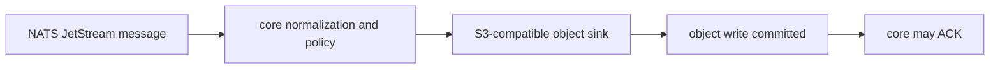

# Latest Test Report

This file is the canonical test report for the repository. It is intentionally
stored at a stable path and should be overwritten when a newer validation run is
performed. Do not create or commit timestamped copies of this report.

The report is sanitized. It must never contain server addresses, usernames,
passwords, tokens, certificate contents, private keys, Oracle wallet material,
full connection strings, sensitive subjects, sensitive payloads, container IDs,
generated database passwords, or full raw logs from live systems.

## Report Summary

| Field | Value |
| --- | --- |
| Overall result | Pass |
| Report generated | 2026-05-29 issue `#39` S3-compatible object sink implementation for upcoming `v0.4.2` development |
| Project version | `0.4.1` package metadata with `v0.4.2` development changes |
| Python version | 3.12.4 |
| Git revision checked | Branch `issue-39-s3-sink`, to be merged back into `release-v0.4.2` |
| Live NATS details | Environment-gated live tests skipped unless explicitly enabled |
| Live Oracle Database details | Environment-gated live tests skipped unless explicitly enabled |
| Live Oracle MySQL details | Environment-gated live tests skipped unless explicitly enabled |
| Live Oracle NoSQL details | Environment-gated live tests skipped unless explicitly enabled |
| Live Oracle Coherence details | Environment-gated live tests skipped unless explicitly enabled |
| Live S3-compatible object storage details | Environment-gated live tests skipped unless explicitly enabled |
| Container e2e details | Docker-backed container gates were not enabled for this S3 sink run |

This refresh covered issue `#39`, which adds a first-party S3-compatible object
sink with deterministic object-key construction, explicit duplicate policies,
bounded configuration validation, safe metadata handling, public API
registration, and documentation.

## Core And Repository Validation

| Check | Result |
| --- | --- |
| Ruff format | Pass, `292` files already formatted after formatting the new S3 files |
| Ruff lint | Pass |
| Mypy | Pass, no issues in `126` source files |
| Version metadata consistency | Pass for `0.4.1` |
| Dependency manifests | Pass, manifest files up to date |
| Backlog metadata | Pass, `148` backlog items validated |
| Bug report metadata | Pass, `94` bug reports validated |
| PyPI-facing Markdown links | Pass |
| Documentation builds | Pass for Read the Docs and GitHub Pages MkDocs builds |
| Security checks | Pass; existing reviewed `nosec` warnings remained non-blocking |
| Package build | Pass, source distribution and wheel built |
| SBOM and checksums | Pass, CycloneDX JSON/XML and checksum manifest generated |

## Test Results

| Test Area | Command | Result |
| --- | --- | --- |
| Focused S3 sink, CLI, and public API subset | `python -m pytest tests/unit/test_s3_sink.py tests/unit/test_cli.py::test_cli_validates_s3_sink_config tests/unit/test_cli.py::test_cli_registry_always_exposes_first_party_connectors tests/unit/test_public_api.py -q` | Pass, `22 passed` |
| Focused S3 lint and typing subset | `python -m ruff check src/nats_sinks/s3 ...` and `python -m mypy src/nats_sinks/s3` | Pass |
| S3 example configuration validation | `nats-sink validate examples/s3-basic/config.json` | Pass |
| Main repository test suite | run by `scripts/check.sh` | Pass, `1310 passed, 13 skipped` |
| Commit, encryption, file, and Oracle sink subset | run by `scripts/check.sh` | Pass, `142 passed` |
| Sink certification and example validation | run by `scripts/check.sh` | Pass, `217 passed` plus configuration validation for file, Oracle Database, Oracle MySQL Database, Oracle NoSQL Database, Oracle Coherence Community Edition, fan-out, Foundry, Gotham, HTTP, and S3 examples |
| Full local validation | `scripts/check.sh` | Pass |

The skipped tests are the existing environment-gated live NATS, Oracle
Database, Oracle MySQL, Oracle NoSQL Database, Oracle Coherence Community
Edition, S3-compatible object storage, and push-consumer integration tests.
They were not required for this S3 sink change because the new behavior is
covered through deterministic unit, configuration, public API, certification,
documentation, and full local repository checks.

## S3 Sink Evidence

The focused suite proves:

- S3 bucket names, prefixes, key strategies, duplicate policies, metadata
  modes, compression settings, endpoint URLs, credential modes, encryption
  settings, and retry settings are validated before runtime use;
- endpoint URLs reject credentials, paths, queries, fragments, and cleartext
  non-loopback access unless local testing is explicitly enabled;
- object-key construction is deterministic for idempotency key, stream
  sequence, message ID, and payload hash strategies;
- duplicate policies are explicit: skip existing objects, replace existing
  objects, fail on existing objects, or write a sidecar object;
- sidecar recovery can write a missing sidecar when the primary object already
  exists;
- object values can store the full normalized event envelope or only the
  payload, with deterministic JSON and optional deterministic gzip encoding;
- object metadata remains low-sensitivity and does not expose raw subjects,
  classifications, labels, payloads, or message IDs;
- retryable S3 client failures and request timeouts remain temporary sink
  failures, preserving redelivery;
- permanent S3 failures and invalid configuration fail closed;
- the S3 sink never ACKs directly and remains behind the core
  commit-then-ACK boundary;
- public import paths, connector registry metadata, and fan-out optional ACK
  defaults expose the new sink explicitly.

## Issues Found During Validation

No new managed bugs were found during this validation pass. The security scan
reported existing reviewed `nosec` annotations as warnings, and the check
remained passing.

## Documentation Evidence

The following public documentation was updated and built successfully:

- [README](https://github.com/ProjectCuillin/nats-sinks/blob/main/README.md)
- [Configuration](configuration.md)
- [S3-Compatible Object Sink](s3-sink.md)
- [Idempotency](idempotency.md)
- [Sink Framework](sink-framework.md)
- [Security](security.md)
- [Security Rule Review](security-rule-review.md)
- [Testing](testing.md)
- [Roadmap](roadmap.md)
- [Documentation Home](index.md)
- [Public API](public-api.md)

The changelog, backlog metadata, latest test report, security control register,
roadmap, example configuration, public API documentation, and public
documentation were updated for issue `#39`.
