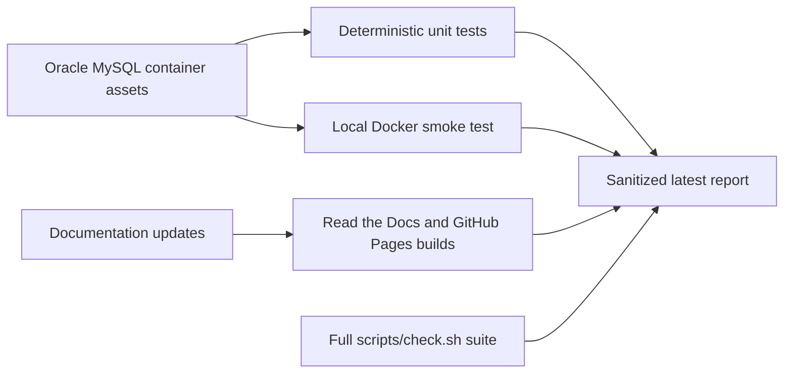

# Latest Test Report

This file is the canonical test report for the repository. It is intentionally
stored at a stable path and should be overwritten when a newer validation run is
performed. Do not create or commit timestamped copies of this report.

The report is sanitized. It must never contain server addresses, usernames,
passwords, tokens, certificate contents, private keys, Oracle wallet material,
full connection strings, sensitive subjects, sensitive payloads, container IDs,
generated database passwords, or full raw logs from live systems.

## Report Summary

| Field | Value |
| --- | --- |
| Overall result | Pass |
| Report generated | 2026-05-25 issue `#247` Oracle MySQL test container validation |
| Project version | `0.4.0` post-release development for `v0.4.1` |
| Python version | 3.12.4 |
| Git revision checked | Branch `issue-247-oracle-mysql-test-container`, base revision `e954d14` with local issue changes |
| Live NATS details | Not used by this issue-specific Docker test |
| Live Oracle Database details | Not used by this issue-specific Docker test |
| Live Oracle MySQL details | Local short-lived Docker container only; generated credentials and container identifiers redacted |

This refresh covered issue `#247`, adding a local Oracle MySQL test database
container for future Oracle MySQL sink development. The implementation adds an
Oracle Linux 9 slim based Dockerfile, explicit Oracle MySQL 9.7.0 LTS package
selection, a test-only entrypoint, generated per-run credentials, loopback-only
random host-port exposure, cleanup-by-default behavior, deterministic unit
tests, dedicated documentation, and a Docker smoke runner that verifies table
creation plus one insert/read cycle. The Oracle MySQL sink itself remains
separate backlog work and was not implemented by this issue.



## Core And Repository Validation

| Check | Result |
| --- | --- |
| Ruff format | Pass, `195 files already formatted` after formatting the new test file |
| Ruff lint | Pass |
| Mypy | Pass, no issues in `76` source files |
| Version metadata consistency | Pass for `0.4.0` |
| Dependency manifests | Pass, manifest files up to date |
| Backlog item validation | Pass, `141` backlog items validated |
| Bug report validation | Pass, `65` bug report items validated |
| PyPI-facing Markdown links | Pass |
| Secret scan | Pass, no high-confidence secret material found |
| Bandit | Pass with existing reviewed `nosec` warnings for Oracle dynamic SQL builders |
| Package build | Pass, sdist and wheel built |
| SBOM generation | Pass, CycloneDX JSON and XML generated |
| Checksum generation | Pass, `dist/SHA256SUMS` generated |
| Twine metadata check | Pass for retained distributions |

## Test Results

| Test Area | Command | Result |
| --- | --- | --- |
| Oracle MySQL container focused unit tests | `python -m pytest tests/unit/test_oracle_mysql_test_container.py -q` | Pass, `10 passed` |
| Docker asset focused tests | `python -m pytest tests/unit/test_oracle_mysql_test_container.py tests/unit/test_docker_assets.py -q` | Pass, `20 passed` |
| Main repository test suite | `scripts/check.sh` | Pass, `844 passed, 9 skipped` |
| Encryption and sink contract subset | `scripts/check.sh` | Pass, `123 passed` |
| Sink capability subset | `scripts/check.sh` | Pass, `104 passed` |
| Documentation builds | `scripts/check.sh` | Pass for Read the Docs and GitHub Pages MkDocs builds |

The skipped tests are the existing environment-gated live NATS and Oracle
Database integration tests. They require explicit local services or environment
flags and were not required for issue `#247`.

## Oracle MySQL Docker Smoke Evidence

The optional local Docker smoke test was executed with the local Docker daemon:

```bash
python scripts/run-oracle-mysql-container-smoke.py
```

Sanitized result:

```text
Oracle MySQL container smoke test passed with one verified test record.
```

The smoke test verified:

- local image build from Oracle Linux 9 slim;
- Oracle MySQL 9.7.0 LTS package installation from Oracle package repositories;
- fresh generated root and application credentials;
- random container name, Docker volume, and loopback host port;
- Oracle MySQL readiness through the generated test account;
- test table creation;
- one insert/read verification cycle;
- cleanup of the container, Docker volume, and generated secret files by
  default.

Docker image inspection confirmed the expected image metadata:

```text
base.name=container-registry.oracle.com/os/oraclelinux:9-slim
version=9.7.0
```

During development, two hardened-runtime startup issues were found and fixed
inside the feature branch before completion:

- the initial `--cap-drop ALL` profile was too restrictive for a fresh Oracle
  MySQL data-volume bootstrap, so the smoke runner now drops all capabilities
  and adds only `CHOWN`, `DAC_OVERRIDE`, `FOWNER`, `SETGID`, and `SETUID`;
- Oracle MySQL initialization attempted to write its default error log under
  `/var/log` on a read-only root filesystem, so initialization logging now uses
  the writable `/tmp` tmpfs path.

No generated passwords, container IDs, local host paths, or private endpoints
are included in this report.

## Documentation Evidence

The following documentation was updated and built successfully:

- [Oracle MySQL Test Container](oracle-mysql-test-container.md)
- [Testing](testing.md)
- [Local Docker Stack](docker.md)
- [Sink Framework](sink-framework.md)
- [Roadmap](roadmap.md)
- [Home](index.md)

The README and changelog were also updated for issue `#247`.
