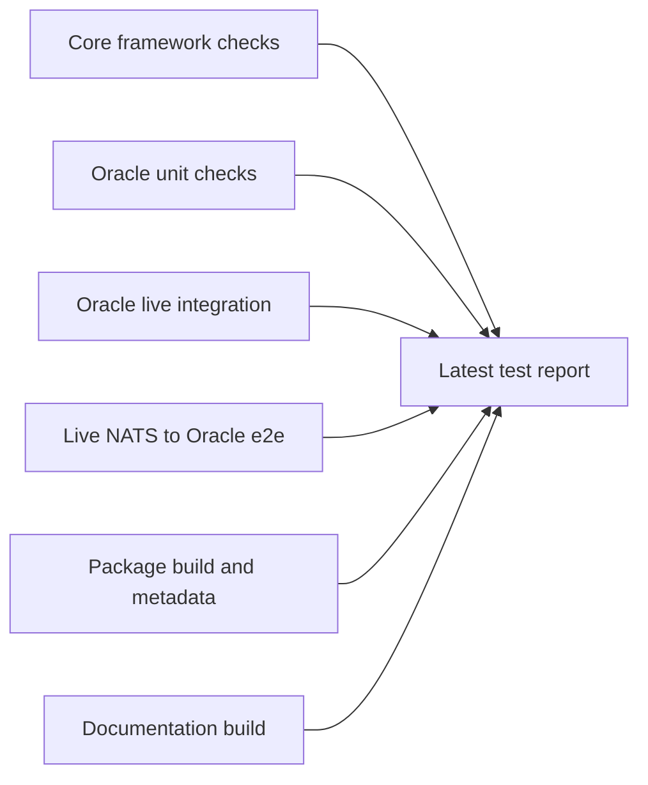
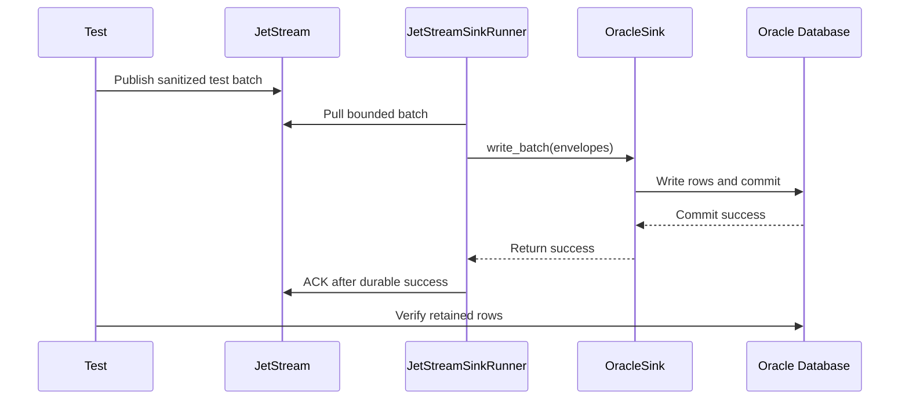

# Latest Test Report

This file is the canonical test report for the repository. It is intentionally
stored at a stable path and should be overwritten when a newer validation run is
performed. Do not create or commit timestamped copies of this report.

The report is sanitized. It must never contain server addresses, usernames,
passwords, tokens, certificate contents, private keys, Oracle wallet material,
full connection strings, sensitive subjects, sensitive payloads, or full raw
logs from live systems.

## Report Summary

| Field | Value |
| --- | --- |
| Overall result | Pass |
| Report generated | 2026-05-17 21:01:04 CEST |
| Project version | 0.1.0 |
| Python version | 3.12.4 |
| Git revision checked | `d4dbebe` |
| Worktree state | Active development workspace with uncommitted changes |
| Live NATS details | Redacted |
| Live Oracle details | Redacted |

The validation run covered the core framework, documentation, package build,
Oracle sink unit and integration behavior, and a live NATS-to-Oracle
end-to-end path.



## Report Retention Policy

Only this latest report should be preserved in the repository. Raw command
output, live environment files, CA files, Oracle wallets, connection strings,
and local service details belong under ignored `.local/` paths or in local
terminal history, not in git.

When refreshing this report:

1. Run the required checks.
2. Record only sanitized command names and summarized outcomes.
3. Replace this file in place.
4. Do not include environment variable values, connection strings, service
   endpoints, usernames, certificates, passwords, tokens, wallet contents, or
   sensitive message bodies.

## Core Framework

The core section validates package-wide behavior that must remain true for all
current and future sinks. This includes configuration parsing, secret
redaction, immutable envelope behavior, payload normalization, metadata
capture, batching, retry policy, sink registry behavior, commit-then-ACK
ordering, DLQ-before-ACK ordering, and deterministic unhappy-path handling.

| Check | Command | Result | Sanitized outcome |
| --- | --- | --- | --- |
| Formatting | `ruff format --check .` | Pass | 56 files already formatted |
| Linting | `ruff check .` | Pass | All checks passed |
| Type checking | `mypy src` | Pass | No type issues in 31 source files |
| Unit and gated test suite | `python -m pytest -q` | Pass | 90 passed, 8 skipped |
| Documentation build | `mkdocs build --strict` | Pass | Documentation built successfully |
| Package build | `python -m build` | Pass | Source distribution and wheel built |
| Package metadata | `twine check dist/*` | Pass | Wheel and source distribution passed |
| Security scan | `scripts/security.sh` | Pass | Bandit completed; SQL construction warnings are covered by explicit identifier validation and `nosec` annotations |
| Import smoke test | Python import command | Pass | Public runner, envelope, sink protocol, and Oracle sink imports succeeded |
| CLI smoke test | `nats-sink --help` and `nats-sink validate examples/oracle-jetstream/config.json` | Pass | CLI help rendered and example config validated |

The skipped tests in the normal pytest run are external-service integration
tests. They are intentionally guarded behind integration markers and explicit
environment variables so unit test runs stay deterministic and do not make
network calls.

### Core Failure Paths Covered

The test suite includes deterministic checks for these non-happy paths:

- malformed JSON payloads do not crash the core processing path,
- non-JSON text can be persisted through the shared JSON payload envelope,
- empty payload bodies are wrapped and persisted rather than crashing,
- non-UTF-8 bytes are base64-wrapped for JSON storage,
- sink failures do not ACK JetStream messages,
- permanent failures publish to DLQ before ACKing the original message,
- DLQ publish failures do not ACK the original message,
- invalid NATS and Oracle configuration is rejected with clear framework
  errors,
- invalid SQL identifiers and invalid subject route patterns are rejected.

## Oracle Sink

The Oracle section validates Oracle-specific behavior while keeping endpoint,
credential, wallet, and service-name details out of the report.

| Check | Command | Result | Sanitized outcome |
| --- | --- | --- | --- |
| Oracle-focused unit coverage | Included in `python -m pytest -q` | Pass | SQL generation, mapping, routing, payload, and sink contract tests passed |
| Live Oracle integration | `python -m pytest -q -s -m integration tests/integration/test_oracle_sink.py` | Pass | 4 passed |
| Retained Oracle integration table | `NATS_SINKS_ORACLE_TEST_EVENTS` | Pass | Table kept after the run |
| Cleanup flags | `NATS_SINKS_ORACLE_DROP_TABLE_BEFORE=false`, `NATS_SINKS_ORACLE_DROP_TABLE_AFTER=false` | Pass | No cleanup requested |

The live Oracle integration run verified:

- table creation can be performed when enabled for the test table,
- a normal batch can be written and committed,
- duplicate redelivery is idempotent in `merge` mode,
- non-JSON text payloads are stored as JSON payload envelopes,
- empty payload bodies are stored as JSON payload envelopes,
- the test table remains available for inspection after the run.

## Live NATS To Oracle End-To-End

The end-to-end section validates the complete live path from NATS JetStream to
Oracle through the core runner and Oracle sink. The report omits all live
service details.



| Check | Command | Result | Sanitized outcome |
| --- | --- | --- | --- |
| Live e2e | `scripts/run-oracle-e2e.sh --table NATS_SINKS_E2E_EVENTS_V2 --message-count 250 --batch-size 64` | Pass | 1 passed |
| Message count | Configured test parameter | Pass | 250 messages |
| Batch count | Captured timing metric | Pass | 4 batches |
| Final partial batch | Captured current-batch-size metric | Pass | 58 messages |
| Backend write timing | Captured timing metric | Pass | 3.040223 seconds total, 82.23 messages/second |
| Retained e2e table | `NATS_SINKS_E2E_EVENTS_V2` | Pass | Table kept after the run |
| Cleanup flags | Defaults | Pass | Drop before=false, drop after=false |

The e2e run verified:

- the runner consumed messages from a durable pull consumer,
- Oracle committed the rows before JetStream ACKs were complete,
- there were no pending ACKs on the test consumer after processing,
- the expected row count was present in Oracle,
- missing `Nats-Msg-Id` headers did not crash processing,
- present NATS-reserved headers were captured in `METADATA_JSON`,
- wildcard subscription behavior was exercised through separate subscribe and
  publish subjects,
- empty message bodies were persisted without crashing,
- non-JSON encrypted-text-style messages were persisted through the standard
  payload envelope,
- the final partial batch was written and ACKed without waiting for 64
  messages,
- backend write timing was captured for the sink write path.

The timing result is a functional test observation from the current test
environment, not a production benchmark. Production throughput depends on NATS
placement, Oracle service class, Oracle wallet/TLS configuration, batch size,
payload size, table indexes, commit frequency, and network latency.

## Future Sink Sections

When additional sinks are implemented, add a new section using the same shape:

- sink-specific unit checks,
- sink-specific integration checks,
- retained test resource policy,
- cleanup flags and defaults,
- failure paths covered,
- known limitations,
- sanitized performance observations when available.

Future reports should keep the same rule: summarize outcomes, never paste raw
logs or live environment details.

## Known Limitations Of This Report

- Coverage percentages were not captured in this report.
- The e2e timing is not a controlled benchmark.
- Integration results depend on external services and are not reproduced by
  the default unit-test-only CI path.
- The active development worktree had uncommitted changes when this report was
  generated.

## Refresh Checklist

Run the following local checks for a full report refresh:

```bash
ruff format --check .
ruff check .
mypy src
python -m pytest -q
mkdocs build --strict
python -m build
twine check dist/*
```

Run the live Oracle checks only with ignored local environment files:

```bash
python -m pytest -q -s -m integration tests/integration/test_oracle_sink.py
scripts/run-oracle-e2e.sh --table NATS_SINKS_E2E_EVENTS_V2 --message-count 250 --batch-size 64
```

Before committing a refreshed report, scan it for secrets and live identifiers.
The report should describe what was tested, not where or with which private
credentials it was tested.
