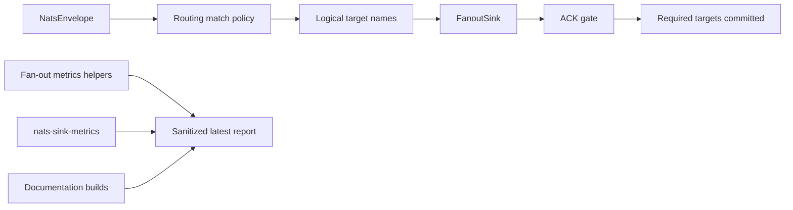

# Latest Test Report

This file is the canonical test report for the repository. It is intentionally
stored at a stable path and should be overwritten when a newer validation run is
performed. Do not create or commit timestamped copies of this report.

The report is sanitized. It must never contain server addresses, usernames,
passwords, tokens, certificate contents, private keys, Oracle wallet material,
full connection strings, sensitive subjects, sensitive payloads, container IDs,
generated database passwords, or full raw logs from live systems.

## Report Summary

| Field | Value |
| --- | --- |
| Overall result | Pass |
| Report generated | 2026-05-26 issue `#133` validation for upcoming `v0.4.2` development |
| Project version | `0.4.1` package metadata with `v0.4.2` development changes |
| Python version | 3.12.4 |
| Git revision checked | Branch `issue-133-core-fanout-orchestration` based on `release-v0.4.2` |
| Live NATS details | Environment-gated live tests skipped unless explicitly enabled |
| Live Oracle Database details | Environment-gated live tests skipped unless explicitly enabled |
| Live Oracle MySQL details | Environment-gated live tests skipped unless explicitly enabled |

This refresh covered production fan-out sink orchestration for issue `#133` and
a full local regression cycle for the current development branch. The new tests
prove that `sink.type: "fanout"` can route one NATS message to one or more named
child sinks, enforce required-versus-optional ACK gates, tolerate bounded
optional waits, reject or ignore unmatched messages according to policy, and
validate a NATO SECRET / NATO UNCLASS fan-out example without contacting live
infrastructure.

## Core And Repository Validation

| Check | Result |
| --- | --- |
| Ruff format | Pass, `226 files already formatted` |
| Ruff lint | Pass |
| Mypy | Pass, no issues in `90` source files |
| Version metadata consistency | Pass for `0.4.1` |
| Dependency manifests | Pass, manifest files up to date |
| Backlog item validation | Pass, `142` backlog items validated |
| Bug report validation | Pass, `87` bug report items validated |
| PyPI-facing Markdown links | Pass |
| Secret scan | Pass, no high-confidence secret material found |
| Bandit | Pass with reviewed `nosec` annotations for validated SQL identifier builders |
| Package build | Pass, sdist and wheel built |
| SBOM generation | Pass, CycloneDX JSON and XML generated |
| Checksum generation | Pass, `dist/SHA256SUMS` generated |
| Twine metadata check | Pass for retained distributions |

## Test Results

| Test Area | Command | Result |
| --- | --- | --- |
| Fan-out focused tests | `python -m pytest tests/unit/test_fanout_sink.py tests/unit/test_fanout_certification.py tests/unit/test_fanout_observability.py tests/unit/test_fanout_ack_gate.py tests/unit/test_named_sinks.py tests/unit/test_routing_policy.py tests/unit/test_public_api.py -q` | Pass, `86 passed` |
| Main repository test suite | `scripts/check.sh` | Pass, `992 passed, 10 skipped` |
| Encryption and sink contract subset | `scripts/check.sh` | Pass, `123 passed` |
| Sink capability subset | `scripts/check.sh` | Pass, `117 passed` |
| Documentation builds | `scripts/check.sh` | Pass for Read the Docs and GitHub Pages MkDocs builds |
| Example validation | `nats-sink validate examples/named-multi-sink/config.json` through unit/CLI coverage | Pass |

The skipped tests are the existing environment-gated live NATS, Oracle
Database, and Oracle MySQL integration tests. Issue `#133` adds generic fan-out
orchestration in front of existing sink implementations. The feature is covered
with unit, CLI validation, sink certification, documentation build, package
build, SBOM, checksum, secret-scan, and repository smoke validation.

## Fan-Out Orchestration Evidence

The new unit coverage verifies:

- a fan-out configuration must enable routing and define named child sinks;
- one message can be delivered to multiple child sinks;
- mixed batches are split per selected target without delivering unrelated
  messages to a child sink;
- required child sink failure blocks ACK eligibility and surfaces as a temporary
  sink failure;
- optional child sink failure or timeout does not block required ACK
  eligibility;
- `no_match: reject` and `no_match: ignore` are both honored;
- the JetStream runner leaves a message unacked when required fan-out delivery
  fails after a partial child-sink success;
- CLI validation accepts the tracked fan-out example and rejects unknown target
  names before runtime;
- fan-out aggregate metrics remain payload-free and sink-name-free.

## Issues Found During Validation

No new product bugs were found during issue `#133` validation. The first full
check stopped on formatting for the new fan-out sink implementation file. Ruff
formatting was applied. A later privacy hardening pass removed child sink names
from fan-out ACK-gate exception messages, which required one test to assert the
internal `.sink` attribute instead of matching the operator-facing message. The
final `scripts/check.sh` cycle then passed.

## Documentation Evidence

The following public documentation was updated and built successfully:

- [README](https://github.com/ProjectCuillin/nats-sinks/blob/main/README.md)
- [Configuration](configuration.md)
- [Sink Framework](sink-framework.md)
- [Sink Certification](sink-certification.md)
- [Testing](testing.md)
- [Development](development.md)
- [Architecture](architecture.md)
- [Operations](operations.md)
- [Metrics](metrics.md)
- [Observability](observability.md)
- [Prometheus Integration](prometheus.md)
- [Named Sinks And Routing](named-sinks.md)
- [Fan-Out Example](https://github.com/ProjectCuillin/nats-sinks/blob/main/examples/fanout/config.json)
- [Idempotency](idempotency.md)
- [Security](security.md)
- [File Sink](file-sink.md)
- [Oracle Sink](oracle-sink.md)
- [Named Multi-Sink Example](https://github.com/ProjectCuillin/nats-sinks/blob/main/examples/named-multi-sink/config.json)
- [Documentation Home](index.md)

The changelog, backlog metadata, public API contract tests, route policy tests,
ACK-gate tests, sink certification tests, and fan-out orchestration tests were
also updated for issue `#133`.
