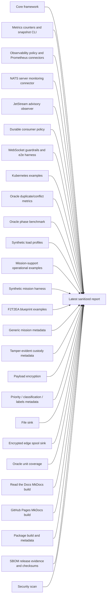
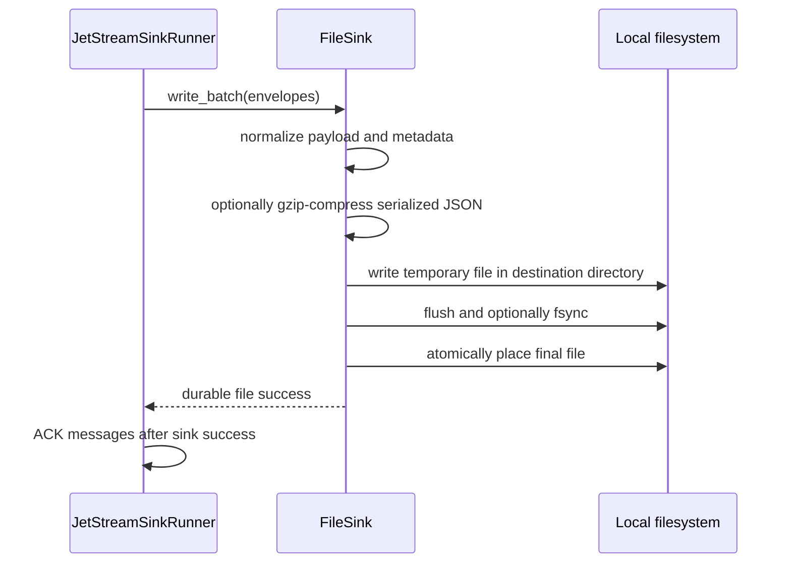
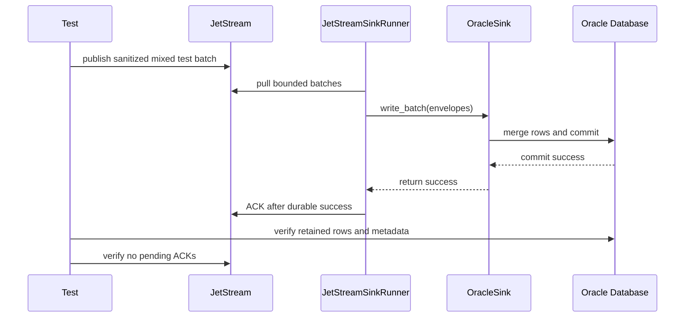
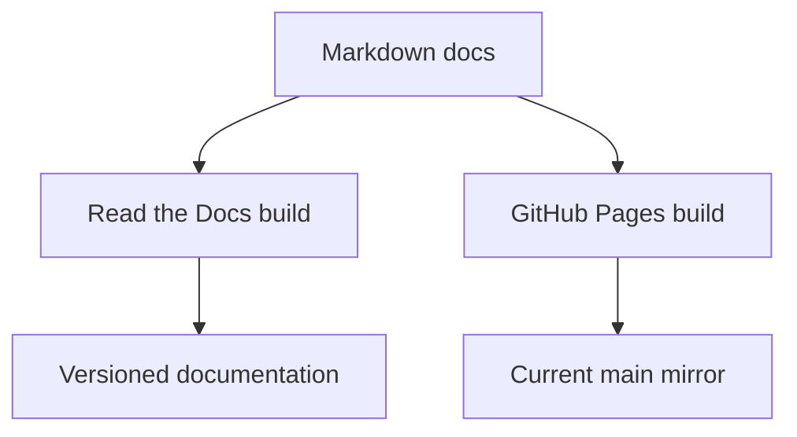
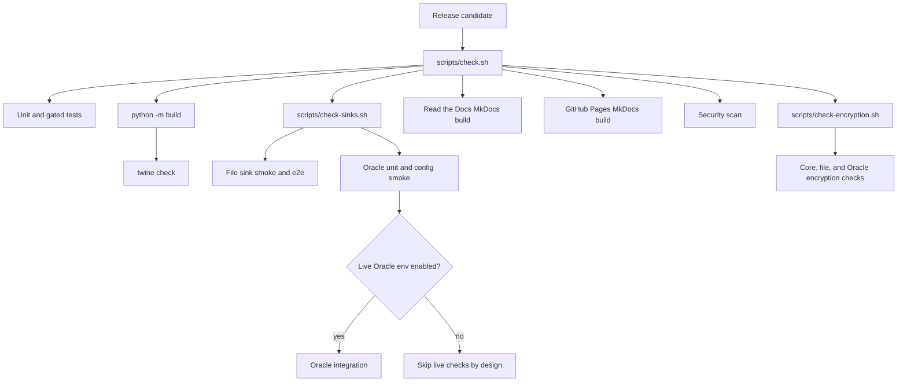

# Latest Test Report

This file is the canonical test report for the repository. It is intentionally
stored at a stable path and should be overwritten when a newer validation run is
performed. Do not create or commit timestamped copies of this report.

The report is sanitized. It must never contain server addresses, usernames,
passwords, tokens, certificate contents, private keys, Oracle wallet material,
full connection strings, sensitive subjects, sensitive payloads, or full raw
logs from live systems.

## Report Summary

| Field | Value |
| --- | --- |
| Overall result | Pass |
| Report generated | 2026-05-22 22:31:39 CEST |
| Project version | `0.4.0` post-release development |
| Python version | 3.12.4 |
| Git revision checked | Active `release-v0.4.1` hierarchical branch workflow workspace |
| Worktree state | Active issue branch for issue `#51` with encrypted edge spool-and-forward sink implementation, `nats-sink replay-spool` CLI support, spool documentation, example configuration, updated backlog metadata for release `v0.4.1`, and the previously validated `release-v0.4.1` capability set covering branch workflow automation, connector framework, stream planning, WebSocket guardrails, Oracle high-throughput staging, custody metadata, advisory observation, durable consumer management, richer consumer policy controls, NATS no-echo, OTLP export, secure-development hardening, strict JSON config loading, log-injection sanitization, secret scanning, public API compatibility tests, GitHub Dependency Graph manifests, sanitized backlog tooling, release-gated close automation, standardized SPDX headers, metrics snapshots and CLI, observability policy core, Prometheus and NATS monitoring connectors, Kubernetes examples, systemd installer, NATS reconnect tuning, least-privilege NATS permission templates, JetStream topology guidance, retry backoff with jitter, priority-aware lanes, synthetic mission testing, mission-support examples, SBOM generation, release checksums, hash-verified installation guidance, property-style tests, defence and mission-support blueprints, generic mission metadata, payload encryption, and Oracle/file sink support |
| Live NATS details | Redacted |
| Live Oracle details | Redacted |

This refresh also included live WebSocket/NATS and NATS-to-Oracle validation.
The first Oracle e2e attempt intentionally kept the retained test table and
failed closed because that table was stale and missing newer metadata columns.
That was treated as an environment/schema hygiene finding rather than a product
bug because the harness reported a clear operator-facing message and the same
test passed after recreating the configured test table. A direct Oracle
integration invocation also failed inside the local sandbox at DNS resolution;
the same test passed when rerun with explicit network permission, confirming
that it was a sandbox reachability condition rather than sink behavior.

This validation refresh covered the new encrypted edge spool sink and replay
command for issue `#51`, plus the core framework, strict JSON configuration
loading, safe log formatting, high-confidence secret scanning, the 316-control
security rule review, additional project-specific controls, expanded public API
compatibility checks and documentation, release-version consistency automation, clearer basic
metrics counters, WebSocket transport guardrails, optional WebSocket connection
headers, a collision-safe local WebSocket certification harness, local JSON metrics snapshots, the `nats-sink-metrics`
inspection CLI, the `nats-sink-observe` observability policy CLI,
policy-controlled Prometheus textfile export, optional native Prometheus HTTP
endpoint support, the disabled-by-default OpenTelemetry OTLP metrics
connector, the disabled-by-default NATS server monitoring connector,
optional disabled-by-default JetStream advisory observation with sanitized
low-cardinality counters, explicit durable pull-consumer management with
fail-closed drift validation, richer durable consumer policy controls for
plural filter subjects, server-side BackOff, replicas, memory storage, and
bounded consumer metadata, optional NATS no-echo connection configuration,
Kubernetes deployment examples with JSON ConfigMaps, Secret references,
mounted trust material, resource limits, security contexts, graceful shutdown
settings, and optional Prometheus observability sidecars,
Oracle high-throughput staging-table merge mode with transaction and rollback
coverage, Oracle duplicate/conflict metrics
exposed through the same CLI, clearer Oracle operator-facing schema/privilege
error messages, NATS reconnect tuning and connection event metrics,
least-privilege NATS permission templates for runtime, DLQ, management, and
advisory-reader accounts, advanced JetStream topology guidance for mirrors,
sources, transforms, republish behavior, compression, placement, metadata, and
idempotency review, exponential retry backoff with jitter controls,
priority-aware processing lanes with weighted starvation controls and
aggregate non-sensitive metrics, Oracle
benchmark scripts with publish, fetch, map, write, commit, ACK, retry, and
shutdown phase timing, sanitized synthetic load-test profiles for normal,
retry, DLQ, shutdown, optional encryption-workload, and metrics-snapshot
behavior, mission-support operational examples for restricted event storage,
disconnected file handoff, DLQ triage and replay preparation,
and destination outage recovery, runner metrics contract tests, global and
subject-specific payload encryption, global and subject-specific
priority/classification/labels message metadata defaults, generic mission
metadata validation and storage, tamper-evident custody metadata with
deterministic payload/metadata/record hashes, file sink, Oracle unit coverage, the
deterministic synthetic mission scenario harness and local file-sink smoke
adapter, the F2T2EA event phase tagging blueprint with tracked example
validation, the expanded defence and mission-support blueprint set for sensor
event custody, classification and labels, chain of custody, cross-domain
handoff preparation, edge operation, and audit-oriented persistence,
Mermaid-enabled documentation builds for both Read the Docs and GitHub Pages,
CLI smoke checks, package build, metadata validation, security
scanning, GitHub Dependency Graph manifest generation and drift checks, local
backlog item validation, exact-marker GitHub issue sync tooling, sanitized
backlog comment tooling, completed-label workflow support, stricter issue
lifecycle enforcement, sanitized GitHub issue synchronization for managed
issues, including the scoped GoldenGate-inspired sink candidate sync that
created issues `#158` through `#190`, standardized SPDX source headers across
Python and shell files,
CycloneDX SBOM generation, release checksum manifest generation,
hash-verified installation guidance, standalone systemd installer
asset-fetch and package-spec checks, deterministic bounded property-style
generator tests for security-sensitive validators and normalizers, and the
file sink path sanitizer regression tracked as bug issue `#62`, synthetic
load-profile phase-rate reporting tracked as bug issue `#63`, Oracle benchmark
non-message phase-rate reporting tracked as bug issue `#64`, finite metrics
snapshot hardening tracked as bug issue `#65`, strict NATS monitoring JSON
handling tracked as bug issue `#66`, and strict payload JSON constant handling
tracked as bug issue `#67`. The regular pytest command still skips live NATS
and Oracle tests unless the explicit integration flags are set; separate
release-prep live NATS-to-Oracle and Oracle benchmark smoke runs were executed
and are recorded below.



## Report Retention Policy

Only this latest report should be preserved in the repository. Raw command
output, live environment files, CA files, Oracle wallets, connection strings,
and local service details belong under ignored `.local/` paths or in local
terminal history, not in git.

When refreshing this report:

1. Run the required checks.
2. Record only sanitized command names and summarized outcomes.
3. Replace this file in place.
4. Do not include environment variable values, connection strings, service
   endpoints, usernames, certificates, passwords, tokens, wallet contents, or
   sensitive message bodies.

## Current Workspace Validation

The current workspace is prepared on the `release-v0.4.1` branch after the
published `0.4.0` release and has passed local validation. It includes:

- encrypted edge spool-and-forward work for issue `#51`, including
  `nats_sinks.spool.SpoolSink`, secure-by-default record-level encryption,
  bounded record and byte limits, deterministic idempotency-key filenames,
  duplicate-redelivery handling, priority-aware replay, safe cleanup after
  target sink success, `nats-sink replay-spool`, an example configuration, and
  documentation in the Sinks, Operations, Security, CLI, Idempotency, and
  Configuration pages. Focused spool and CLI tests passed with `26 passed`;
  the full local project validation passed with `scripts/check.sh`, including
  `639 passed, 8 skipped` in the main pytest run, `120 passed` in the
  encryption and sink contract suite, and `104 passed` in the sink-focused
  suite,
- GoldenGate-inspired sink candidate research added on 2026-05-23, including a
  dedicated documentation page, roadmap updates, changelog entry, and 33
  scoped managed backlog items synced to GitHub as issues `#158` through
  `#190`. Targeted validation for this documentation and backlog-only change
  passed with backlog JSON validation, Ruff formatting check, Ruff lint,
  MkDocs strict build, and backlog sync unit tests,
- full validation on 2026-05-22 with `scripts/check.sh`, the local WebSocket
  e2e harness, direct Oracle integration tests, and live NATS-to-Oracle e2e
  runs. The live Oracle checks covered 256-message non-encrypted delivery,
  256-message AES-256-GCM encrypted delivery with decrypt verification,
  250-message partial-final-batch delivery with `batch_size=64`, and
  128-message AES-256-CCM encrypted delivery with decrypt verification. No new
  product bugs were identified during this run,
- sink certification contract work for issue `#41`, including a documented
  release gate, reusable `nats_sinks.testing` certification helpers, FileSink
  lifecycle/write/duplicate certification coverage, Oracle durable-success
  certification with a fake committed connection, public API coverage, and
  `scripts/check-sinks.sh` enforcement. Full local validation after this work
  passed with `622 passed, 8 skipped` in the main pytest run, `120 passed` in
  the encryption and sink contract suite, and `104 passed` in the
  sink-focused suite; Ruff, mypy, documentation builds, security scan, package
  build, SBOM generation, checksum generation, and Twine checks also passed,
- safe sink connector framework work for issue `#35`, including
  `SinkConnector` metadata, explicit `SinkRegistry` connector registration,
  built-in first-party Oracle and FileSink descriptors, optional
  disabled-by-default allow-listed entry-point discovery for reviewed external
  connectors, plugin configuration validation, public API compatibility
  coverage, security guidance, and connector development documentation,
- researched and synchronized GitHub backlog items for Oracle-family connector
  candidates, Palantir Foundry and Palantir Gotham, and low-priority
  Kafka-style destination patterns such as search, warehouse, object storage,
  stream, document database, key-value, and wide-column sinks,
- full local validation after the connector framework implementation:
  `scripts/check.sh` passed with `616 passed, 8 skipped` in the main pytest
  run, `120 passed` in the encryption and sink contract suite, and `98 passed`
  in the sink suite; Ruff format/check, mypy, backlog and bug manifest
  validation, PyPI-facing Markdown link checks, documentation builds,
  CLI smoke checks, high-confidence secret scan, Bandit, package build,
  SBOM/checksum generation, and Twine metadata checks also passed,
- WebSocket transport guardrails for issues `#129`, `#130`, and `#132`,
  including fail-closed mixed transport rejection, credential-free NATS URLs,
  secure WebSocket TLS context construction with local CA support, optional
  redacted WebSocket connection headers, a reusable collision-safe harness, and
  `scripts/run-websocket-e2e.sh` for optional local WebSocket certification,
- bug issue `#139`, which fixed the new WebSocket harness unit tests so they
  mock port probes instead of binding sockets, preserving the no-network unit
  test rule,
- bug issue `#140`, which fixed noisy transient startup tracebacks in the
  optional WebSocket e2e script by waiting for the temporary local WebSocket
  listener before invoking the NATS client,
- full local validation after the WebSocket implementation:
  `scripts/check.sh` passed with `575 passed, 8 skipped` in the main pytest
  run, `108 passed` in the encryption and runner-ordering suite, and
  `85 passed` in the sink suite; Ruff format/check, mypy, backlog and bug
  manifest validation, Markdown link checks, documentation builds, CLI smoke
  checks, high-confidence secret scan, Bandit, package build, SBOM/checksum
  generation, and Twine metadata checks also passed,
- optional local WebSocket e2e validation passed with synthetic messages and a
  non-even batch size, selecting local loopback ports, writing all messages
  through the file sink, and reporting clean sanitized JSON output,
- optional JetStream advisory observation for issue `#18`, disabled by
  default, isolated from sink ACK behavior, bounded by safe JSON parsing and
  advisory-subject validation, and exposed through sanitized low-cardinality
  metrics for selected `$JS.EVENT.ADVISORY...` subjects,
- full local validation after the JetStream advisory implementation:
  `scripts/check.sh` passed with `522 passed, 8 skipped` in the main pytest
  run, `108 passed` in the encryption and runner-ordering suite, and
  `85 passed` in the sink suite; Ruff format/check, mypy, documentation
  builds, Markdown link checks, high-confidence secret scan, Bandit, package
  build, SBOM/checksum generation, and Twine metadata checks also passed,
- explicit durable pull-consumer management for issue `#19`, including
  `bind_only`, `create_if_missing`, and `reconcile` modes, safe startup drift
  validation for filter subject, explicit ACK policy, pull-consumer shape,
  AckWait, MaxDeliver, MaxAckPending, MaxWaiting, and headers-only state,
  plus least-privilege permission guidance,
- full local validation after the consumer-management implementation:
  `scripts/check.sh` passed with `534 passed, 8 skipped` in the main pytest
  run, `108 passed` in the encryption and runner-ordering suite, and
  `85 passed` in the sink suite; Ruff format/check, mypy, documentation
  builds, Markdown link checks, high-confidence secret scan, Bandit, package
  build, SBOM/checksum generation, and Twine metadata checks also passed,
- richer durable consumer policy configuration for issue `#20`, including
  bounded `filter_subjects`, server-side `backoff_seconds`, `num_replicas`,
  `memory_storage`, bounded consumer `metadata`, fail-closed unsafe-combination
  validation, and drift detection for existing durable pull consumers,
- full local validation after the richer consumer-policy implementation:
  `scripts/check.sh` passed with `543 passed, 8 skipped` in the main pytest
  run, `108 passed` in the encryption and runner-ordering suite, and
  `85 passed` in the sink suite; Ruff format/check, mypy, documentation
  builds, Markdown link checks, high-confidence secret scan, Bandit, package
  build, SBOM/checksum generation, and Twine metadata checks also passed,
- optional NATS no-echo connection configuration for issue `#25`, including a
  default-off `nats.no_echo` JSON field, an environment override, `nats-py`
  option construction, and documentation explaining that no-echo is mainly for
  reviewed same-connection publish/subscribe policies rather than normal
  JetStream pull-consumer sink delivery,
- full local validation after the no-echo implementation:
  `scripts/check.sh` passed with `545 passed, 8 skipped` in the main pytest
  run, `108 passed` in the encryption and runner-ordering suite, and
  `85 passed` in the sink suite; Ruff format/check, mypy, documentation
  builds, Markdown link checks, high-confidence secret scan, Bandit, package
  build, SBOM/checksum generation, and Twine metadata checks also passed,
- quiet hierarchical release and issue branch workflow enforcement prepared on `release-v0.4.1`,
  including active GitHub branch protection for `main`, quiet branch pushes,
  draft pull request helpers, manual release-validation dispatch, pull request
  governance checks, CODEOWNERS review ownership, release workflow validation
  that tags are already merged to `main`, and documentation for maintainers
  and agents,
- full local validation after the hierarchical branch workflow update:
  `scripts/check.sh` passed with `454 passed, 8 skipped` in the main pytest
  run, `86 passed` in the encryption and runner-ordering suite, and
  `72 passed` in the sink suite; documentation build, secret scan, package
  build, SBOM/checksum generation, and Twine metadata checks also passed,
- offline JetStream stream-management planning for issue `#42`, including the
  separate `nats-sink stream-plan` helper, allow-listed retention/discard/
  storage/replica/duplicate-window validation, runtime-versus-administration
  permission guidance, JSON and text output, operations/security/architecture
  documentation, and NATS feature-gap and roadmap updates,
- full local validation after the stream-management helper implementation:
  `scripts/check.sh` passed with `629 passed, 8 skipped` in the main pytest
  run, `120 passed` in the encryption and runner-ordering suite, and
  `104 passed` in the sink suite; Ruff format/check, mypy, documentation
  builds, Markdown link checks, high-confidence secret scan, Bandit, package
  build, SBOM/checksum generation, and Twine metadata checks also passed,
- focused local validation after quieting work-branch GitHub Actions:
  workflow YAML parsed successfully, shell syntax passed for the updated
  release helpers, PyPI-facing Markdown links passed, `git diff --check`
  passed, and `scripts/check-docs.sh` rebuilt both documentation variants,
- Oracle high-throughput staging-table merge mode for issue `#31`, including
  validated `sink.staging` configuration, staging-table DDL helper coverage,
  SQL generation tests, direct and staging write-path contract tests,
  rollback-on-failure coverage, insert-ignore duplicate metrics coverage,
  Oracle documentation updates, performance notes, and security/operations
  guidance,
- full local validation after the Oracle staging-table implementation:
  `scripts/check.sh` passed with `465 passed, 8 skipped` in the main pytest
  run, `92 passed` in the encryption and runner-ordering suite, and
  `83 passed` in the sink suite; Ruff format/check, mypy, documentation build,
  Markdown link checks, high-confidence secret scan, package build,
  SBOM/checksum generation, and Twine metadata checks also passed,
- the non-JSON boundary hardening bug hunt tracked through GitHub issues `#81`
  through `#93`, covering NATS URL scheme validation, NATS authentication
  mutual exclusivity, username/password pairing, TLS context creation for TLS
  seed URLs, retry policy construction guards, exponential backoff overflow
  capping, Oracle payload-field idempotency validation, and NATS JetStream
  metadata normalization,
- focused red/green coverage in
  `tests/unit/test_bug_hunt_non_json_boundaries.py`, which initially failed
  with `13 failed` before implementation and now passes with `13 passed`,
- full local validation after the non-JSON boundary hardening work:
  `scripts/check.sh` passed with `443 passed, 8 skipped` in the main pytest
  run, `86 passed` in the encryption and runner-ordering suite, and
  `72 passed` in the sink suite; documentation build, secret scan, package
  build, SBOM/checksum generation, and Twine metadata checks also passed,
- priority-aware processing lanes for already-fetched bounded batches, with
  validated lane configuration, weighted starvation controls, missing and
  unknown priority handling, malformed priority rejection, aggregate
  non-sensitive lane metrics, commit-then-ACK ordering tests, and explicit
  documentation that the feature does not provide exactly-once processing or
  strict total ordering,
- GitHub issue planning metadata automation for managed bugs and backlog
  items, including local JSON `relationships` validation, generated issue-body
  relationship sections, required live GitHub Issue `Priority` field sync,
  legacy priority-label cleanup for managed issues, native
  GitHub issue dependency sync for `blocked_by` and `blocks`, and a repair
  helper for completed issues whose Acceptance Criteria need to remain checked
  after body refreshes,
- live managed issue maintenance for the current open backlog and bug reports:
  backlog and bug issue bodies were refreshed with the new relationship
  section, completed open issues had Acceptance Criteria restored to checked
  state, `ProjectCuillin` Project `1` was created with a single-select
  `Priority` field, repository variables were set for the sync workflows, and
  `scripts/sync-issue-planning.py --check` validated 85 open managed issues
  against the configured Project,
- a local GitHub CLI authentication preflight helper for maintainer release
  workflows,
- release and publishing documentation for the GitHub CLI authentication
  preflight,
- MkDocs Mermaid fence configuration so Read the Docs and GitHub Pages render
  diagrams from the same Markdown source,
- Read the Docs and GitHub Pages documentation explaining the Mermaid rendering
  setup,
- optional core payload encryption before sink delivery, supporting
  AES-256-GCM and AES-256-CCM through `nats-sinks[crypto]`, with both global
  all-subject policy and ordered subject-specific rules,
- core-normalized `priority`, `classification`, and `labels` message metadata fields with
  configurable NATS header extraction, deployment defaults, subject-specific
  defaults, Oracle column storage, file JSON storage, semicolon-separated
  scalar label storage, and tests for present, missing, explicit-empty, and
  subject-rule values,
- encryption tests for core runner ordering, subject-rule matching and
  exemptions, file sink storage, gzip output, local file e2e, Oracle row
  mapping, and decrypt verification,
- tracked encryption test helper scripts that generate temporary key material
  and delete it by default,
- detailed payload encryption documentation and sink-specific encrypted storage
  guidance,
- detailed labels documentation, including header/default resolution,
  semicolon-separated scalar storage, generic metadata arrays, file sink output
  fields, and Oracle `LABELS` column guidance,
- a public documentation wording refresh that adds subtle mission, defence,
  public-sector, and operational examples where they clarify reliability,
  security, audit, DLQ, encryption, deployment, and sink behavior,
- concrete file sink and Oracle documentation examples showing how encrypted
  payload envelopes, NATO-style classification values, priority, and
  semicolon-separated labels appear in stored files and database rows,
- secure-development guidance in `ROBOTS.md`, `AGENTS.md`, and public security
  documentation covering hostile-input handling, least privilege, fail-closed
  defaults, defense in depth, threat modeling, injection prevention, safe
  logging, bounded resources, dependency hygiene, file safety, deserialization
  safety, and testing expectations,
- strict JSON configuration loading that rejects oversized files, duplicate
  object keys, invalid UTF-8, null roots, and non-object roots,
- log level allow-listing and CLI log formatting that escapes control
  characters before log records reach terminals or collectors,
- a dependency-free high-confidence secret scan wired into
  `scripts/security.sh`, CI, and pre-commit,
- `docs/security-rule-review.md`, which records all 316 maintainer-provided
  secure-development guidance points plus project-specific controls for public
  API compatibility, release-version consistency, generated site output,
  PyPI-safe links, sink capability checks, and security-register maintenance,
- automated release-version consistency checks across `pyproject.toml`,
  `nats_sinks.__version__`, README release text, the documentation home page,
  and `CHANGELOG.md`,
- generated `requirements*.txt` manifests derived from `pyproject.toml` for
  GitHub Dependency Graph, Dependabot, and dependency review workflows,
  including CI and pre-commit drift checks,
- local JSON backlog staging under `backlog/items/`, a GitHub CLI based
  `scripts/sync-backlog-issues.py` tool, a maintainer-run `Backlog Sync`
  workflow, `target_release` labels, 52 detailed roadmap backlog items,
  sanitized comment helper tooling, and validation tests for exact-marker
  issue body lookup and public-leak rejection,
- a detailed OCI Object Storage sink backlog item synced to GitHub issue `#47`,
  covering native OCI SDK usage, workload identity, deterministic object keys,
  duplicate policies, checksums, multipart upload, least-privilege IAM,
  integration testing, and release criteria,
- a deterministic synthetic mission scenario harness under `nats_sinks.testing`
  and `scripts/run-synthetic-harness.py`, covering valid JSON, malformed
  JSON-like text, duplicate idempotency keys, stale timestamps, fake
  encrypted-payload envelopes, NATO-style classification values, priority
  values, labels, empty payloads, sanitized report rendering, and local
  file-sink smoke execution without live services,
- an F2T2EA event phase tagging blueprint under
  `docs/use-cases/defence/f2t2ea-event-phase-tagging.md`, with metadata-only
  scope, explicit non-goals, allowed example phase values, Oracle and file
  storage examples, tracked sanitized JSON examples, and validation tests,
- expanded defence and mission-support blueprint documentation under
  `docs/use-cases/defence/`, covering sensor event custody, classification and
  labels, chain of custody, cross-domain handoff preparation, edge operation,
  and audit-oriented persistence with Mermaid diagrams, explicit non-goals,
  Oracle JSON-column examples, and file sink record-shape examples,
- stricter backlog lifecycle tooling that requires structured start,
  completion, test-plan evidence, and close-out evidence comments; supports
  assignment and Acceptance Criteria checklist completion; and prevents release
  automation from closing issues without checked criteria and evidence,
- standardized SPDX headers across all detected Python and shell files with
  `SPDX-FileCopyrightText: 2026 Johan Louwers <louwersj@gmail.com>` and
  `SPDX-License-Identifier: Apache-2.0`,
- public API compatibility tests for documented package exports, production
  sink imports, sink extension points, configuration helpers, metrics helpers,
  and console-script entry points, plus `docs/public-api.md` explaining the
  compatibility contract for maintainers and external users,
- clearer basic metrics counters and observations for fetched, prepared,
  written, ACKed, NAKed, failed, DLQ, sink write, normalization error,
  encryption error, DLQ publish error, ACK error, last-success, and active
  batch behavior,
- `JsonFileMetrics`, which writes a bounded local JSON metrics snapshot for
  operator scripts and developer diagnostics,
- the standalone `nats-sink-metrics` CLI, including table, JSON, JSONL, shell,
  metric-name, and Prometheus text output, plus stale-snapshot and missing
  metric exit behavior,
- observability policy core under `nats_sinks.observability`, including
  disabled-by-default policies, safe subject hint propagation from runtime
  config, metric allow/deny lists, observation suppression by default, and a
  connector-neutral extension point for future observability platforms,
- the standalone `nats-sink-observe` CLI, including policy generation,
  validation, effective-policy display, metric listing, subject-hint listing,
  and policy-filtered Prometheus textfile rendering,
- a Prometheus textfile connector for node_exporter that reads only local
  metrics snapshots and exports no metrics unless both the global
  observability policy and Prometheus connector are enabled,
- an optional native Prometheus HTTP endpoint that reads the same local
  snapshot and allow-list policy, stays disabled by default, enforces
  stale-snapshot and response-size controls, and runs as a separate
  observability service without changing ACK behavior,
- a disabled-by-default NATS server monitoring connector under
  `nats-sink-observe` that keeps `/jsz`, `/healthz`, and similar NATS server
  endpoints outside the delivery worker while supporting policy-approved
  endpoint polling, field extraction, sanitized local snapshots, optional
  Prometheus rendering, and separate systemd service assets,
- Debian and Oracle Linux systemd assets for running Prometheus textfile export
  as a separate service and timer from the main `nats-sink` worker, plus a
  disabled native Prometheus HTTP service example for direct scrape
  deployments,
- a unified `scripts/install-systemd.sh` installer that detects
  Debian-family systems or Oracle Linux from `/etc/os-release`, with the older
  distribution-specific script paths preserved as compatibility wrappers,
- single-command Debian and Oracle Linux install documentation using the
  GitHub-hosted installer, plus safer download-inspect-run guidance for
  sensitive production environments,
- standalone installer support for fetching required example config and
  systemd unit files from GitHub when the script is run outside a checkout,
  plus tagged-release package-spec defaults that install the matching PyPI
  version unless an operator explicitly sets `NATS_SINKS_PACKAGE_SPEC`,
- Oracle duplicate/conflict counters for idempotent Oracle operations:
  `oracle_conflicts_total`, `oracle_duplicates_total`, and
  `oracle_duplicate_ignored_total`, plus Oracle merge visibility counters for
  no-update duplicates, merge rows, and update-enabled merge rows with unknown
  insert-versus-match outcome, including CLI filtering through
  `nats-sink-metrics show --metric "oracle_*"`,
- Oracle per-route idempotency overrides for subject-to-table routing,
  including inherited defaults, message-ID keys, payload-field keys, and
  route-specific merge update controls,
- core size-policy controls for sink-bound payload bytes, normalized headers,
  labels, mission metadata, standard metadata, approximate record size, and
  accepted batch size before any Oracle, file, or future sink write,
- clearer Oracle runtime errors for `ORA-00904`, `ORA-00942`, and `ORA-01017`
  so schema drift, missing table grants, and authentication failures are
  explained in operator-facing language without logging secrets,
- NATS reconnect tuning fields, multiple seed URL support, and connection event
  metrics for disconnect, reconnect, close, discovered-server, and
  asynchronous error callbacks,
- least-privilege NATS permission templates for runtime worker pull and ACK
  access, DLQ-enabled deployments, optional runtime consumer creation, and
  separate advisory reader accounts, with cross-links from security,
  configuration, operations, DLQ, README, roadmap, and feature-gap
  documentation,
- advanced JetStream topology guidance for mirrors, sources, subject
  transforms, republish behavior, stream compression, placement, metadata, and
  idempotency review questions, including explicit separation between
  documentation guidance and unsupported stream-management behavior,
- exponential retry backoff with fixed, linear, and exponential modes,
  configurable delay caps, `none`/`full`/`equal` jitter, and retry budget
  exhaustion that leaves failed messages redeliverable instead of ACKing them,
- Oracle benchmark scripts and report helpers that measure publish, fetch, map,
  write, commit, ACK, retry, and shutdown phases separately while preserving
  Oracle commit-before-ACK behavior and keeping live environment details out of
  public output,
- `--stream auto` benchmark stream discovery that uses the JetStream stream
  owning the benchmark subject when available, avoiding unsafe overlapping
  stream creation during live tests,
- synthetic load-test profiles and report helpers for normal, retry, DLQ,
  shutdown, optional encryption-workload, and metrics-snapshot behavior without
  connecting to live services,
- Kubernetes deployment examples covering JSON ConfigMaps, Secret references,
  mounted trust material, worker/observability separation, resource limits,
  security contexts, graceful shutdown settings, optional Prometheus HTTP
  sidecars, and NetworkPolicy guidance,
- mission-support operational examples for restricted event storage,
  disconnected file handoff, DLQ triage and replay preparation, and
  destination outage recovery, each with configuration, operational flow,
  failure behavior, sink-specific choices, test guidance, and Mermaid diagrams,
- compatibility aliases for the original metrics names while documentation and
  tests use the clearer preferred names,
- CycloneDX SBOM generation through `scripts/sbom.sh`, with JSON and XML files
  written under `dist/sbom/`, local check and release-build integration, CI
  artifact upload, release workflow attachment to GitHub Releases, and
  documentation explaining that SBOMs are release evidence rather than runtime
  behavior or PyPI distributions,
- SHA-256 release checksum manifest generation through
  `scripts/generate-checksums.py`, release workflow attachment of
  `dist/SHA256SUMS`, and public hash-verified installation guidance for
  wheelhouse-style deployments,
- release workflow automation that closes managed release-labeled backlog
  issues only after the associated GitHub Release has been created or updated
  and after acceptance criteria plus public evidence comments are present,
- deterministic bounded property-style generator tests for subject matching,
  payload normalization, message metadata normalization, mission metadata
  validation, and file path sanitization without adding a new development
  dependency,
- file sink path sanitizer hardening that treats failed string conversion as
  hostile input and returns a bounded fallback component without logging or
  embedding a raw object representation.

## Core Framework

The core section validates package-wide behavior that must remain true for all
current and future sinks. This includes configuration parsing, secret
redaction, immutable envelope behavior, payload normalization, metadata
capture, batching, retry policy, sink registry behavior, commit-then-ACK
ordering, DLQ-before-ACK ordering, and deterministic unhappy-path handling.

| Check | Command | Result | Sanitized outcome |
| --- | --- | --- | --- |
| Formatting | `ruff format --check .` | Pass | 146 files already formatted |
| Linting | `ruff check .` | Pass | All checks passed, including synthetic harness and load-profile source, scripts, and tests |
| Type checking | `mypy src` | Pass | No type issues in 56 source files |
| Version consistency | `python scripts/check-version-consistency.py` | Pass | Package metadata, runtime `__version__`, README, docs home page, and changelog all report `0.4.0` |
| Dependency manifest consistency | `python scripts/update-dependency-manifests.py --check` | Pass | Generated `requirements*.txt` files are in sync with `pyproject.toml` for GitHub Dependency Graph and Dependabot visibility |
| Local backlog validation | `python scripts/sync-backlog-issues.py --check` | Pass | Validated 136 local backlog item JSON files; validation rejects common public-leak patterns before issue bodies are generated |
| Local bug report validation | `python scripts/sync-bug-reports.py --check` | Pass | Validated 39 local bug report JSON files, including the file path sanitizer, synthetic reporting, metrics, NATS monitoring, payload serialization, NATS auth, retry-policy, Oracle idempotency, MkDocs build isolation, metrics CLI CI repair, release workflow artifact separation, and other regression reports |
| OCI Object Storage backlog sync | `python scripts/sync-backlog-issues.py --directory /private/tmp/nats-sinks-oci-backlog-sync` | Pass | Created GitHub issue `#47` from the scoped validated backlog item without publishing secrets or private service details |
| GoldenGate-inspired sink backlog sync | `python scripts/sync-backlog-issues.py --directory /private/tmp/nats-sinks-goldengate-backlog-sync --issue-priority-field Priority --issue-priority-field-id 41029122` | Pass | Created managed GitHub issues `#158` through `#190` from 33 scoped validated backlog items without publishing secrets, private service addresses, credentials, or payload material |
| GoldenGate-inspired backlog tests | `pytest tests/unit/test_backlog_sync.py tests/unit/test_bug_hunt_strict_json_boundaries.py -q` | Pass | 26 passed, covering strict backlog JSON validation, duplicate-key rejection, non-standard JSON constant rejection, public-leak rejection, issue body rendering, release labels, and official GitHub Issue Priority field handling |
| Markdown link guard | `python scripts/check-markdown-links.py` | Pass | PyPI-facing README links use fully qualified URLs; MkDocs docs keep version-local relative links |
| NATS permissions documentation | `scripts/check-docs.sh` through `scripts/check.sh` | Pass | Added and built least-privilege NATS permission templates for runtime, DLQ, management, and advisory-reader scenarios |
| JetStream topology documentation | `scripts/check-docs.sh` through `scripts/check.sh` | Pass | Added and built advanced topology guidance for mirrors, sources, transforms, republish, compression, placement, metadata, and idempotency review |
| NATS server monitoring connector | `pytest tests/unit/test_nats_monitoring.py tests/unit/test_observability_cli.py` and `scripts/check-docs.sh` through `scripts/check.sh` | Pass | Added and built the server monitoring connector docs; tests cover disabled policy behavior, endpoint validation, malformed JSON handling, sanitized snapshots, optional Prometheus rendering, and CLI behavior without live network calls |
| Security rule review count | `rg -c "^\\| SD-" docs/security-rule-review.md` | Pass | 316 controls recorded |
| Unit and gated test suite | `pytest` through `scripts/check.sh` | Pass | 557 passed, 8 skipped |
| JetStream advisory focused checks | `pytest tests/unit/test_advisory.py tests/unit/test_config.py tests/unit/test_commit_then_ack_contract.py tests/unit/test_metrics.py tests/unit/test_public_api.py` | Pass | 101 passed, covering advisory parsing, subject filtering, safe parse failures, metrics, monitor lifecycle, configuration validation, public exports, and isolation from sink ACK behavior |
| Consumer policy focused checks | `pytest tests/unit/test_consumer_management.py tests/unit/test_config.py tests/unit/test_commit_then_ack_contract.py tests/unit/test_public_api.py` | Pass | 93 passed, covering bind-only, create-if-missing, compatible existing consumers, incompatible drift, reconcile behavior, richer policy fields, plural filter subjects, BackOff validation, consumer metadata validation, runner startup ordering, configuration validation, and public API compatibility |
| MkDocs build isolation regression | `pytest tests/unit/test_docs_build_isolation.py -q` and two parallel `scripts/check-docs.sh` runs | Pass | 3 focused tests passed; two overlapping docs helper runs built isolated Read the Docs and GitHub Pages output directories without colliding in `site/` |
| Bounded property-style generator tests | `pytest tests/unit/test_property_generators.py` | Pass | 16 deterministic generator tests passed, covering subject matching, subject pattern validation, payload normalization, message metadata normalization, mission metadata validation, and file path sanitization |
| File path sanitizer regression | `pytest tests/unit/test_bug_62_file_path_component_str_failure.py tests/unit/test_property_generators.py tests/unit/test_file_sink.py` | Pass | 36 tests passed, including the regression proving failed string conversion produces a safe fallback path component |
| Backlog and issue planning sync checks | `pytest tests/unit/test_backlog_sync.py tests/unit/test_bug_report_sync.py tests/unit/test_issue_planning_sync.py` | Pass | 26 passed, covering local backlog and bug JSON validation, issue-body marker rendering, exact hidden-marker lookup, release labels, legacy priority-label cleanup, official GitHub Issue Priority field sync, public-leak rejection, explicit Issue field ID support, and Issue field configuration validation |
| Managed issue comment workflow checks | `pytest tests/unit/test_backlog_comment.py tests/unit/test_bug_comment.py tests/unit/test_release_backlog_close.py tests/unit/test_release_bug_close.py -q` | Pass | 24 passed, covering sanitized lifecycle comment validation, completed-label dry runs, completed-label application helpers, acceptance checklist completion, and release-gated close readiness |
| Release checksum and backlog close checks | `pytest tests/unit/test_release_checksums.py tests/unit/test_release_backlog_close.py` | Pass | 8 passed, covering deterministic SHA-256 manifests, release workflow package/checksum artifact separation, release close-out comment sanitization, managed-issue marker filtering, acceptance criteria checks, close-out evidence checks, and dry-run close behavior |
| Release close live dry-run | `python scripts/close-released-backlog-issues.py --release v0.4.0 --dry-run` | Pass | The hardened close helper would close all release-labeled managed backlog issues with checked Acceptance Criteria and sanitized evidence comments after the associated release exists: issues `#59`, `#57`, `#56`, `#53`, `#50`, `#43`, `#40`, `#37`, `#29`, `#24`, `#23`, `#22`, `#21`, `#16`, and `#14` |
| Bug close live dry-run | `python scripts/close-released-bug-issues.py --release v0.4.0 --dry-run` | Pass | The hardened bug close helper would close all completed release-labeled bug issues after the associated release exists, including issues `#96` through `#61`; issues `#95` and `#96` have the `completed` label, checked Acceptance Criteria, and sanitized release evidence comments |
| Encryption capability suite | `scripts/check-encryption.sh` through `scripts/check.sh` | Pass | 108 encryption-focused and runner-ordering tests passed with generated temporary AES-256 key material that was deleted after the run |
| Sink capability suite | `scripts/check-sinks.sh` | Pass | 85 sink-focused tests passed plus file, encrypted file, and Oracle CLI smoke checks |
| Retry backoff focused checks | `pytest tests/unit/test_retry.py tests/unit/test_commit_then_ack_contract.py tests/unit/test_config.py` | Pass | 49 passed, covering fixed, linear, exponential, capped, jitter, no-jitter, active retry exhaustion, and config validation paths |
| NATS connection option and event metrics checks | `pytest tests/unit/test_nats_connection_options.py tests/unit/test_nats_connection_events.py tests/unit/test_metrics.py tests/unit/test_metrics_cli.py` | Pass | 35 passed, covering seed URLs, reconnect tuning, connection callback metrics, callback preservation, and metrics CLI behavior |
| Oracle benchmark unit checks | `pytest tests/unit/test_bug_64_oracle_benchmark_phase_rates.py tests/unit/test_oracle_benchmark.py` | Pass | 7 passed, covering option validation, public redaction, phase rendering, live opt-in protection, shell wrapper syntax, and timing-only retry/shutdown phase reporting |
| Synthetic load-profile checks | `pytest tests/unit/test_bug_63_load_profile_phase_rates.py tests/unit/test_load_profiles.py tests/unit/test_metrics.py` | Pass | 25 passed, covering option bounds, normal/retry/DLQ/shutdown counters, phase-specific throughput rates, sanitized Markdown output, report-file writing, metrics snapshot cleanup, metrics helpers, and shell wrapper syntax |
| Metrics non-finite JSON regression | `pytest tests/unit/test_bug_65_metrics_nonfinite_values.py tests/unit/test_metrics.py tests/unit/test_metrics_cli.py tests/unit/test_observability_cli.py tests/unit/test_prometheus_observability.py -q` | Pass | 52 passed, covering finite-only metrics snapshots, strict snapshot loading, valid metrics CLI reads, observability policy rendering, and Prometheus output paths |
| NATS monitoring strict JSON regression | `pytest tests/unit/test_bug_66_nats_monitoring_nonfinite_json.py tests/unit/test_nats_monitoring.py tests/unit/test_observability_cli.py tests/unit/test_prometheus_observability.py -q` | Pass | 32 passed, covering rejection of non-standard JSON constants from endpoint responses and stored snapshots while preserving disabled-by-default monitoring behavior |
| Payload strict JSON regression | `pytest tests/unit/test_bug_67_payload_json_nonfinite_values.py tests/unit/test_payload_normalization.py tests/unit/test_envelope.py tests/unit/test_oracle_mapping.py tests/unit/test_file_sink.py tests/unit/test_oracle_sink_contract.py -q` | Pass | 65 passed, covering standards-compliant payload JSON parsing, safe text-envelope fallback, envelope JSON errors, Oracle JSON serialization, and file sink JSON serialization |
| Synthetic load-profile smoke | `python scripts/run-load-profile.py --profile normal --message-count 16 --batch-size 4 --with-encryption --format markdown --report-file .local/load-profile/normal.md` plus retry, DLQ, and shutdown profile CLI runs | Pass | Produced sanitized reports; normal profile wrote and ACKed 16 generated messages with synthetic encryption work, retry profile recorded 2 retry events and 8 modeled NAKs, DLQ profile recorded 2 modeled DLQ records, and shutdown profile left 2 generated messages unfetched |
| Kubernetes example checks | `pytest tests/unit/test_kubernetes_examples.py` | Pass | 6 passed, covering manifest presence, JSON ConfigMap extraction, Secret references, resource limits, security contexts, graceful shutdown settings, observability sidecar separation, public-safe placeholders, and documentation links |
| Public API compatibility checks | `pytest tests/unit/test_public_api.py` | Pass | 6 passed, covering documented imports, `__all__` exports, README-style imports, metrics helper naming, console-script metadata, and runtime version metadata |
| Mission metadata focused checks | `pytest tests/unit/test_mission_metadata.py tests/unit/test_commit_then_ack_contract.py tests/unit/test_oracle_mapping.py tests/unit/test_file_mapping.py` | Pass | Covered header parsing, duplicate-key rejection, profile allow-lists, subject-aware defaults, size limits, secret-like key rejection, file record output, Oracle `MISSION_METADATA_JSON` mapping, metadata snapshots, and DLQ-before-ACK behavior for invalid mission metadata |
| Metrics CLI focused checks | `pytest tests/unit/test_metrics.py tests/unit/test_metrics_cli.py tests/unit/test_public_api.py tests/unit/test_cli.py` | Pass | Metrics snapshot validation, output formats, public imports, CLI behavior, and Oracle duplicate metric filtering are covered |
| Synthetic harness focused checks | `pytest tests/unit/test_synthetic_harness.py` | Pass | 9 passed, covering deterministic scenario generation, required edge cases, duplicate idempotency keys, sanitized reports, file-sink smoke execution, gzip cleanup behavior, metadata persistence, and the script report path |
| F2T2EA example validation | `pytest tests/unit/test_f2t2ea_examples.py` | Pass | 3 passed, covering tracked message, file-record, and Oracle-row examples plus the documented allowed phase vocabulary |
| Defence use-case blueprint checks | `pytest tests/unit/test_defence_use_case_docs.py tests/unit/test_f2t2ea_examples.py` | Pass | 6 passed, covering use-case page discovery, MkDocs navigation, Mermaid diagrams, explicit non-goal wording, and Oracle/file mission metadata example shapes |
| Mission-support operational example checks | `pytest tests/unit/test_mission_support_examples.py tests/unit/test_defence_use_case_docs.py` | Pass | 6 passed, covering scenario discovery, README/docs index links, MkDocs navigation, required operational sections, Mermaid diagrams, test guidance, and separation between generic and sink-specific behavior |
| Synthetic harness core smoke | `python scripts/run-synthetic-harness.py --message-count 18` | Pass | Produced a sanitized core report with 18 messages, 16 unique idempotency keys, 2 duplicates, 2 stale messages, 2 malformed JSON text messages, and 2 encrypted-marker messages |
| Synthetic harness file smoke | `python scripts/run-synthetic-harness.py --sink file --message-count 18 --compression gzip --format markdown` | Pass | Produced a sanitized file-sink report with 16 durable compressed files from 18 generated messages because duplicate redelivery keys map to existing files |
| OTLP observability focused checks | `pytest tests/unit/test_otlp_observability.py tests/unit/test_observability_policy.py tests/unit/test_observability_cli.py tests/unit/test_public_api.py tests/unit/test_systemd_install_script.py` | Pass | 37 passed, covering disabled-by-default OTLP behavior, policy validation, allow-list filtering, OTLP request rendering, request-size bounds, environment-sourced headers, bounded retry behavior, CLI dry-run and disabled-policy behavior, public API compatibility, and systemd asset coverage |
| Observability focused checks | `pytest tests/unit/test_observability_policy.py tests/unit/test_nats_monitoring.py tests/unit/test_observability_cli.py tests/unit/test_public_api.py tests/unit/test_systemd_install_script.py` | Pass | Covered disabled policy generation, NATS monitoring endpoint validation, sanitized snapshot generation, optional Prometheus and OTLP behavior, CLI behavior, public API compatibility, and systemd asset coverage |
| Observability CLI smoke | `python -m nats_sinks.cli.observability init-prometheus-policy ...`, `validate-policy`, and `prometheus-textfile --dry-run` | Pass | Generated and validated a disabled Prometheus policy from the file sink example; disabled policy rendered a no-metrics Prometheus comment without needing a snapshot |
| Unified systemd installer checks | `sh -n scripts/install-systemd*.sh` and `pytest tests/unit/test_systemd_install_script.py` | Pass | Shell syntax passed for the unified installer and compatibility wrappers; unit tests confirmed OS detection branches, local-checkout detection, GitHub asset-fetch support, package-spec-aware tagged installs, Prometheus service assets, NATS monitoring service assets, and wrapper delegation |
| Oracle duplicate/conflict metric checks | `pytest tests/unit/test_oracle_sink_contract.py tests/unit/test_metrics_cli.py` | Pass | Covered duplicate-key conflict counting, safe `insert_ignore` duplicate counting, configurable no-update `merge` duplicate counting, merge outcome visibility counters, strict insert conflict failure, CLI `oracle_*` filtering, and metric name listing |
| Metrics CLI smoke | `python -m nats_sinks.cli.metrics --version` and `python -m nats_sinks.cli.metrics describe --format names` | Pass | Printed `0.4.0`; `describe --format names` listed Oracle duplicate, conflict, no-op duplicate, and merge visibility counters |
| Read the Docs documentation build | `scripts/check-docs.sh` | Pass | MkDocs site built successfully with the default Read the Docs canonical URL in an isolated temporary output directory |
| GitHub Pages documentation build | `scripts/check-docs.sh` | Pass | MkDocs site built successfully with the GitHub Pages canonical URL in an isolated temporary output directory |
| Security scan | `scripts/security.sh` | Pass | High-confidence secret scan passed; Bandit passed; expected targeted Oracle SQL `nosec` annotations were reported as warnings only |
| Package build | `python -m build` | Pass | Source distribution and wheel built for `0.4.0` |
| SBOM generation | `scripts/sbom.sh` through `scripts/check.sh` | Pass | Generated `dist/sbom/nats-sinks-0.4.0.cyclonedx.json` and `dist/sbom/nats-sinks-0.4.0.cyclonedx.xml` |
| Checksum manifest generation | `python scripts/generate-checksums.py dist` through `scripts/check.sh` | Pass | Generated `dist/SHA256SUMS` for release artifacts and SBOM files |
| Package metadata | `twine check dist/*.whl dist/*.tar.gz` | Pass | Wheel and source distribution artifacts passed while the SBOM directory was excluded from Twine input |
| Whitespace check | `git diff --check` | Pass | No whitespace errors |
| Live NATS-to-Oracle release e2e | `scripts/run-oracle-e2e.sh --table REDACTED --message-count 128 --batch-size 64` | Pass | Published, consumed, wrote, committed, and ACKed 128 messages in 2 batches against the live retained e2e table; backend write timing reported 62.26 messages per second with connection details redacted |

After the secure-development hardening pass, the 316-control security rule
review, the additional project-specific controls, the version-consistency
guard, generated dependency manifest checks, local backlog validation and
GitHub issue sync verification, stricter backlog lifecycle enforcement, the
OCI Object Storage sink backlog addition, the expanded public API
compatibility tests and documentation, the clearer metrics counters, the local
metrics snapshot CLI work, the observability policy core, the
`nats-sink-observe` CLI, Prometheus textfile connector, optional native
Prometheus HTTP endpoint, OpenTelemetry OTLP connector, unified Linux systemd installer, standalone installer
package-spec handling, and clearer Oracle schema/privilege error guidance, Oracle
duplicate/conflict metric support, NATS reconnect/event metric support,
least-privilege NATS permission templates, advanced JetStream topology
guidance, exponential retry backoff with jitter controls, deterministic bounded
property-style generator tests, file path sanitizer hardening, SBOM release-evidence
automation, release checksum manifests, hash-verified installation guidance,
Kubernetes example validation, and release-gated backlog close automation with
acceptance/evidence checks,
`scripts/check.sh` was rerun successfully. The run included formatting,
linting, type checking, dependency manifest validation, local backlog validation,
Markdown link validation, the full pytest suite,
encryption checks, Read the Docs and GitHub Pages MkDocs builds, sink
capability checks, high-confidence secret scanning, Bandit, package build,
CycloneDX SBOM generation, SHA-256 checksum manifest generation, and Twine
metadata validation.

The skipped tests in the normal pytest run are external-service integration
tests. They are intentionally guarded behind integration markers and explicit
environment variables so unit test runs stay deterministic and do not make
network calls. Live NATS-to-Oracle e2e checks were run separately against the
sanitized retained test tables recorded below.

### Core Failure Paths Covered

The test suite includes deterministic checks for these non-happy paths:

- malformed JSON payloads do not crash the core processing path,
- non-JSON text can be persisted through the shared JSON payload envelope,
- empty payload bodies are wrapped and persisted rather than crashing,
- non-UTF-8 bytes are base64-wrapped for JSON storage,
- AES-256-GCM and AES-256-CCM payloads encrypt and decrypt back to the
  original bytes,
- subject-specific encryption rules encrypt matching subjects, leave unmatched
  subjects unchanged, support disabled-rule exemptions, and preserve
  first-match-wins ordering,
- priority, classification, and labels are resolved from configured headers,
  global defaults, subject-specific defaults, or explicit empty values without
  crashing, labels are normalized from semicolon-separated strings into a
  deduplicated list, and missing values are stored as JSON null, empty JSON
  arrays, or SQL NULL rather than the string `"null"`,
- payload encryption happens before sink writes and ACK still happens only
  after sink success,
- payload encryption failures do not write or ACK messages,
- metrics are recorded for fetched, prepared, written, ACKed, NAKed, failed,
  DLQ, sink error, normalization error, encryption error, DLQ publish error,
  ACK error, last-success, and active-batch paths without changing ACK order,
- local metrics snapshots reject malformed JSON, duplicate object keys,
  unexpected schemas, missing sections, oversized files, and non-numeric metric
  values before shell-friendly output is produced,
- the metrics CLI prints deterministic table, JSON, JSONL, shell, names, and
  Prometheus text output without connecting to NATS, Oracle, file sinks, or any
  external backend,
- synthetic load profiles exercise normal processing, retry delay modeling,
  DLQ counting, metrics snapshot rendering, optional encryption-workload
  timing, and shutdown pressure without live infrastructure,
- the observability CLI rejects disabled native Prometheus endpoint policies
  before opening a listener, renders native endpoint dry-run output from local
  snapshots only, and uses the configured loopback host, port, and path when
  startup is requested,
- the native Prometheus HTTP renderer returns no metrics when disabled,
  returns not-found responses for unexpected paths, fails closed for stale
  snapshots, and suppresses oversized responses according to
  `response_max_bytes`,
- Oracle duplicate/conflict counters are recorded without changing sink
  success semantics: safe `insert_ignore` duplicates increment
  `oracle_duplicates_total` and `oracle_duplicate_ignored_total`, duplicate
  key conflicts increment `oracle_conflicts_total`, and strict `insert` mode
  still raises instead of hiding the conflict,
- multiple NATS seed URLs and reconnect tuning fields are validated and passed
  through to `nats-py` using the expected option names,
- runner-managed NATS connection callbacks record disconnect, reconnect, close,
  discovered-server, and asynchronous error metrics while preserving
  user-provided callbacks,
- retryable failures use delivery-attempt-aware delayed NAK backoff, support
  fixed, linear, exponential, capped, and no-jitter policies, and do not ACK
  when the active retry budget is exhausted,
- sink failures do not ACK JetStream messages,
- permanent failures publish to DLQ before ACKing the original message,
- DLQ publish failures do not ACK the original message,
- invalid NATS, file sink, and Oracle configuration is rejected with clear
  framework errors,
- JSON configuration with duplicate object keys, null roots, non-object roots,
  invalid UTF-8, or oversized content is rejected before runtime objects are
  constructed,
- unknown logging levels fail closed and CLI log-level errors return a clean
  configuration error without a traceback,
- control characters in log messages and logging arguments are escaped before
  they reach terminals or log collectors,
- invalid SQL identifiers, unsafe file path components, and invalid subject
  route patterns are rejected or safely normalized,
- Oracle runtime errors for invalid identifiers, missing/inaccessible tables,
  and failed authentication are translated into human-readable framework
  errors that explain possible table shape, grant, migration, or credential
  causes without printing secrets,
- deterministic bounded generator tests exercise subject matching, payload
  normalization, message metadata, mission metadata, and file path
  sanitization with synthetic hostile values that do not contain secrets,
- failed string conversion during file path sanitization produces a safe
  bounded fallback component instead of an unexpected exception,
- the global CLI `--version` option exits successfully without requiring a
  subcommand.

## File Sink

The file sink writes one JSON document per message, supports optional gzip
compression, uses atomic placement, supports deterministic file names, and
returns success only after the file write has completed.



| Check | Command | Result | Sanitized outcome |
| --- | --- | --- | --- |
| File mapping unit tests | Included in `scripts/check-sinks.sh` | Pass | Filename strategies, JSON envelope records, priority/classification/labels metadata, gzip extension defaults, compression-level validation, and fuzzed path components passed |
| File sink unit tests | Included in `scripts/check-sinks.sh` | Pass | Duplicate policies, overwrite behavior, missing metadata, health check, filesystem errors, gzip output, multiple compressed files, encrypted payload storage, decrypt verification, and Ruff async-safety fix passed |
| File e2e test | `tests/integration/test_file_sink_e2e.py` through `scripts/check-sinks.sh` | Pass | Runner processed fake JetStream messages with both, one, or no priority/classification/labels headers plus subject-specific metadata defaults; wrote uncompressed, gzip-compressed, and encrypted JSON/text/empty/bytes records across multiple files; verified decryption; and ACKed after file success |
| File CLI validation | `nats-sink validate examples/file-basic/config.json` | Pass | Configuration is valid and active sink is `file` |
| File CLI smoke | `nats-sink test-sink examples/file-basic/config.json` | Pass | Sink health check succeeded without external services |
| Encrypted file CLI validation | `nats-sink validate examples/payload-encryption/file-config.json` | Pass | Encrypted file example configuration is valid and active sink is `file` |
| Encrypted file CLI smoke | `nats-sink test-sink examples/payload-encryption/file-config.json` | Pass | Sink health check succeeded without resolving or printing encryption key material |

The file sink test matrix specifically covers these production risks:

- duplicate messages are skipped, overwritten, or rejected according to policy,
- gzip compression produces decompressible `.json.gz` files while preserving the
  same commit-then-ACK boundary as uncompressed writes,
- compressed and uncompressed test outputs can be retained for inspection or
  deleted after the e2e test; deletion is the default,
- missing required stream or message-id metadata raises a clear permanent error,
- subject names that contain unsafe path characters cannot escape the root
  directory,
- non-UTF-8 payloads are preserved through base64 encoding inside the JSON
  payload envelope,
- core-encrypted payload envelopes are stored and can be decrypted back to the
  original message body,
- priority and classification values are stored when present, labels are stored
  as both a semicolon-separated scalar and an array, and missing or explicitly
  empty values become JSON null or an empty label array,
- a destination path that already exists as a file is rejected clearly,
- filesystem write errors are translated into framework sink errors.

## Oracle Sink

The Oracle section validates Oracle-specific behavior while keeping endpoint,
credential, wallet, and service-name details out of the report.

| Check | Command | Result | Sanitized outcome |
| --- | --- | --- | --- |
| Oracle-focused unit coverage | Included in `python -m pytest` and `scripts/check-sinks.sh` | Pass | SQL generation, mapping, routing, priority/classification/labels columns, payload, encrypted payload storage, and sink contract tests passed |
| Oracle CLI validation | `nats-sink validate examples/oracle-jetstream/config.json` | Pass | Configuration is valid and active sink is `oracle` |
| Live Oracle integration | `python -m pytest -q -s -m integration tests/integration/test_oracle_sink.py` | Not run directly in this refresh | Oracle write behavior was last covered through the `0.2.1` live NATS-to-Oracle e2e release checks |

The most recent direct live Oracle integration run from the `0.2.0` release candidate
verified table creation, normal batch writes, duplicate redelivery in `merge`
mode, non-JSON text payload storage, empty payload storage, and the retained
test table schema. For the `0.2.1` release, the live Oracle path was
revalidated through the complete NATS-to-Oracle e2e tests summarized below.

## Live NATS To Oracle End-To-End

The end-to-end section validates the complete live path from NATS JetStream to
Oracle through the core runner and Oracle sink. The report omits all live
service details.



| Check | Command | Result | Sanitized outcome |
| --- | --- | --- | --- |
| Live e2e, Oracle duplicate metric worktree smoke | `scripts/run-oracle-e2e.sh --table NATS_SINKS_E2E_ORA_METRICS --message-count 64 --batch-size 32` | Pass | 64 messages written in 2 batches against a retained current-schema Oracle test table; mixed payload and metadata scenarios, wildcard subject handling, Oracle write/commit, ACK completion, and backend timing checks passed; backend write timing observed 1.439850 seconds and 44.45 messages per second in that test environment |
| Live e2e, Prometheus observability worktree smoke | `scripts/run-oracle-e2e.sh --table NATS_SINKS_E2E_PROM_OBS --message-count 32 --batch-size 16` | Pass | 32 messages written in 2 batches against a retained current-schema Oracle test table; mixed payload and metadata scenarios, wildcard subject handling, Oracle write/commit, ACK completion, and backend timing checks passed; backend write timing observed 1.408221 seconds and 22.72 messages per second in that test environment |
| Live e2e, exact batch multiple with current metrics worktree | `scripts/run-oracle-e2e.sh --table NATS_SINKS_E2E_METRICS --message-count 256 --batch-size 64` | Pass | 256 messages written in 4 batches against a fresh retained test table; required schema check included priority, classification, labels, metadata, and timing columns; mixed JSON, non-JSON text, empty payload, missing message ID, priority/classification/labels combinations, wildcard subject, metrics observations, and ACK completion checks passed; backend write timing observed 3.684471 seconds and 69.48 messages per second in that test environment |
| Live e2e, release-prep exact batch multiple | `scripts/run-oracle-e2e.sh --drop-table-before --table NATS_SINKS_REL_PREP_20260522 --message-count 256 --batch-size 64` | Pass | 256 messages written in 4 batches against a fresh release-prep test table; backend write timing observed 3.665825 seconds and 69.83 messages per second in that test environment |
| Live e2e, exact batch multiple on older retained table | `scripts/run-oracle-e2e.sh --table NATS_SINKS_E2E_EVENTS_V2 --message-count 256 --batch-size 64` | Failed fast as expected | The retained table existed with an older schema missing priority/classification/labels columns. The test stopped before processing and advised using a fresh table or explicit drop-before-test flag. |
| Live e2e, partial final batch | `scripts/run-oracle-e2e.sh --table NATS_SINKS_E2E_EVENTS_V2 --message-count 250 --batch-size 64` | Not run in this refresh | Last `0.2.1` release run passed: 250 messages written in 4 batches; backend write timing observed 2.650088 seconds and 94.34 messages per second in that test environment |
| Live e2e, release-prep partial final batch | `scripts/run-oracle-e2e.sh --drop-table-before --table NATS_SINKS_REL_PREP_20260522_PARTIAL --message-count 250 --batch-size 64` | Pass | 250 messages written in 4 batches, proving the partial final batch is flushed before shutdown; backend write timing observed 3.154674 seconds and 79.25 messages per second in that test environment |
| Live e2e, unencrypted Oracle labels smoke | `scripts/run-oracle-e2e.sh --drop-table-before --table NATS_E2E_LABELS_PLAIN --message-count 64 --batch-size 16` | Pass | 64 messages written in 4 batches against a fresh retained test table; required schema check included `LABELS`; mixed JSON, non-JSON text, empty payload, missing message ID, priority/classification/labels combinations, metadata, wildcard subject, and ACK completion checks passed; backend write timing observed 2.309987 seconds and 27.71 messages per second in that test environment |
| Live e2e, encrypted Oracle labels mode | `scripts/run-oracle-e2e.sh --with-encryption --drop-table-before --table NATS_E2E_LABELS_ENC --message-count 64 --batch-size 16` | Pass | 64 messages written in 4 batches against a fresh retained test table; required schema check included `LABELS`; stored Oracle JSON payloads were decrypted and compared with original JSON, text, empty, and binary payloads; priority/classification/labels columns were verified; backend write timing observed 8.082369 seconds and 7.92 messages per second in that test environment |
| Live e2e, release-prep encrypted Oracle mode | `scripts/run-oracle-e2e.sh --with-encryption --drop-table-before --table NATS_SINKS_REL_PREP_20260522_ENC --message-count 64 --batch-size 16` | Pass | 64 encrypted messages written in 4 batches against a fresh release-prep test table; encrypted payload storage and decrypt verification passed; backend write timing observed 1.737274 seconds and 36.84 messages per second in that test environment |
| Live Oracle phase benchmark smoke | `scripts/run-oracle-benchmark.sh --message-count 16 --batch-size 8 --payload-shape mixed --sink-mode merge --drop-table-before --stream auto --format markdown --report-file .local/oracle-benchmark/report.md` | Pass | 16 messages processed in 2 batches with sanitized phase totals: publish 0.091173 seconds, fetch 0.011254 seconds, map 0.000546 seconds, write 0.915060 seconds, commit 0.037681 seconds, ACK 0.000179 seconds, retry 0 seconds, and shutdown 0.025546 seconds; the generated report passed the high-confidence secret scan |
| Live Oracle release-prep phase benchmark smoke | `scripts/run-oracle-benchmark.sh --message-count 16 --batch-size 8 --payload-shape mixed --sink-mode merge --drop-table-before --stream auto --format markdown --report-file .local/oracle-benchmark/release-prep-20260522.md` | Pass | 16 messages processed in 2 batches with sanitized phase totals: publish 0.078744 seconds, fetch 0.010081 seconds, map 0.000449 seconds, write 0.742219 seconds, commit 0.029897 seconds, ACK 0.000290 seconds, retry 0 seconds, and shutdown 0.027245 seconds; the generated report passed the high-confidence secret scan |

The most recent live NATS-to-Oracle e2e runs verified commit-before-ACK
behavior, wildcard subscription behavior, missing message ID handling, metadata
priority/classification/labels persistence, empty payload persistence,
non-JSON payload persistence, no pending ACKs after processing, encrypted
Oracle payload storage, decrypt verification, and bounded batch handling. The
timing values are functional test observations, not production benchmarks.

Earlier retained-table attempts during this unreleased worktree used older
local test tables that lacked current metadata columns. Those attempts failed
fast with schema messages and did not proceed with those tables. The passing
current-worktree runs used retained tables with the current required schema.

## Documentation Hosting

The documentation checks now cover both hosted documentation targets:

- Read the Docs remains the preferred versioned documentation site for package
  users.
- GitHub Pages is prepared as a repository-hosted mirror of the current `main`
  branch documentation.



The GitHub Pages workflow is ready from the repository side. A maintainer still
needs to enable GitHub Pages once in repository settings by choosing `Settings`
-> `Pages` -> `Source: GitHub Actions`.

## Release Gate Coverage

The release workflow and local check scripts require sink capability checks
before publishing. The default gate validates all production sinks without
external services where possible. Live Oracle and live NATS-to-Oracle tests are
enabled only by explicit local or CI environment variables because they require
private infrastructure.



## Known Limitations Of This Report

- Coverage percentages were not captured in this report.
- Integration results depend on external services and are not reproduced by
  the default unit-test-only CI path.
- Live service details are intentionally redacted, so this report cannot be
  used to reconstruct the private test environment.
- Direct live Oracle-only integration tests were not rerun separately; Oracle
  write behavior, including the new `LABELS` column path, was covered by the
  live NATS-to-Oracle e2e checks in this refresh.
- The newest live e2e pass in this refresh used 256 messages, which proves
  four full 64-message batches but is still not a production throughput
  benchmark.
- The Oracle phase benchmark smoke used 16 messages and 2 batches. It proves
  script behavior, phase reporting, sanitized output, and commit-before-ACK
  execution, but it is intentionally not a production throughput benchmark.
- The active development worktree had uncommitted changes when this report was
  generated.
- The live GitHub issue Priority migration now uses the native GitHub Issue
  `Priority` field. Managed issues no longer carry legacy `priority-p*` labels
  in the checked open/closed issue set, and the sync tooling keeps priority out
  of labels for future backlog and bug issues.

## Refresh Checklist

Run the following local checks for a full report refresh:

```bash
scripts/check.sh
scripts/check-encryption.sh
scripts/check-sinks.sh
```

Run the live Oracle checks only with ignored local environment files:

```bash
python -m pytest -q -s -m integration tests/integration/test_oracle_sink.py
scripts/run-oracle-e2e.sh --table NATS_SINKS_E2E_EVENTS_V2 --message-count 256 --batch-size 64
scripts/run-oracle-e2e.sh --table NATS_SINKS_E2E_METRICS --message-count 256 --batch-size 64
scripts/run-oracle-e2e.sh --table NATS_SINKS_E2E_EVENTS_V2 --message-count 250 --batch-size 64
scripts/run-oracle-e2e.sh --drop-table-before --table NATS_E2E_LABELS_PLAIN --message-count 64 --batch-size 16
scripts/run-oracle-e2e.sh --with-encryption --drop-table-before --table NATS_E2E_LABELS_ENC --message-count 64 --batch-size 16
scripts/run-oracle-benchmark.sh --message-count 16 --batch-size 8 --payload-shape mixed --sink-mode merge --drop-table-before --stream auto --format markdown --report-file .local/oracle-benchmark/report.md
```

Before committing a refreshed report, scan it for secrets and live identifiers.
The report should describe what was tested, not where or with which private
credentials it was tested.
