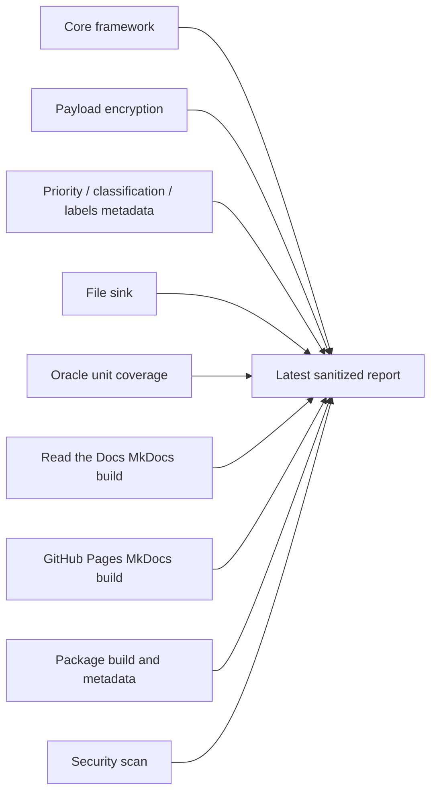
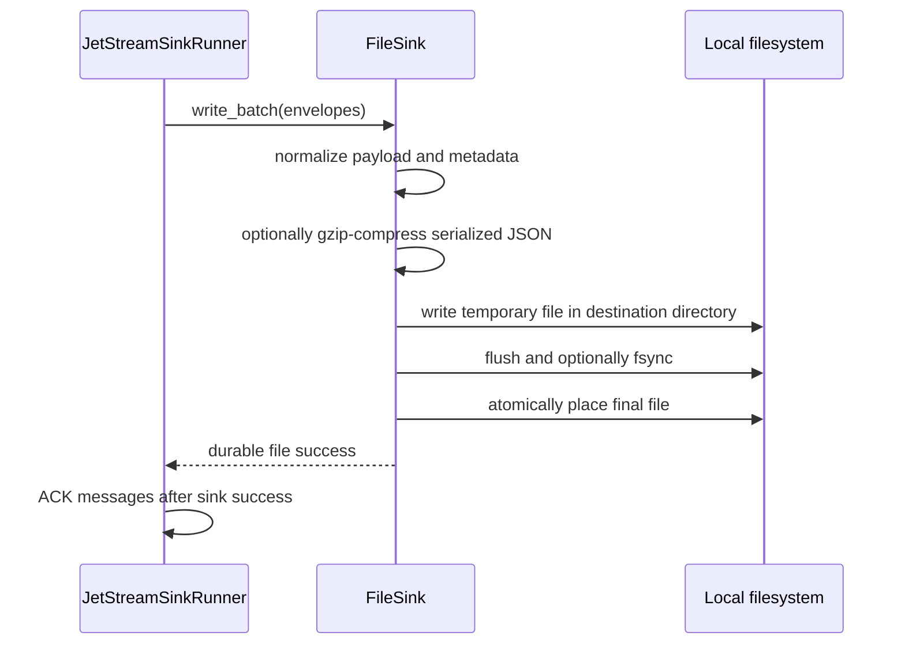
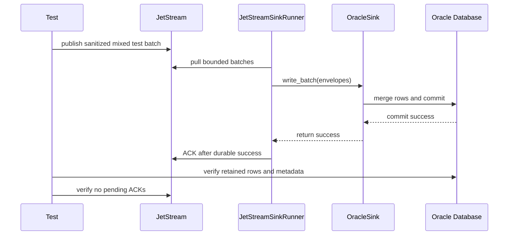
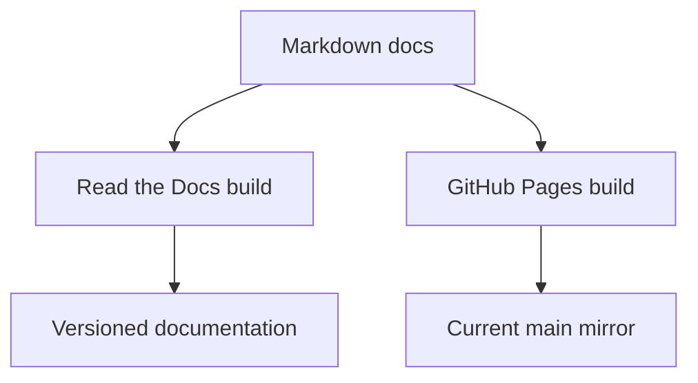
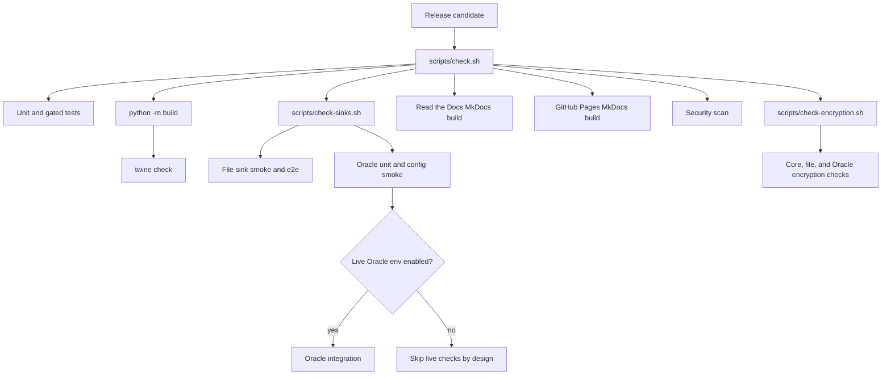

# Latest Test Report

This file is the canonical test report for the repository. It is intentionally
stored at a stable path and should be overwritten when a newer validation run is
performed. Do not create or commit timestamped copies of this report.

The report is sanitized. It must never contain server addresses, usernames,
passwords, tokens, certificate contents, private keys, Oracle wallet material,
full connection strings, sensitive subjects, sensitive payloads, or full raw
logs from live systems.

## Report Summary

| Field | Value |
| --- | --- |
| Overall result | Pass |
| Report generated | 2026-05-20 11:25:56 CEST |
| Project version | `0.3.0` release candidate with payload-encryption, message-metadata, documentation, and release-flow changes |
| Python version | 3.12.4 |
| Git revision checked | Release-preparation workspace before the `v0.3.0` tag |
| Worktree state | Active workspace prepared for the `0.3.0` release with payload encryption, subject-specific encryption rules, subject-specific priority/classification/labels metadata defaults, GitHub CLI auth preflight, and Mermaid documentation rendering changes |
| Live NATS details | Redacted |
| Live Oracle details | Redacted |

This validation refresh covered the core framework, global and subject-specific
payload encryption, global and subject-specific priority/classification/labels message
metadata defaults, file sink, Oracle unit coverage, Mermaid-enabled
documentation builds for both Read the Docs and GitHub Pages, CLI smoke checks,
package build, metadata validation, security scanning, and live
NATS-to-Oracle e2e runs against fresh retained Oracle test tables that include
the new `LABELS` column.



## Report Retention Policy

Only this latest report should be preserved in the repository. Raw command
output, live environment files, CA files, Oracle wallets, connection strings,
and local service details belong under ignored `.local/` paths or in local
terminal history, not in git.

When refreshing this report:

1. Run the required checks.
2. Record only sanitized command names and summarized outcomes.
3. Replace this file in place.
4. Do not include environment variable values, connection strings, service
   endpoints, usernames, certificates, passwords, tokens, wallet contents, or
   sensitive message bodies.

## Current Release Validation

The `0.3.0` release validation has passed and is suitable for publication. It
includes:

- a local GitHub CLI authentication preflight helper for maintainer release
  workflows,
- release and publishing documentation for the GitHub CLI authentication
  preflight,
- MkDocs Mermaid fence configuration so Read the Docs and GitHub Pages render
  diagrams from the same Markdown source,
- Read the Docs and GitHub Pages documentation explaining the Mermaid rendering
  setup.
- optional core payload encryption before sink delivery, supporting
  AES-256-GCM and AES-256-CCM through `nats-sinks[crypto]`, with both global
  all-subject policy and ordered subject-specific rules,
- core-normalized `priority`, `classification`, and `labels` message metadata fields with
  configurable NATS header extraction, deployment defaults, subject-specific
  defaults, Oracle column storage, file JSON storage, semicolon-separated
  scalar label storage, and tests for present, missing, explicit-empty, and
  subject-rule values,
- encryption tests for core runner ordering, subject-rule matching and
  exemptions, file sink storage, gzip output, local file e2e, Oracle row
  mapping, and decrypt verification,
- tracked encryption test helper scripts that generate temporary key material
  and delete it by default,
- detailed payload encryption documentation and sink-specific encrypted storage
  guidance,
- detailed labels documentation, including header/default resolution,
  semicolon-separated scalar storage, generic metadata arrays, file sink output
  fields, and Oracle `LABELS` column guidance,
- a public documentation wording refresh that adds subtle mission, defence,
  public-sector, and operational examples where they clarify reliability,
  security, audit, DLQ, encryption, deployment, and sink behavior,
- concrete file sink and Oracle documentation examples showing how encrypted
  payload envelopes, NATO-style classification values, priority, and
  semicolon-separated labels appear in stored files and database rows.

## Core Framework

The core section validates package-wide behavior that must remain true for all
current and future sinks. This includes configuration parsing, secret
redaction, immutable envelope behavior, payload normalization, metadata
capture, batching, retry policy, sink registry behavior, commit-then-ACK
ordering, DLQ-before-ACK ordering, and deterministic unhappy-path handling.

| Check | Command | Result | Sanitized outcome |
| --- | --- | --- | --- |
| Formatting | `ruff format --check .` | Pass | 69 files already formatted |
| Linting | `ruff check .` | Pass | All checks passed, including payload encryption source and tests |
| Type checking | `mypy src` | Pass | No type issues in 38 source files |
| Markdown link guard | `python scripts/check-markdown-links.py` | Pass | PyPI-facing README links use fully qualified URLs; MkDocs docs keep version-local relative links |
| Unit and gated test suite | `pytest` through `scripts/check.sh` | Pass | 164 passed, 8 skipped |
| Encryption capability suite | `scripts/check-encryption.sh` through `scripts/check.sh` | Pass | 68 encryption-focused tests passed with generated temporary AES-256 key material that was deleted after the run |
| Sink capability suite | `scripts/check-sinks.sh` | Pass | 66 sink-focused tests passed plus file, encrypted file, and Oracle CLI smoke checks |
| Read the Docs documentation build | `mkdocs build --strict` | Pass | MkDocs site built successfully with default Read the Docs canonical URL |
| GitHub Pages documentation build | `NATS_SINKS_DOCS_SITE_URL="https://projectcuillin.github.io/nats-sinks/" mkdocs build --strict` | Pass | MkDocs site built successfully with GitHub Pages canonical URL |
| Security scan | `scripts/security.sh` | Pass | Bandit passed; expected targeted Oracle SQL `nosec` annotations were reported as warnings only |
| Package build | `python -m build` | Pass | Source distribution and wheel built for `0.3.0` |
| Package metadata | `twine check dist/*` | Pass | Wheel and source distribution passed |
| Whitespace check | `git diff --check` | Pass | No whitespace errors |

After the mission-oriented documentation wording refresh, the Markdown link
guard, default MkDocs build, GitHub Pages MkDocs build, and whitespace check
were rerun successfully. The full unit and packaging checks listed above are
from the preceding validation run in the same working session.

After adding the encrypted-file and Oracle-row storage examples, the sink
capability suite (`66 passed`), encryption suite (`68 passed`), Markdown link
guard, default MkDocs build, GitHub Pages MkDocs build, and whitespace check
were rerun successfully.

The skipped tests in the normal pytest run are external-service integration
tests. They are intentionally guarded behind integration markers and explicit
environment variables so unit test runs stay deterministic and do not make
network calls. Live NATS-to-Oracle e2e checks were run separately against the
sanitized retained test tables recorded below.

### Core Failure Paths Covered

The test suite includes deterministic checks for these non-happy paths:

- malformed JSON payloads do not crash the core processing path,
- non-JSON text can be persisted through the shared JSON payload envelope,
- empty payload bodies are wrapped and persisted rather than crashing,
- non-UTF-8 bytes are base64-wrapped for JSON storage,
- AES-256-GCM and AES-256-CCM payloads encrypt and decrypt back to the
  original bytes,
- subject-specific encryption rules encrypt matching subjects, leave unmatched
  subjects unchanged, support disabled-rule exemptions, and preserve
  first-match-wins ordering,
- priority, classification, and labels are resolved from configured headers,
  global defaults, subject-specific defaults, or explicit empty values without
  crashing, labels are normalized from semicolon-separated strings into a
  deduplicated list, and missing values are stored as JSON null, empty JSON
  arrays, or SQL NULL rather than the string `"null"`,
- payload encryption happens before sink writes and ACK still happens only
  after sink success,
- payload encryption failures do not write or ACK messages,
- sink failures do not ACK JetStream messages,
- permanent failures publish to DLQ before ACKing the original message,
- DLQ publish failures do not ACK the original message,
- invalid NATS, file sink, and Oracle configuration is rejected with clear
  framework errors,
- invalid SQL identifiers, unsafe file path components, and invalid subject
  route patterns are rejected or safely normalized,
- the global CLI `--version` option exits successfully without requiring a
  subcommand.

## File Sink

The file sink writes one JSON document per message, supports optional gzip
compression, uses atomic placement, supports deterministic file names, and
returns success only after the file write has completed.



| Check | Command | Result | Sanitized outcome |
| --- | --- | --- | --- |
| File mapping unit tests | Included in `scripts/check-sinks.sh` | Pass | Filename strategies, JSON envelope records, priority/classification/labels metadata, gzip extension defaults, compression-level validation, and fuzzed path components passed |
| File sink unit tests | Included in `scripts/check-sinks.sh` | Pass | Duplicate policies, overwrite behavior, missing metadata, health check, filesystem errors, gzip output, multiple compressed files, encrypted payload storage, decrypt verification, and Ruff async-safety fix passed |
| File e2e test | `tests/integration/test_file_sink_e2e.py` through `scripts/check-sinks.sh` | Pass | Runner processed fake JetStream messages with both, one, or no priority/classification/labels headers plus subject-specific metadata defaults; wrote uncompressed, gzip-compressed, and encrypted JSON/text/empty/bytes records across multiple files; verified decryption; and ACKed after file success |
| File CLI validation | `nats-sink validate examples/file-basic/config.json` | Pass | Configuration is valid and active sink is `file` |
| File CLI smoke | `nats-sink test-sink examples/file-basic/config.json` | Pass | Sink health check succeeded without external services |
| Encrypted file CLI validation | `nats-sink validate examples/payload-encryption/file-config.json` | Pass | Encrypted file example configuration is valid and active sink is `file` |
| Encrypted file CLI smoke | `nats-sink test-sink examples/payload-encryption/file-config.json` | Pass | Sink health check succeeded without resolving or printing encryption key material |

The file sink test matrix specifically covers these production risks:

- duplicate messages are skipped, overwritten, or rejected according to policy,
- gzip compression produces decompressible `.json.gz` files while preserving the
  same commit-then-ACK boundary as uncompressed writes,
- compressed and uncompressed test outputs can be retained for inspection or
  deleted after the e2e test; deletion is the default,
- missing required stream or message-id metadata raises a clear permanent error,
- subject names that contain unsafe path characters cannot escape the root
  directory,
- non-UTF-8 payloads are preserved through base64 encoding inside the JSON
  payload envelope,
- core-encrypted payload envelopes are stored and can be decrypted back to the
  original message body,
- priority and classification values are stored when present, labels are stored
  as both a semicolon-separated scalar and an array, and missing or explicitly
  empty values become JSON null or an empty label array,
- a destination path that already exists as a file is rejected clearly,
- filesystem write errors are translated into framework sink errors.

## Oracle Sink

The Oracle section validates Oracle-specific behavior while keeping endpoint,
credential, wallet, and service-name details out of the report.

| Check | Command | Result | Sanitized outcome |
| --- | --- | --- | --- |
| Oracle-focused unit coverage | Included in `python -m pytest` and `scripts/check-sinks.sh` | Pass | SQL generation, mapping, routing, priority/classification/labels columns, payload, encrypted payload storage, and sink contract tests passed |
| Oracle CLI validation | `nats-sink validate examples/oracle-jetstream/config.json` | Pass | Configuration is valid and active sink is `oracle` |
| Live Oracle integration | `python -m pytest -q -s -m integration tests/integration/test_oracle_sink.py` | Not run directly in this refresh | Oracle write behavior was last covered through the `0.2.1` live NATS-to-Oracle e2e release checks |

The most recent direct live Oracle integration run from the `0.2.0` release candidate
verified table creation, normal batch writes, duplicate redelivery in `merge`
mode, non-JSON text payload storage, empty payload storage, and the retained
test table schema. For the `0.2.1` release, the live Oracle path was
revalidated through the complete NATS-to-Oracle e2e tests summarized below.

## Live NATS To Oracle End-To-End

The end-to-end section validates the complete live path from NATS JetStream to
Oracle through the core runner and Oracle sink. The report omits all live
service details.



| Check | Command | Result | Sanitized outcome |
| --- | --- | --- | --- |
| Live e2e, exact batch multiple | `scripts/run-oracle-e2e.sh --table NATS_SINKS_E2E_EVENTS_V2 --message-count 256 --batch-size 64` | Not run in this refresh | Last `0.2.1` release run passed: 256 messages written in 4 batches; backend write timing observed 2.772645 seconds and 92.33 messages per second in that test environment |
| Live e2e, partial final batch | `scripts/run-oracle-e2e.sh --table NATS_SINKS_E2E_EVENTS_V2 --message-count 250 --batch-size 64` | Not run in this refresh | Last `0.2.1` release run passed: 250 messages written in 4 batches; backend write timing observed 2.650088 seconds and 94.34 messages per second in that test environment |
| Live e2e, unencrypted Oracle labels smoke | `scripts/run-oracle-e2e.sh --drop-table-before --table NATS_E2E_LABELS_PLAIN --message-count 64 --batch-size 16` | Pass | 64 messages written in 4 batches against a fresh retained test table; required schema check included `LABELS`; mixed JSON, non-JSON text, empty payload, missing message ID, priority/classification/labels combinations, metadata, wildcard subject, and ACK completion checks passed; backend write timing observed 2.309987 seconds and 27.71 messages per second in that test environment |
| Live e2e, encrypted Oracle labels mode | `scripts/run-oracle-e2e.sh --with-encryption --drop-table-before --table NATS_E2E_LABELS_ENC --message-count 64 --batch-size 16` | Pass | 64 messages written in 4 batches against a fresh retained test table; required schema check included `LABELS`; stored Oracle JSON payloads were decrypted and compared with original JSON, text, empty, and binary payloads; priority/classification/labels columns were verified; backend write timing observed 8.082369 seconds and 7.92 messages per second in that test environment |

The most recent live NATS-to-Oracle e2e runs verified commit-before-ACK
behavior, wildcard subscription behavior, missing message ID handling, metadata
priority/classification/labels persistence, empty payload persistence,
non-JSON payload persistence, no pending ACKs after processing, encrypted
Oracle payload storage, decrypt verification, and bounded batch handling. The
timing values are functional test observations, not production benchmarks.

The first encrypted e2e attempt used an older locally configured test table
that lacked the current metadata and timing columns. The test failed fast with
a schema message and did not proceed with that table. The passing encrypted run
used an explicit fresh retained test table.

## Documentation Hosting

The documentation checks now cover both hosted documentation targets:

- Read the Docs remains the preferred versioned documentation site for package
  users.
- GitHub Pages is prepared as a repository-hosted mirror of the current `main`
  branch documentation.



The GitHub Pages workflow is ready from the repository side. A maintainer still
needs to enable GitHub Pages once in repository settings by choosing `Settings`
-> `Pages` -> `Source: GitHub Actions`.

## Release Gate Coverage

The release workflow and local check scripts require sink capability checks
before publishing. The default gate validates all production sinks without
external services where possible. Live Oracle and live NATS-to-Oracle tests are
enabled only by explicit local or CI environment variables because they require
private infrastructure.



## Known Limitations Of This Report

- Coverage percentages were not captured in this report.
- Integration results depend on external services and are not reproduced by
  the default unit-test-only CI path.
- Live service details are intentionally redacted, so this report cannot be
  used to reconstruct the private test environment.
- Direct live Oracle-only integration tests were not rerun separately; Oracle
  write behavior, including the new `LABELS` column path, was covered by the
  live NATS-to-Oracle e2e checks in this refresh.
- The live e2e passes in this refresh used 64 messages, which is enough to
  prove the paths and decrypt verification but is not a throughput benchmark.
- The active development worktree had uncommitted changes when this report was
  generated.

## Refresh Checklist

Run the following local checks for a full report refresh:

```bash
scripts/check.sh
scripts/check-encryption.sh
```

Run the live Oracle checks only with ignored local environment files:

```bash
python -m pytest -q -s -m integration tests/integration/test_oracle_sink.py
scripts/run-oracle-e2e.sh --table NATS_SINKS_E2E_EVENTS_V2 --message-count 256 --batch-size 64
scripts/run-oracle-e2e.sh --table NATS_SINKS_E2E_EVENTS_V2 --message-count 250 --batch-size 64
scripts/run-oracle-e2e.sh --drop-table-before --table NATS_E2E_LABELS_PLAIN --message-count 64 --batch-size 16
scripts/run-oracle-e2e.sh --with-encryption --drop-table-before --table NATS_E2E_LABELS_ENC --message-count 64 --batch-size 16
```

Before committing a refreshed report, scan it for secrets and live identifiers.
The report should describe what was tested, not where or with which private
credentials it was tested.
