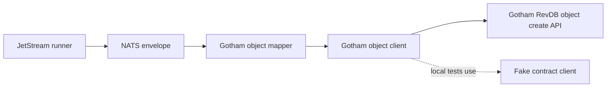

# Latest Test Report

This file is the canonical test report for the repository. It is intentionally
stored at a stable path and should be overwritten when a newer validation run is
performed. Do not create or commit timestamped copies of this report.

The report is sanitized. It must never contain server addresses, usernames,
passwords, tokens, certificate contents, private keys, Oracle wallet material,
full connection strings, sensitive subjects, sensitive payloads, container IDs,
generated database passwords, or full raw logs from live systems.

## Report Summary

| Field | Value |
| --- | --- |
| Overall result | Pass |
| Report generated | 2026-05-28 issue `#151` Gotham sink validation for upcoming `v0.4.2` development |
| Project version | `0.4.1` package metadata with `v0.4.2` development changes |
| Python version | 3.12.4 |
| Git revision checked | Branch `issue-151-palantir-gotham-sink` based on `release-v0.4.2` |
| Live NATS details | Environment-gated live tests skipped unless explicitly enabled |
| Live Oracle Database details | Environment-gated live tests skipped unless explicitly enabled |
| Live Oracle MySQL details | Environment-gated live tests skipped unless explicitly enabled |
| Live Gotham details | No live Gotham tenant was contacted; validation used local fake clients and contract tests |

This refresh covered the experimental Palantir Gotham RevDB object sink for
issue `#151`. The implementation keeps Gotham support disabled unless
configured, validates base URLs and allowed hosts before any HTTP request is
built, requires credentials to come from environment variables, bounds request
and response sizes, maps normalized events into configured Gotham object
properties, and treats local fake-client certification as separate from future
live Gotham certification.

## Core And Repository Validation

| Check | Result |
| --- | --- |
| Ruff format | Pass, `253 files already formatted` |
| Ruff lint | Pass |
| Mypy | Pass, no issues in `105` source files |
| Version metadata consistency | Pass for `0.4.1` |
| Dependency manifests | Pass, manifest files up to date |
| Backlog metadata | Pass, `142` backlog items validated |
| Bug report metadata | Pass, `90` bug reports validated |
| PyPI-facing Markdown links | Pass |
| Documentation builds | Pass for Read the Docs and GitHub Pages MkDocs builds |
| Security checks | Pass; existing reviewed `nosec` warnings remained non-blocking |
| Package build | Pass, source distribution and wheel built |
| SBOM and checksums | Pass, CycloneDX JSON/XML and checksum manifest generated |

## Test Results

| Test Area | Command | Result |
| --- | --- | --- |
| Gotham focused subset | `python -m pytest tests/unit/test_gotham_sink.py tests/unit/test_foundry_static_security.py tests/unit/test_cli.py tests/unit/test_public_api.py -q` | Pass, `37 passed` |
| Gotham example validation | `nats-sink validate examples/gotham-basic/config.json` | Pass |
| Main repository test suite | `python -m pytest -q` | Pass, `1148 passed, 11 skipped` |
| Commit, encryption, file, and Oracle sink subset | run by `scripts/check.sh` | Pass, `130 passed` |
| Sink certification and example validation | `scripts/check-sinks.sh` via `scripts/check.sh` | Pass, `145 passed` plus file, Oracle, Foundry, and Gotham config validation |
| Full local validation | `scripts/check.sh` | Pass |

The skipped tests are the existing environment-gated live NATS, Oracle
Database, Oracle MySQL, and push-consumer integration tests.

## Gotham Evidence

The new focused coverage verifies:

- Gotham sink configuration rejects ambiguous or unsafe base URLs;
- HTTPS is required outside explicit loopback-only local testing;
- endpoint allow-listing is enforced before HTTP requests are made;
- authentication uses environment variable names instead of inline token
  values;
- object type names, property type mappings, security markings, batch sizes,
  object sizes, and response sizes are bounded;
- duplicate external IDs and oversized object requests fail closed;
- fake-client contract tests prove successful writes, duplicate redelivery,
  retryable failures, permanent failures, and ambiguous results;
- runner-level tests preserve commit-then-ACK behavior for Gotham writes;
- the reviewed `urllib.request.urlopen` boundary carries the Bandit `B310`
  suppression required by the security gate.

## Issues Found During Validation

No new release-blocking issues were found during the `#151` validation cycle.

## Documentation Evidence

The following public documentation was updated and built successfully:

- [README](https://github.com/ProjectCuillin/nats-sinks/blob/main/README.md)
- [Gotham Sink](gotham-sink.md)
- [Configuration](configuration.md)
- [Sink Framework](sink-framework.md)
- [Sink Certification](sink-certification.md)
- [Security](security.md)
- [Operations](operations.md)
- [Testing](testing.md)
- [Defence Use Cases](use-cases/defence/index.md)
- [Roadmap](roadmap.md)
- [Documentation Home](index.md)

The changelog, backlog metadata, latest test report, examples, and public sink
documentation were updated for issue `#151`.
