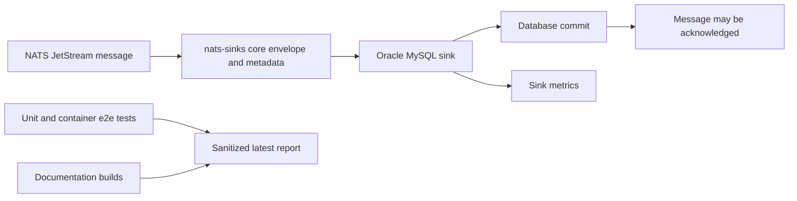

# Latest Test Report

This file is the canonical test report for the repository. It is intentionally
stored at a stable path and should be overwritten when a newer validation run is
performed. Do not create or commit timestamped copies of this report.

The report is sanitized. It must never contain server addresses, usernames,
passwords, tokens, certificate contents, private keys, Oracle wallet material,
full connection strings, sensitive subjects, sensitive payloads, container IDs,
generated database passwords, or full raw logs from live systems.

## Report Summary

| Field | Value |
| --- | --- |
| Overall result | Pass |
| Report generated | 2026-05-26 issue `#252` validation for upcoming `v0.4.2` development |
| Project version | `0.4.1` package metadata with `v0.4.2` development changes |
| Python version | 3.12.4 |
| Git revision checked | Branch `issue-252-pypi-release-artifact-container-validation` based on `release-v0.4.2` |
| Live NATS details | Local disposable NATS server only; ports and process details redacted |
| Live Oracle Database details | Environment-gated test table only; connection details redacted |
| Live Oracle MySQL details | Local short-lived Docker container only; generated credentials, ports, container names, and container identifiers redacted |
| PyPI artifact details | Public `nats-sinks` artifact installed inside short-lived Oracle Linux validation containers; image tags, container names, and raw logs redacted |

This refresh covered the issue `#252` post-release PyPI artifact validation
harness and a full local regression cycle for the current development branch.
It validated the core runtime, Oracle Database sink, Oracle MySQL sink, file
sink, spool support, observability connectors, Docker assets, documentation
builds, package build, SBOM generation, checksum generation, release issue
hygiene, and the new Oracle Linux based PyPI artifact validation container.



## Core And Repository Validation

| Check | Result |
| --- | --- |
| Ruff format | Pass, `215 files already formatted` |
| Ruff lint | Pass |
| Mypy | Pass, no issues in `85` source files |
| Version metadata consistency | Pass for `0.4.1` |
| Dependency manifests | Pass, manifest files up to date |
| Backlog item validation | Pass, `142` backlog items validated |
| Bug report validation | Pass, `87` bug report items validated |
| PyPI-facing Markdown links | Pass |
| Secret scan | Pass, no high-confidence secret material found |
| Bandit | Pass with reviewed `nosec` annotations for validated SQL identifier builders |
| Package build | Pass, sdist and wheel built |
| SBOM generation | Pass, CycloneDX JSON and XML generated |
| Checksum generation | Pass, `dist/SHA256SUMS` generated |
| Twine metadata check | Pass for retained distributions |

## Test Results

| Test Area | Command | Result |
| --- | --- | --- |
| Oracle MySQL sink hardening and regression tests | `scripts/check.sh` | Pass as part of the full unit suite, including the Oracle MySQL bug-hunt hardening tests |
| Oracle MySQL container end-to-end test | `python scripts/run-mysql-sink-e2e.py` | Pass |
| Local Docker/NATS/file-sink smoke test | `python scripts/run-docker-local-smoke.py` | Pass |
| Oracle MySQL test container smoke test | `python scripts/run-oracle-mysql-container-smoke.py` | Pass |
| WebSocket NATS end-to-end test | `scripts/run-websocket-e2e.sh` | Pass, `16` messages persisted |
| Oracle Database live end-to-end test | `scripts/run-oracle-e2e.sh --table NATS_SINKS_E2E_EVENTS_V2 --message-count 64 --batch-size 64` | Pass, `1 passed` |
| PyPI artifact validation container, latest | `python scripts/run-pypi-release-container-validation.py --version latest` | Pass, installed public `0.4.1` artifact |
| PyPI artifact validation container, explicit with extras | `python scripts/run-pypi-release-container-validation.py --version 0.4.1 --extras crypto,mysql` | Pass, installed public `0.4.1` artifact |
| Main repository test suite | `scripts/check.sh` | Pass, `910 passed, 10 skipped` |
| Encryption and sink contract subset | `scripts/check.sh` | Pass, `123 passed` |
| Sink capability subset | `scripts/check.sh` | Pass, `105 passed` |
| Documentation builds | `scripts/check.sh` | Pass for Read the Docs and GitHub Pages MkDocs builds |

The skipped tests are the existing environment-gated live NATS and Oracle
Database integration tests. Where release validation required live coverage,
the dedicated local e2e scripts were run explicitly and their sensitive
connection details were excluded from this report.

## Oracle MySQL Sink Evidence

The optional local Oracle MySQL sink end-to-end test was executed with the local
Docker daemon:

```bash
python scripts/run-mysql-sink-e2e.py
```

Sanitized result:

```text
Oracle MySQL sink container e2e test passed.
```

The test verified:

- a fresh Oracle MySQL test container with generated credentials;
- loopback-only random host-port exposure;
- automatic test table creation through the Oracle MySQL sink;
- commit-before-success processing;
- JSON payload persistence;
- non-JSON payload envelope persistence;
- empty-message handling;
- priority, classification, labels, mission metadata, and security labels;
- subject-to-table routing;
- duplicate handling through idempotency configuration;
- cleanup of the container, Docker volume, and generated secret files by
  default.

Docker cleanup was checked after the run. No `nats-sinks` Oracle MySQL test
container or volume remained active.

## PyPI Artifact Validation Evidence

The new local post-release artifact harness was executed against the public
PyPI package:

```bash
python scripts/run-pypi-release-container-validation.py --version latest
python scripts/run-pypi-release-container-validation.py --version 0.4.1 --extras crypto,mysql
```

Sanitized result:

```text
PyPI artifact validation status: passed
Requested version: latest
Installed version: 0.4.1
```

The explicit-version run also passed with the optional `crypto` and `mysql`
extras. Sanitized local JSON reports were written under
`.local/pypi-release-validation/reports/`; they are intentionally ignored by
Git and not copied into this public report.

## Issues Found During Validation

The issue `#252` validation raised and repaired managed GitHub bug reports
`#272` and `#273`. The fixes cover executable temporary storage for native
Python wheels in the validation container and literal virtual-environment path
handling in the isolated import smoke snippet. Both bugs have public issue
evidence, release labels, completed status, checked Acceptance Criteria, and
regression coverage.

Previously completed release-hardening issues remain covered by the full
regression suite, including Oracle MySQL hardening bugs `#253` through `#269`.

## Documentation Evidence

The following documentation was updated and built successfully:

- [Oracle MySQL Sink](mysql-sink.md)
- [Oracle MySQL Test Container](oracle-mysql-test-container.md)
- [Configuration](configuration.md)
- [Docker](docker.md)
- [Release](release.md)
- [Publishing](publishing.md)
- [Metrics](metrics.md)
- [Public API](public-api.md)
- [Python Usage](python-usage.md)
- [Sink Certification](sink-certification.md)
- [Sink Framework](sink-framework.md)
- [Testing](testing.md)
- [Roadmap](roadmap.md)

The README, changelog, MkDocs navigation, example configuration, dependency
manifest, public API checks, sink certification checks, and CLI registry tests
were also updated for issue `#101`.
