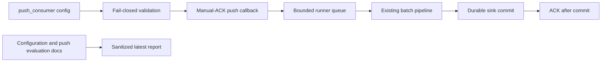

# Latest Test Report

This file is the canonical test report for the repository. It is intentionally
stored at a stable path and should be overwritten when a newer validation run is
performed. Do not create or commit timestamped copies of this report.

The report is sanitized. It must never contain server addresses, usernames,
passwords, tokens, certificate contents, private keys, Oracle wallet material,
full connection strings, sensitive subjects, sensitive payloads, container IDs,
generated database passwords, or full raw logs from live systems.

## Report Summary

| Field | Value |
| --- | --- |
| Overall result | Pass |
| Report generated | 2026-05-26 issues `#123` and `#125` validation for upcoming `v0.4.2` development |
| Project version | `0.4.1` package metadata with `v0.4.2` development changes |
| Python version | 3.12.4 |
| Git revision checked | Branch `issue-123-125-push-consumer-mode` based on `release-v0.4.2` |
| Live NATS details | Environment-gated live tests skipped unless explicitly enabled |
| Live Oracle Database details | Environment-gated live tests skipped unless explicitly enabled |
| Live Oracle MySQL details | Environment-gated live tests skipped unless explicitly enabled |

This refresh covered the push-consumer configuration guardrails for issue
`#123` and the opt-in bounded push-consumer runner mode for issue `#125`, plus
a full local regression cycle for the current development branch. The new tests
prove that push mode is disabled by default, that manual ACK is required, that
deliver subjects and groups are validated, that pending message and byte limits
are bounded, that callback intake uses a bounded queue, that overflow does not
ACK, and that accepted push messages still ACK only after sink commit.

## Core And Repository Validation

| Check | Result |
| --- | --- |
| Ruff format | Pass, `231 files already formatted` |
| Ruff lint | Pass |
| Mypy | Pass, no issues in `92` source files |
| Version metadata consistency | Pass for `0.4.1` |
| Dependency manifests | Pass, manifest files up to date |
| Backlog item validation | Pass |
| Bug report validation | Pass, `89` bug report item(s) |
| PyPI-facing Markdown links | Pass |
| Secret scan | Pass, no high-confidence secret material found |
| Bandit | Pass with reviewed `nosec` annotations for validated SQL identifier builders |
| Package build | Pass, sdist and wheel built |
| SBOM generation | Pass, CycloneDX JSON and XML generated |
| Checksum generation | Pass, `dist/SHA256SUMS` generated |
| Twine metadata check | Pass for retained distributions |

## Test Results

| Test Area | Command | Result |
| --- | --- | --- |
| Push-consumer focused tests | `python -m pytest tests/unit/test_push_consumer.py tests/unit/test_consumer_management.py tests/unit/test_public_api.py -q` | Pass, `30 passed` |
| Unit test suite | `python -m pytest tests/unit -q` | Pass, `1028 passed` |
| Main repository test suite | `scripts/check.sh` | Pass, `1033 passed, 10 skipped` |
| Encryption and sink contract subset | `scripts/check.sh` | Pass, `123 passed` |
| Sink capability subset | `scripts/check.sh` | Pass, `117 passed` |
| Documentation builds | `scripts/check.sh` | Pass for Read the Docs and GitHub Pages MkDocs builds |
| Example validation | `nats-sink validate examples/named-multi-sink/config.json` through unit/CLI coverage | Pass |

The skipped tests are the existing environment-gated live NATS, Oracle
Database, and Oracle MySQL integration tests. Issues `#123` and `#125` add
opt-in push-consumer delivery support. Pull mode remains the default, and push
mode reuses the existing message delivery, retries, DLQ-before-ACK, sink write,
and idempotency contract.

## Push-Consumer Guardrail Evidence

The new unit coverage verifies:

- push-consumer mode remains disabled until explicitly configured;
- `push_consumer.manual_ack=false` is rejected when push mode is enabled;
- `push_consumer.deliver_subject` is required and cannot contain wildcards;
- `push_consumer.deliver_group` is validated through an allow-list;
- partial or unsupported `nats-py` push-subscribe capability surfaces fail
  closed;
- `consumer_management.max_ack_pending` cannot exceed the push pending message
  limit;
- callback intake queues messages without ACKing;
- queue overflow NAKs without ACKing when the default overflow action is used;
- push-runner ACK happens only after the sink records durable commit;
- shutdown stops new callback intake before draining accepted messages.

## Issues Found During Validation

No new release-blocking issues were found during the `#123` and `#125`
validation cycle. The only local correction was formatting
`src/nats_sinks/core/consumer_management.py` before rerunning the full gate.

## Documentation Evidence

The following public documentation was updated and built successfully:

- [README](https://github.com/ProjectCuillin/nats-sinks/blob/main/README.md)
- [Configuration](configuration.md)
- [Sink Framework](sink-framework.md)
- [Sink Certification](sink-certification.md)
- [Testing](testing.md)
- [Development](development.md)
- [Architecture](architecture.md)
- [Operations](operations.md)
- [Push Consumer Evaluation](push-consumer-evaluation.md)
- [Metrics](metrics.md)
- [Observability](observability.md)
- [Subject-Aware Observability Evaluation](subject-aware-observability-evaluation.md)
- [Subject-Aware Observability Runbook](subject-aware-observability-runbook.md)
- [Prometheus Integration](prometheus.md)
- [Named Sinks And Routing](named-sinks.md)
- [Idempotency](idempotency.md)
- [Security](security.md)
- [File Sink](file-sink.md)
- [Oracle Sink](oracle-sink.md)
- [Named Multi-Sink Example](https://github.com/ProjectCuillin/nats-sinks/blob/main/examples/named-multi-sink/config.json)
- [Documentation Home](index.md)

The changelog, backlog metadata, public API contract tests, configuration
guide, security guidance, operations guide, NATS feature-gap analysis, and
push-consumer evaluation documentation were also updated for issues `#123` and
`#125`.
