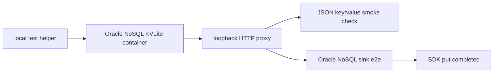

# Latest Test Report

This file is the canonical test report for the repository. It is intentionally
stored at a stable path and should be overwritten when a newer validation run is
performed. Do not create or commit timestamped copies of this report.

The report is sanitized. It must never contain server addresses, usernames,
passwords, tokens, certificate contents, private keys, Oracle wallet material,
full connection strings, sensitive subjects, sensitive payloads, container IDs,
generated database passwords, or full raw logs from live systems.

## Report Summary

| Field | Value |
| --- | --- |
| Overall result | Pass |
| Report generated | 2026-05-28 issue `#310` Oracle NoSQL Database test backend and issue `#149` container-backed sink verification for upcoming `v0.4.2` development |
| Project version | `0.4.1` package metadata with `v0.4.2` development changes |
| Python version | 3.12.4 |
| Git revision checked | Branch `bug-313-oracle-nosql-kvlite-readiness`, to be merged back into `issue-310-oracle-nosql-test-container` and then `release-v0.4.2` |
| Live NATS details | Environment-gated live tests skipped unless explicitly enabled |
| Live Oracle Database details | Environment-gated live tests skipped unless explicitly enabled |
| Live Oracle MySQL details | Environment-gated live tests skipped unless explicitly enabled |
| Live Oracle NoSQL details | Local short-lived KVLite container smoke and sink e2e tests passed |
| Live Oracle Coherence details | Environment-gated live tests skipped unless explicitly enabled |
| Oracle NoSQL test container details | Official Oracle NoSQL Community Edition KVLite image wrapper, loopback proxy, fake JSON data, cleanup by default |

This refresh covered the Oracle NoSQL Database KVLite test backend for issue
`#310`, revisited the Oracle NoSQL Database sink from issue `#149` against
that backend, and fixed the SDK-level readiness race tracked as issue `#313`.

## Core And Repository Validation

| Check | Result |
| --- | --- |
| Ruff format | Pass, `278` files already formatted after formatting the new scripts |
| Ruff lint | Pass |
| Mypy | Pass, no issues in `116` source files |
| Version metadata consistency | Pass for `0.4.1` |
| Dependency manifests | Pass, manifest files up to date |
| Backlog metadata | Pass, `146` backlog items validated |
| Bug report metadata | Pass, `91` bug reports validated |
| PyPI-facing Markdown links | Pass |
| Documentation builds | Pass for Read the Docs and GitHub Pages MkDocs builds |
| Security checks | Pass; existing reviewed `nosec` warnings remained non-blocking |
| Package build | Pass, source distribution and wheel built |
| SBOM and checksums | Pass, CycloneDX JSON/XML and checksum manifest generated |

## Test Results

| Test Area | Command | Result |
| --- | --- | --- |
| Oracle NoSQL test-backend and sink subset | `python -m pytest tests/unit/test_oracle_nosql_test_container.py tests/unit/test_oracle_nosql_sink.py tests/integration/test_oracle_nosql_sink_e2e.py -q` | Pass, `26 passed, 1 skipped` |
| Oracle NoSQL test backend smoke | `python scripts/run-oracle-nosql-container-smoke.py --timeout-seconds 300` | Pass, one verified JSON key/value entry |
| Oracle NoSQL sink container e2e | `python scripts/run-oracle-nosql-sink-e2e.py --timeout-seconds 300` | Pass |
| Oracle NoSQL container cleanup check | Docker container listing filtered for the local Oracle NoSQL test name | Pass, no retained containers |
| Sink certification and example validation | `scripts/check-sinks.sh` | Pass, `189 passed` plus file, Oracle, Oracle NoSQL, Oracle Coherence, multi-sink routing, Foundry, and Gotham config validation |
| Main repository test suite | run by `scripts/check.sh` | Pass, `1245 passed, 13 skipped` |
| Commit, encryption, file, and Oracle sink subset | run by `scripts/check.sh` | Pass, `130 passed` |
| Full local validation | `scripts/check.sh` | Pass |

The skipped tests are the existing environment-gated live NATS, Oracle
Database, Oracle MySQL, Oracle NoSQL Database default integration path, Oracle
Coherence, and push-consumer integration tests. The Oracle NoSQL container e2e
path was run separately through its dedicated helper so it could start and
clean up its own short-lived backend.

## Oracle NoSQL Database Test Backend Evidence

The new test-backend coverage verifies:

- the default image reference is Oracle's Community Edition image from GitHub
  Container Registry;
- there is no repository-local custom Dockerfile for Oracle NoSQL Database;
- the helper binds only to `127.0.0.1` with a random local port;
- Docker is invoked through fixed argument lists with `shell=False`;
- host networking, privileged mode, and Docker socket mounts are not used;
- transient SDK readiness failures are retried after TCP readiness;
- persistent SDK readiness failures fail closed with concise output;
- the smoke record is complete fake event JSON;
- cleanup removes the short-lived container by default;
- the sink e2e helper starts the backend, enables the live-gated integration
  test, and cleans up afterward.

## Issues Found During Validation

Issue `#313` was found during the first live container run: the helper treated
an open TCP proxy port as readiness before the Oracle NoSQL Python SDK could
complete a table request. A failing regression test was added first, the bug
was raised on GitHub, the helper was fixed to wait for SDK-level readiness, and
the bug was marked completed with sanitized unit and container evidence.

No additional repository defects were found after the fix. The security scan
reported existing reviewed `nosec` annotations as warnings, and the check
remained passing.

## Documentation Evidence

The following public documentation was updated and built successfully:

- [README](https://github.com/ProjectCuillin/nats-sinks/blob/main/README.md)
- [Oracle NoSQL Database Sink](oracle-nosql-sink.md)
- [Oracle NoSQL Database Test Backend](oracle-nosql-test-container.md)
- [Local Docker Stack](docker.md)
- [Testing](testing.md)
- [Sink Framework](sink-framework.md)
- [Security Rule Review](security-rule-review.md)
- [Roadmap](roadmap.md)
- [Documentation Home](index.md)

The changelog, backlog metadata, bug report metadata, latest test report, and
public documentation were updated for issues `#310`, `#149`, and `#313`.
