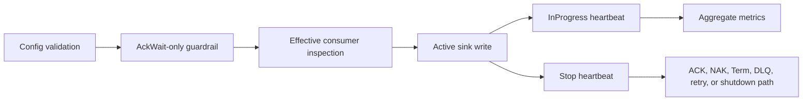

# Latest Test Report

This file is the canonical test report for the repository. It is intentionally
stored at a stable path and should be overwritten when a newer validation run is
performed. Do not create or commit timestamped copies of this report.

The report is sanitized. It must never contain server addresses, usernames,
passwords, tokens, certificate contents, private keys, Oracle wallet material,
full connection strings, sensitive subjects, sensitive payloads, container IDs,
generated database passwords, or full raw logs from live systems.

## Report Summary

| Field | Value |
| --- | --- |
| Overall result | Pass |
| Report generated | 2026-05-27 issue `#117` validation for upcoming `v0.4.2` development |
| Project version | `0.4.1` package metadata with `v0.4.2` development changes |
| Python version | 3.12.4 |
| Git revision checked | Branch `issue-117-inprogress-policy-guardrails` based on `release-v0.4.2` |
| Live NATS details | Environment-gated live tests skipped unless explicitly enabled |
| Live Oracle Database details | Environment-gated live tests skipped unless explicitly enabled |
| Live Oracle MySQL details | Environment-gated live tests skipped unless explicitly enabled |

This refresh covered effective JetStream `InProgress` consumer-policy
guardrails for issue `#117`, plus a full local regression cycle for the current
development branch. The new tests prove that progress heartbeats fail closed
unless the runner can verify safe durable consumer timing, that bind-only
deployments can use an inspected existing AckWait-only consumer, that unsafe or
non-finite AckWait values are rejected, and that configured or effective BackOff
policies remain unsupported until BackOff-aware timing is implemented.

## Core And Repository Validation

| Check | Result |
| --- | --- |
| Ruff format | Pass, `236 files already formatted` |
| Ruff lint | Pass |
| Mypy | Pass, no issues in `93` source files |
| Version metadata consistency | Pass for `0.4.1` |
| Dependency manifests | Pass, manifest files up to date |
| Backlog item validation | Pass, `142` backlog item(s) |
| Bug report validation | Pass, `89` bug report item(s) |
| PyPI-facing Markdown links | Pass |
| Secret scan | Pass, no high-confidence secret material found |
| Bandit | Pass with reviewed `nosec` annotations for validated SQL identifier builders |
| Package build | Pass, sdist and wheel built |
| SBOM generation | Pass, CycloneDX JSON and XML generated |
| Checksum generation | Pass, `dist/SHA256SUMS` generated |
| Distribution checksum verification | Pass for retained distributions |

## Test Results

| Test Area | Command | Result |
| --- | --- | --- |
| InProgress consumer-policy guardrail subset | `python -m pytest tests/unit/test_consumer_management.py tests/unit/test_config.py tests/unit/test_commit_then_ack_contract.py -q` | Pass, `126 passed` |
| Main repository test suite | `scripts/check.sh` | Pass, `1086 passed, 11 skipped` |
| Encryption and sink contract subset | `scripts/check.sh` | Pass, `130 passed` |
| Sink capability subset | `scripts/check.sh` | Pass, `117 passed` |
| Documentation builds | `scripts/check.sh` | Pass for Read the Docs and GitHub Pages MkDocs builds |
| Example validation | `scripts/check.sh` | Pass for file and Oracle example validation paths |

The skipped tests are the existing environment-gated live NATS, Oracle
Database, Oracle MySQL, and push-consumer integration tests.

## InProgress Guardrail Evidence

The new focused coverage verifies:

- `delivery.in_progress.enabled=true` requires `nats.durable=true`;
- managed consumers still require explicit
  `consumer_management.ack_wait_seconds`;
- bind-only deployments may omit local AckWait only when the existing durable
  consumer exposes a readable effective AckWait before fetch;
- missing, malformed, zero, negative, non-finite, or too-small effective
  AckWait values are rejected before any subscription can fetch work;
- configured and effective JetStream BackOff policies are rejected until
  BackOff-aware heartbeat timing is explicitly implemented;
- created and reconciled consumers are re-read before InProgress heartbeats are
  allowed;
- redacted configuration errors describe the policy problem without exposing
  server addresses, subjects outside configured drift checks, credentials, or
  payload data.

## Issues Found During Validation

No new release-blocking issues were found during the `#117` validation cycle.

## Documentation Evidence

The following public documentation was updated and built successfully:

- [README](https://github.com/ProjectCuillin/nats-sinks/blob/main/README.md)
- [Configuration](configuration.md)
- [Commit Then Acknowledge](commit-then-ack.md)
- [Operations](operations.md)
- [Metrics](metrics.md)
- [InProgress Evaluation](in-progress-evaluation.md)
- [InProgress Metrics Runbook](inprogress-metrics-runbook.md)
- [JetStream Topology](jetstream-topology.md)
- [NATS Permissions](nats-permissions.md)
- [NATS Feature Gap Analysis](nats-feature-gap-analysis.md)
- [Roadmap](roadmap.md)
- [Documentation Home](index.md)

The changelog, backlog metadata, roadmap, latest test report, and public
InProgress documentation were updated for issue `#117`.
