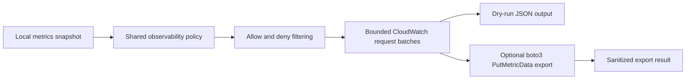

# Latest Test Report

This file is the canonical test report for the repository. It is intentionally
stored at a stable path and should be overwritten when a newer validation run is
performed. Do not create or commit timestamped copies of this report.

The report is sanitized. It must never contain server addresses, usernames,
passwords, tokens, certificate contents, private keys, Oracle wallet material,
full connection strings, sensitive subjects, sensitive payloads, container IDs,
generated database passwords, or full raw logs from live systems.

## Report Summary

| Field | Value |
| --- | --- |
| Overall result | Pass |
| Report generated | 2026-05-27 issue `#102` validation for upcoming `v0.4.2` development |
| Project version | `0.4.1` package metadata with `v0.4.2` development changes |
| Python version | 3.12.4 |
| Git revision checked | Branch `issue-102-cloudwatch-observability` based on `release-v0.4.2` |
| Live NATS details | Environment-gated live tests skipped unless explicitly enabled |
| Live Oracle Database details | Environment-gated live tests skipped unless explicitly enabled |
| Live Oracle MySQL details | Environment-gated live tests skipped unless explicitly enabled |
| Live Amazon CloudWatch details | Not used; tests use dry-run request rendering and fake CloudWatch clients |

This refresh covered the disabled-by-default Amazon CloudWatch observability
connector for issue `#102`, plus a full local regression cycle for the current
development branch. The new tests prove that CloudWatch export remains outside
the message-delivery path, exports only policy-approved aggregate metrics,
builds bounded `PutMetricData` request shapes, keeps regions and credentials out
of dry-run output, retries failed export attempts only within configured limits,
and reports sanitized failure summaries.

## Core And Repository Validation

| Check | Result |
| --- | --- |
| Ruff format | Pass, `238 files already formatted` |
| Ruff lint | Pass |
| Mypy | Pass, no issues in `94` source files |
| Version metadata consistency | Pass for `0.4.1` |
| Dependency manifests | Pass, manifest files up to date |
| Backlog item validation | Pass, `142` backlog item(s) |
| Bug report validation | Pass, `89` bug report item(s) |
| PyPI-facing Markdown links | Pass |
| Secret scan | Pass, no high-confidence secret material found |
| Bandit | Pass with reviewed `nosec` annotations for validated SQL identifier builders |
| Package build | Pass, sdist and wheel built |
| SBOM generation | Pass, CycloneDX JSON and XML generated |
| Checksum generation | Pass, `dist/SHA256SUMS` generated |
| Distribution checksum verification | Pass for retained distributions |

## Test Results

| Test Area | Command | Result |
| --- | --- | --- |
| CloudWatch focused unit and CLI subset | `python -m pytest tests/unit/test_cloudwatch_observability.py tests/unit/test_observability_cli.py tests/unit/test_public_api.py -q` | Pass, `49 passed` |
| Main repository test suite | `scripts/check.sh` | Pass, `1101 passed, 11 skipped` |
| Encryption and sink contract subset | `scripts/check.sh` | Pass, `130 passed` |
| Sink capability subset | `scripts/check.sh` | Pass, `117 passed` |
| Documentation builds | `scripts/check.sh` | Pass for Read the Docs and GitHub Pages MkDocs builds |
| Example validation | `scripts/check.sh` | Pass for file and Oracle example validation paths |

The skipped tests are the existing environment-gated live NATS, Oracle
Database, Oracle MySQL, and push-consumer integration tests.

## CloudWatch Evidence

The new focused coverage verifies:

- Amazon CloudWatch export is disabled by default and does not require a
  metrics snapshot while disabled;
- enabling CloudWatch requires the top-level observability policy to be enabled
  and requires an explicit AWS region;
- dry-run output renders bounded CloudWatch `PutMetricData` request JSON without
  credentials, account IDs, endpoint details, region values, subjects,
  classifications, labels, payloads, message IDs, table names, or file paths;
- metric allow lists and deny lists use the same shared observability policy as
  the existing connectors;
- observation metrics are exported only when observation sharing is enabled;
- static dimensions are bounded and reject sensitive or high-cardinality names;
- prepared subject-family labels become CloudWatch dimensions only when
  `cloudwatch.include_metric_labels_as_dimensions=true`;
- request batching honors `cloudwatch.max_metrics_per_request`;
- oversized request bodies fail closed before any AWS SDK call is made;
- fake-client export tests prove request counts, metric counts, and successful
  export summaries without needing live AWS credentials;
- bounded retry tests prove CloudWatch failures cannot loop indefinitely;
- failure summaries report a safe exception category and do not echo sensitive
  deployment details.

## Issues Found During Validation

No new release-blocking issues were found during the `#102` validation cycle.

## Documentation Evidence

The following public documentation was updated and built successfully:

- [README](https://github.com/ProjectCuillin/nats-sinks/blob/main/README.md)
- [Documentation Home](index.md)
- [Amazon CloudWatch Integration](cloudwatch.md)
- [Observability](observability.md)
- [Observability Connectors](observability-connectors.md)
- [CLI](cli.md)
- [Configuration](configuration.md)
- [Metrics](metrics.md)
- [Operations](operations.md)
- [Service Deployment](service-deployment.md)
- [Security](security.md)
- [Dependency Management](dependency-management.md)
- [Python Usage](python-usage.md)
- [Subject-Aware Observability Runbook](subject-aware-observability-runbook.md)
- [Roadmap](roadmap.md)

The changelog, backlog metadata, roadmap, latest test report, optional
dependency manifests, public CloudWatch documentation, and observability CLI
documentation were updated for issue `#102`.
