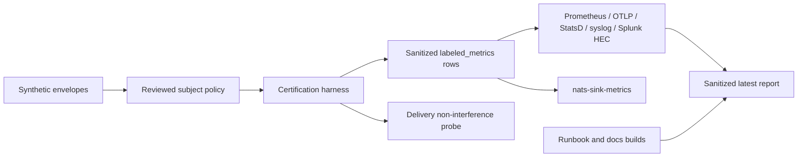

# Latest Test Report

This file is the canonical test report for the repository. It is intentionally
stored at a stable path and should be overwritten when a newer validation run is
performed. Do not create or commit timestamped copies of this report.

The report is sanitized. It must never contain server addresses, usernames,
passwords, tokens, certificate contents, private keys, Oracle wallet material,
full connection strings, sensitive subjects, sensitive payloads, container IDs,
generated database passwords, or full raw logs from live systems.

## Report Summary

| Field | Value |
| --- | --- |
| Overall result | Pass |
| Report generated | 2026-05-26 issue `#127` validation for upcoming `v0.4.2` development |
| Project version | `0.4.1` package metadata with `v0.4.2` development changes |
| Python version | 3.12.4 |
| Git revision checked | Branch `issue-127-subject-observability-certification` based on `release-v0.4.2` |
| Live NATS details | Environment-gated live tests skipped unless explicitly enabled |
| Live Oracle Database details | Environment-gated live tests skipped unless explicitly enabled |
| Live Oracle MySQL details | Environment-gated live tests skipped unless explicitly enabled |

This refresh covered the subject-aware observability certification harness and
operator runbook for issue `#127`, plus a full local regression cycle for the
current development branch. The new tests prove that subject-aware observability
is disabled by default, that approved subject families can be exported without
leaking raw subjects, that malformed policy fails closed, that overflow behavior
stays bounded, and that observability connector failures remain isolated from
delivery decisions.

## Core And Repository Validation

| Check | Result |
| --- | --- |
| Ruff format | Pass, `230 files already formatted` |
| Ruff lint | Pass |
| Mypy | Pass, no issues in `92` source files |
| Version metadata consistency | Pass for `0.4.1` |
| Dependency manifests | Pass, manifest files up to date |
| Backlog item validation | Pass |
| Bug report validation | Pass, `89` bug report item(s) |
| PyPI-facing Markdown links | Pass |
| Secret scan | Pass, no high-confidence secret material found |
| Bandit | Pass with reviewed `nosec` annotations for validated SQL identifier builders |
| Package build | Pass, sdist and wheel built |
| SBOM generation | Pass, CycloneDX JSON and XML generated |
| Checksum generation | Pass, `dist/SHA256SUMS` generated |
| Twine metadata check | Pass for retained distributions |

## Test Results

| Test Area | Command | Result |
| --- | --- | --- |
| Subject-aware observability certification focused tests | `python -m pytest tests/unit/test_subject_observability_certification.py tests/unit/test_subject_family_observability.py tests/unit/test_observability_policy.py tests/unit/test_metrics_cli.py tests/unit/test_public_api.py -q` | Pass, `60 passed` |
| Subject-aware observability regression tests | `python -m pytest tests/unit/test_subject_observability_certification.py tests/unit/test_subject_family_observability.py tests/unit/test_metrics.py tests/unit/test_metrics_cli.py tests/unit/test_observability_policy.py tests/unit/test_observability_cli.py tests/unit/test_prometheus_observability.py tests/unit/test_otlp_observability.py tests/unit/test_elastic_observability.py tests/unit/test_grafana_alloy_observability.py tests/unit/test_splunk_hec_observability.py tests/unit/test_statsd_observability.py tests/unit/test_syslog_observability.py tests/unit/test_public_api.py -q` | Pass, `183 passed` |
| Main repository test suite | `scripts/check.sh` | Pass, `1021 passed, 10 skipped` |
| Encryption and sink contract subset | `scripts/check.sh` | Pass, `123 passed` |
| Sink capability subset | `scripts/check.sh` | Pass, `117 passed` |
| Documentation builds | `scripts/check.sh` | Pass for Read the Docs and GitHub Pages MkDocs builds |
| Example validation | `nats-sink validate examples/named-multi-sink/config.json` through unit/CLI coverage | Pass |

The skipped tests are the existing environment-gated live NATS, Oracle
Database, and Oracle MySQL integration tests. Issue `#127` adds certification
helpers and documentation only. It does not change message delivery, ACK
behavior, retries, DLQ behavior, sink writes, or idempotency behavior.

## Subject-Aware Observability Certification Evidence

The new unit coverage verifies:

- subject-aware observability remains disabled until explicitly configured;
- approved subject families produce bounded, stable labels;
- raw subjects are not exposed in connector output;
- denied subjects do not create exported subject-family rows;
- overflow behavior can aggregate to a reviewed fallback label;
- malformed policy is rejected through the same runtime validation boundary;
- Prometheus, OTLP, StatsD, syslog, Splunk HEC, and `nats-sink-metrics` render
  the same sanitized snapshot contract;
- the certification helper includes a delivery non-interference probe proving
  observability code does not ACK, NACK, publish DLQ messages, or write sinks;
- certification data uses synthetic subjects, documentation endpoints, and
  neutral environment marker names only.

## Issues Found During Validation

Two release-blocking validation issues were found and fixed during issue `#127`
development:

- GitHub issue `#284`: the certification helper initially built
  `ObservabilityPolicy` from plain dictionaries in a way that failed mypy. The
  helper now constructs policies through the runtime validation boundary with a
  typed wrapper.
- GitHub issue `#285`: the certification helper initially used a synthetic HEC
  environment marker that looked like credential material to Bandit. The helper
  now avoids secret-looking literal assignments without suppressing the scanner.

## Documentation Evidence

The following public documentation was updated and built successfully:

- [README](https://github.com/ProjectCuillin/nats-sinks/blob/main/README.md)
- [Configuration](configuration.md)
- [Sink Framework](sink-framework.md)
- [Sink Certification](sink-certification.md)
- [Testing](testing.md)
- [Development](development.md)
- [Architecture](architecture.md)
- [Operations](operations.md)
- [Metrics](metrics.md)
- [Observability](observability.md)
- [Subject-Aware Observability Evaluation](subject-aware-observability-evaluation.md)
- [Subject-Aware Observability Runbook](subject-aware-observability-runbook.md)
- [Prometheus Integration](prometheus.md)
- [Named Sinks And Routing](named-sinks.md)
- [Idempotency](idempotency.md)
- [Security](security.md)
- [File Sink](file-sink.md)
- [Oracle Sink](oracle-sink.md)
- [Named Multi-Sink Example](https://github.com/ProjectCuillin/nats-sinks/blob/main/examples/named-multi-sink/config.json)
- [Documentation Home](index.md)

The changelog, backlog metadata, public API contract tests, metrics CLI tests,
observability connector tests, security guidance, and subject-aware
observability documentation were also updated for issue `#127`.
