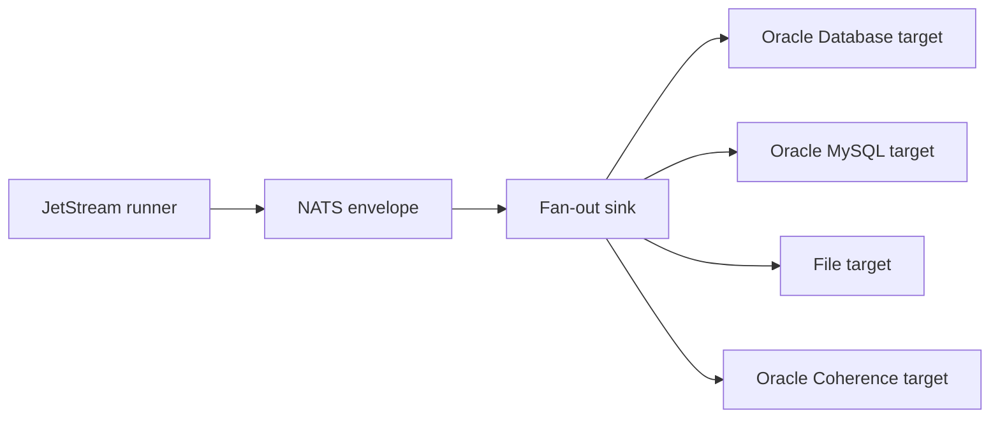

# Latest Test Report

This file is the canonical test report for the repository. It is intentionally
stored at a stable path and should be overwritten when a newer validation run is
performed. Do not create or commit timestamped copies of this report.

The report is sanitized. It must never contain server addresses, usernames,
passwords, tokens, certificate contents, private keys, Oracle wallet material,
full connection strings, sensitive subjects, sensitive payloads, container IDs,
generated database passwords, or full raw logs from live systems.

## Report Summary

| Field | Value |
| --- | --- |
| Overall result | Pass |
| Report generated | 2026-05-28 issue `#301` multi-sink routing end-to-end validation for upcoming `v0.4.2` development |
| Project version | `0.4.1` package metadata with `v0.4.2` development changes |
| Python version | 3.12.4 |
| Git revision checked | Branch `issue-301-multi-sink-routing-e2e-test-flow` based on `release-v0.4.2` |
| Live NATS details | Environment-gated live tests skipped unless explicitly enabled |
| Live Oracle Database details | Environment-gated live tests skipped unless explicitly enabled |
| Live Oracle MySQL details | Environment-gated live tests skipped unless explicitly enabled |
| Live Oracle Coherence details | Environment-gated live tests skipped unless explicitly enabled |

This refresh covered the deterministic multi-sink routing end-to-end flow for
issue `#301`. The new reduced mode validates the tracked fan-out
configuration, routes synthetic messages through the production `FanoutSink`,
and uses local file-backed probe sinks for Oracle Database, Oracle MySQL
Database, File, and Oracle Coherence Community Edition logical targets.

## Core And Repository Validation

| Check | Result |
| --- | --- |
| Ruff format | Pass, `265 files already formatted` |
| Ruff lint | Pass |
| Mypy | Pass, no issues in `110` source files |
| Version metadata consistency | Pass for `0.4.1` |
| Dependency manifests | Pass, manifest files up to date |
| Backlog metadata | Pass, `145` backlog items validated |
| Bug report metadata | Pass, `90` bug reports validated |
| PyPI-facing Markdown links | Pass |
| Documentation builds | Pass for Read the Docs and GitHub Pages MkDocs builds |
| Security checks | Pass; existing reviewed `nosec` warnings remained non-blocking |
| Package build | Pass, source distribution and wheel built |
| SBOM and checksums | Pass, CycloneDX JSON/XML and checksum manifest generated |

## Test Results

| Test Area | Command | Result |
| --- | --- | --- |
| Multi-sink focused subset | `python -m pytest tests/unit/test_multi_sink_routing_e2e.py tests/unit/test_fanout_sink.py tests/unit/test_fanout_certification.py tests/unit/test_routing_policy.py -q` | Pass, `63 passed` |
| Multi-sink reduced e2e runner | `python scripts/run-multi-sink-routing-e2e.py --mode reduced --output .local/multi-sink-routing-e2e/report.json` | Pass, sanitized report generated |
| Multi-sink example validation | `nats-sink validate examples/multi-sink-routing-e2e/config.json` | Pass |
| Main repository test suite | run by `scripts/check.sh` | Pass, `1186 passed, 12 skipped` |
| Commit, encryption, file, and Oracle sink subset | run by `scripts/check.sh` | Pass, `130 passed` |
| Sink certification and example validation | `scripts/check-sinks.sh` via `scripts/check.sh` | Pass, `163 passed` plus file, Oracle, Oracle Coherence, multi-sink routing, Foundry, and Gotham config validation |
| Full local validation | `scripts/check.sh` | Pass |

The skipped tests are the existing environment-gated live NATS, Oracle
Database, Oracle MySQL, Oracle Coherence, and push-consumer integration tests.

## Multi-Sink Routing Evidence

The new focused coverage verifies:

- the tracked `examples/multi-sink-routing-e2e/config.json` file validates
  through the production CLI;
- the route matrix covers subject, priority, classification, `labels_all`,
  `labels_any`, `labels_none`, approved headers, and a static
  `Nats-Sinks-Flow` configuration gate;
- one synthetic message fans out to Oracle Database, Oracle MySQL Database,
  File, and Oracle Coherence Community Edition logical targets;
- one NATO UNCLASS synthetic message routes only to `oracle_unclass`;
- one tasking synthetic message routes only to the Oracle Coherence Community
  Edition read-model target;
- no-route and blocked-training-label messages do not write any probe sink in
  the default `ignore` policy;
- optional target timeout behavior is observed without blocking required
  targets;
- required target failure after partial success raises a temporary failure so
  the original message remains unacknowledged;
- duplicate redelivery attempts are counted while duplicate probe evidence is
  not written again;
- reports and probe evidence contain no payloads, credentials, local paths, or
  live destination details.

## Issues Found During Validation

The initial focused test run found two local example-config mistakes in the new
issue `#301` implementation: a non-existent `batch` section and an unsupported
File sink `format` field. Both were corrected before the final validation
cycle. No existing repository defect required a separate bug report.

## Documentation Evidence

The following public documentation was updated and built successfully:

- [README](https://github.com/ProjectCuillin/nats-sinks/blob/main/README.md)
- [Multi-Sink Routing End-To-End Flow](multi-sink-routing-e2e.md)
- [Configuration](configuration.md)
- [Sink Framework](sink-framework.md)
- [Testing](testing.md)
- [Documentation Home](index.md)

The changelog, backlog metadata, latest test report, examples, and public
testing documentation were updated for issue `#301`.
