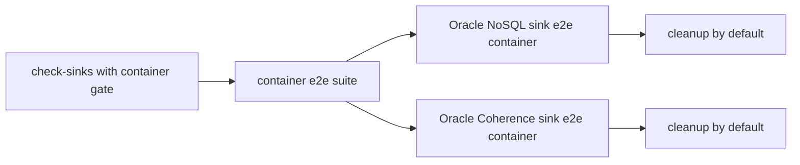

# Latest Test Report

This file is the canonical test report for the repository. It is intentionally
stored at a stable path and should be overwritten when a newer validation run is
performed. Do not create or commit timestamped copies of this report.

The report is sanitized. It must never contain server addresses, usernames,
passwords, tokens, certificate contents, private keys, Oracle wallet material,
full connection strings, sensitive subjects, sensitive payloads, container IDs,
generated database passwords, or full raw logs from live systems.

## Report Summary

| Field | Value |
| --- | --- |
| Overall result | Pass |
| Report generated | 2026-05-28 issue `#316` full local container-backed key/value sink e2e gate for upcoming `v0.4.2` development |
| Project version | `0.4.1` package metadata with `v0.4.2` development changes |
| Python version | 3.12.4 |
| Git revision checked | Branch `issue-316-full-container-e2e-suite`, to be merged back into `release-v0.4.2` |
| Live NATS details | Environment-gated live tests skipped unless explicitly enabled |
| Live Oracle Database details | Environment-gated live tests skipped unless explicitly enabled |
| Live Oracle MySQL details | Environment-gated live tests skipped unless explicitly enabled |
| Live Oracle NoSQL details | Local short-lived KVLite container sink e2e passed through the full container gate |
| Live Oracle Coherence details | Local short-lived Oracle Coherence Community Edition container sink e2e passed through the full container gate |
| Container e2e details | `NATS_SINKS_RUN_CONTAINER_E2E=1 scripts/check-sinks.sh` passed with Docker-backed Oracle NoSQL Database and Oracle Coherence Community Edition e2e runners |

This refresh covered issue `#316`, which adds one explicit local
container-backed e2e gate for the Oracle NoSQL Database and Oracle Coherence
Community Edition key/value sink flows. It also fixed the deterministic
test-loader regression tracked as issue `#317`.

## Core And Repository Validation

| Check | Result |
| --- | --- |
| Ruff format | Pass, `278` files already formatted after formatting the new scripts |
| Ruff lint | Pass |
| Mypy | Pass, no issues in `116` source files |
| Version metadata consistency | Pass for `0.4.1` |
| Dependency manifests | Pass, manifest files up to date |
| Backlog metadata | Pass, `147` backlog items validated |
| Bug report metadata | Pass, `92` bug reports validated |
| PyPI-facing Markdown links | Pass |
| Documentation builds | Pass for Read the Docs and GitHub Pages MkDocs builds |
| Security checks | Pass; existing reviewed `nosec` warnings remained non-blocking |
| Package build | Pass, source distribution and wheel built |
| SBOM and checksums | Pass, CycloneDX JSON/XML and checksum manifest generated |

## Test Results

| Test Area | Command | Result |
| --- | --- | --- |
| Container e2e orchestration and helper subset | `python -m pytest tests/unit/test_container_e2e_suite.py tests/unit/test_oracle_nosql_test_container.py tests/unit/test_oracle_coherence_test_container.py -q` | Pass, `37 passed` |
| Full local container-backed sink e2e gate | `NATS_SINKS_RUN_CONTAINER_E2E=1 scripts/check-sinks.sh` | Pass, `196 passed`; Oracle NoSQL Database sink e2e passed; Oracle Coherence Community Edition sink e2e passed |
| Container cleanup check | Docker container listing filtered for the local Oracle NoSQL and Oracle Coherence test names | Pass, no retained containers |
| Sink certification and example validation | `scripts/check-sinks.sh` | Pass, `196 passed` plus file, Oracle, Oracle NoSQL, Oracle Coherence, multi-sink routing, Foundry, and Gotham config validation |
| Main repository test suite | run by `scripts/check.sh` | Pass, `1252 passed, 13 skipped` |
| Commit, encryption, file, and Oracle sink subset | run by `scripts/check.sh` | Pass, `130 passed` |
| Full local validation | `scripts/check.sh` | Pass |

The skipped tests are the existing environment-gated live NATS, Oracle
Database, Oracle MySQL, Oracle NoSQL Database default integration path, Oracle
Coherence, and push-consumer integration tests. The Oracle NoSQL Database and
Oracle Coherence Community Edition container-backed sink e2e paths were run
through the new explicit local container gate.

## Full Container E2E Evidence

The new full-container e2e coverage verifies:

- normal `scripts/check-sinks.sh` remains Docker-free by default;
- setting `NATS_SINKS_RUN_CONTAINER_E2E=1` runs both maintained key/value
  sink e2e helpers in one pass;
- the Oracle NoSQL Database part uses the short-lived KVLite sink e2e helper;
- the Oracle Coherence Community Edition part uses the Oracle Linux 9 slim
  based local test container sink e2e helper;
- Docker commands stay behind backend-specific fixed argument lists;
- both backend helpers use fake local JSON data and loopback endpoints;
- both backend helpers clean up their short-lived containers by default.

## Issues Found During Validation

Issue `#317` was found during the first focused test run for issue `#316`: the
new unit test loader imported a dataclass-bearing script module without
registering the module in `sys.modules` first. A failing test comment was
posted, the loader was fixed, the focused regression passed with `37 passed`,
and the bug was marked completed with sanitized evidence.

No additional repository defects were found after the fix. The security scan
reported existing reviewed `nosec` annotations as warnings, and the check
remained passing.

## Documentation Evidence

The following public documentation was updated and built successfully:

- [README](https://github.com/ProjectCuillin/nats-sinks/blob/main/README.md)
- [Oracle NoSQL Database Sink](oracle-nosql-sink.md)
- [Oracle NoSQL Database Test Backend](oracle-nosql-test-container.md)
- [Oracle Coherence Community Edition Test Backend](oracle-coherence-test-container.md)
- [Local Docker Stack](docker.md)
- [Testing](testing.md)
- [Publishing](publishing.md)
- [Release](release.md)
- [Sink Framework](sink-framework.md)
- [Security Rule Review](security-rule-review.md)
- [Roadmap](roadmap.md)
- [Documentation Home](index.md)

The changelog, backlog metadata, bug report metadata, latest test report, and
public documentation were updated for issues `#316` and `#317`.
