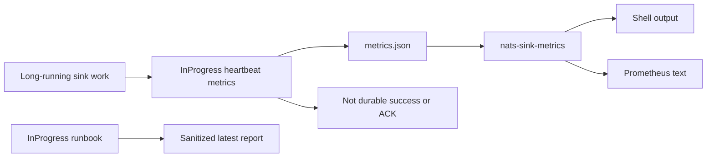

# Latest Test Report

This file is the canonical test report for the repository. It is intentionally
stored at a stable path and should be overwritten when a newer validation run is
performed. Do not create or commit timestamped copies of this report.

The report is sanitized. It must never contain server addresses, usernames,
passwords, tokens, certificate contents, private keys, Oracle wallet material,
full connection strings, sensitive subjects, sensitive payloads, container IDs,
generated database passwords, or full raw logs from live systems.

## Report Summary

| Field | Value |
| --- | --- |
| Overall result | Pass |
| Report generated | 2026-05-26 issue `#119` validation for upcoming `v0.4.2` development |
| Project version | `0.4.1` package metadata with `v0.4.2` development changes |
| Python version | 3.12.4 |
| Git revision checked | Branch `issue-119-inprogress-metrics-runbook` based on `release-v0.4.2` |
| Live NATS details | Environment-gated live tests skipped unless explicitly enabled |
| Live Oracle Database details | Environment-gated live tests skipped unless explicitly enabled |
| Live Oracle MySQL details | Environment-gated live tests skipped unless explicitly enabled |

This refresh covered stable InProgress metrics and the operator runbook for
issue `#119`, plus a full local regression cycle for the current development
branch. The new metric tests prove the InProgress metric names are registered,
written to JSON snapshots, rendered through `nats-sink-metrics`, and available
as Prometheus text without exposing payloads, subjects, credentials,
destinations, classification details, labels, or message identifiers.

## Core And Repository Validation

| Check | Result |
| --- | --- |
| Ruff format | Pass, `236 files already formatted` |
| Ruff lint | Pass |
| Mypy | Pass, no issues in `93` source files |
| Version metadata consistency | Pass for `0.4.1` |
| Dependency manifests | Pass, manifest files up to date |
| Backlog item validation | Pass |
| Bug report validation | Pass, `89` bug report item(s) |
| PyPI-facing Markdown links | Pass |
| Secret scan | Pass, no high-confidence secret material found |
| Bandit | Pass with reviewed `nosec` annotations for validated SQL identifier builders |
| Package build | Pass, sdist and wheel built |
| SBOM generation | Pass, CycloneDX JSON and XML generated |
| Checksum generation | Pass, `dist/SHA256SUMS` generated |
| Twine metadata check | Pass for retained distributions |

## Test Results

| Test Area | Command | Result |
| --- | --- | --- |
| Durable replay guidance subset | `python -m pytest tests/unit/test_durable_replay_guidance.py -q` | Pass, `5 passed` |
| InProgress metrics subset | `python -m pytest tests/unit/test_metrics.py tests/unit/test_metrics_cli.py tests/unit/test_inprogress_metrics_runbook.py -q` | Pass, `36 passed` |
| Main repository test suite | `scripts/check.sh` | Pass, `1063 passed, 11 skipped` |
| Encryption and sink contract subset | `scripts/check.sh` | Pass, `123 passed` |
| Sink capability subset | `scripts/check.sh` | Pass, `117 passed` |
| Documentation builds | `scripts/check.sh` | Pass for Read the Docs and GitHub Pages MkDocs builds |
| Example validation | `nats-sink validate examples/named-multi-sink/config.json` through unit/CLI coverage | Pass |

The skipped tests are the existing environment-gated live NATS, Oracle
Database, Oracle MySQL, and push-consumer integration tests. Issue `#119` adds
the stable InProgress observability contract only. Runtime progress heartbeats
remain disabled until the separate heartbeat feature is implemented and
explicitly configured.

## InProgress Metrics Evidence

The new focused coverage verifies:

- `in_progress_attempts_total`, `in_progress_successes_total`,
  `in_progress_failures_total`,
  `in_progress_max_heartbeats_reached_total`,
  `current_in_progress_batches_active`, and
  `in_progress_heartbeat_seconds` are registered in the public metrics
  contract;
- JSON snapshots persist the counter, gauge, and observation values;
- `nats-sink-metrics` renders the metrics in shell output;
- Prometheus text output includes the InProgress observation count;
- `nats-sink-metrics describe` lists the new metric names;
- documentation guardrails keep the runbook discoverable from the public
  observability tree;
- the runbook examples avoid payload, subject, credential, destination, and
  classification exposure.

## Issues Found During Validation

No new release-blocking issues were found during the `#119` validation cycle.

## Documentation Evidence

The following public documentation was updated and built successfully:

- [README](https://github.com/ProjectCuillin/nats-sinks/blob/main/README.md)
- [Configuration](configuration.md)
- [Sink Framework](sink-framework.md)
- [Sink Certification](sink-certification.md)
- [Testing](testing.md)
- [Development](development.md)
- [Architecture](architecture.md)
- [Operations](operations.md)
- [Ordered Consumer Evaluation](ordered-consumer-evaluation.md)
- [Durable Replay To Sinks](durable-replay-to-sinks.md)
- [Metrics](metrics.md)
- [InProgress Metrics Runbook](inprogress-metrics-runbook.md)
- [Observability](observability.md)
- [Subject-Aware Observability Evaluation](subject-aware-observability-evaluation.md)
- [Subject-Aware Observability Runbook](subject-aware-observability-runbook.md)
- [Prometheus Integration](prometheus.md)
- [Named Sinks And Routing](named-sinks.md)
- [Idempotency](idempotency.md)
- [Security](security.md)
- [File Sink](file-sink.md)
- [Oracle Sink](oracle-sink.md)
- [Named Multi-Sink Example](https://github.com/ProjectCuillin/nats-sinks/blob/main/examples/named-multi-sink/config.json)
- [Documentation Home](index.md)

The changelog, backlog metadata, operations guide, metrics documentation,
observability overview, InProgress evaluation, roadmap, and InProgress metrics
runbook were updated for issue `#119`.
