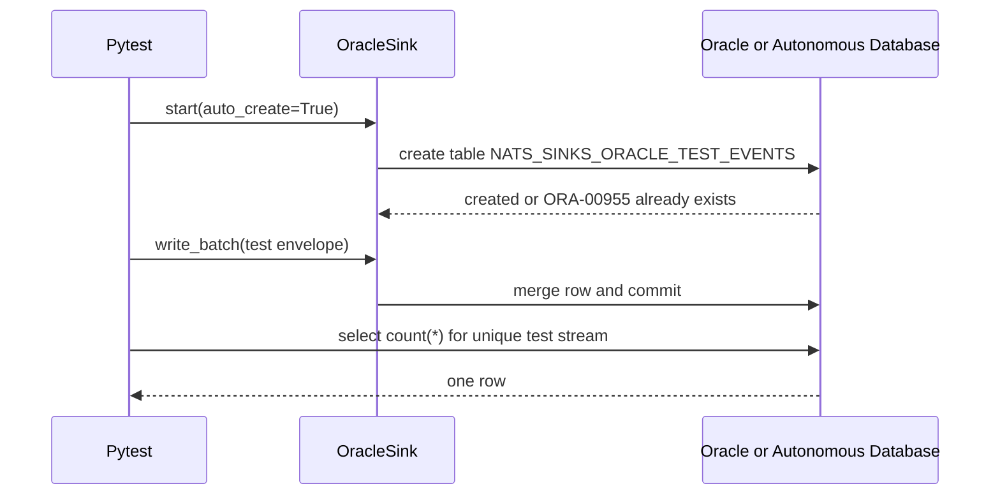
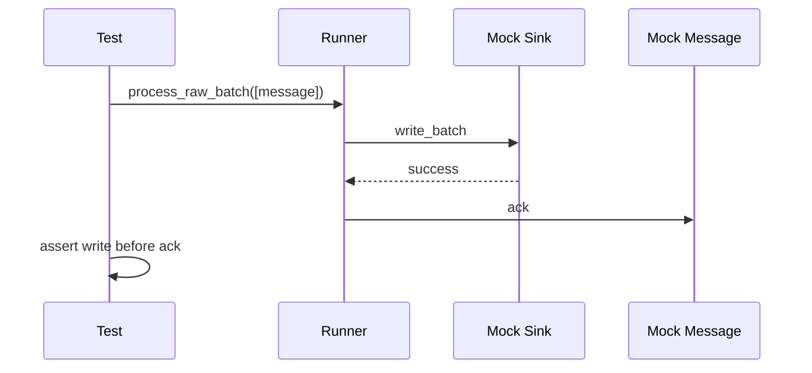
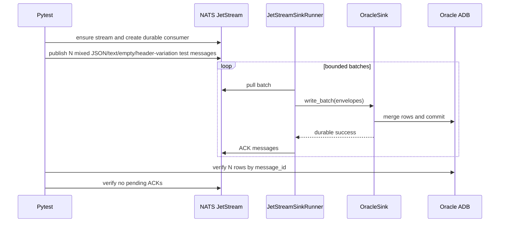

# Testing

The test suite is split between deterministic unit tests and external-service integration tests.

The latest sanitized validation summary is maintained in
[Latest Test Report](https://github.com/ProjectCuillin/nats-sinks/blob/main/docs/test-report.md). Keep only that single report in git and
overwrite it after new validation runs. Do not paste raw logs, server
addresses, usernames, passwords, tokens, certificate material, wallet files,
full connection strings, or sensitive payloads into test reports.

## Unit Tests

Unit tests must not make network calls and must not require NATS or Oracle.

```bash
pytest -m "not integration"
```

Unit tests cover:

- envelope creation,
- idempotency key generation,
- JSON configuration loading,
- secret redaction,
- batch creation,
- retry policy,
- sink protocol contract,
- safe registry behavior,
- Oracle SQL generation,
- Oracle identifier validation,
- Oracle row mapping,
- commit-then-ack ordering,
- DLQ-before-ACK ordering,
- no ACK on sink failure,
- no payload logging by default.

## Integration Tests

Integration tests are marked:

```bash
pytest -m integration
```

They require isolated local services. Do not point integration tests at production NATS or Oracle instances.

### Oracle Integration Tests

Oracle integration tests are disabled unless explicitly enabled. This keeps the
default test suite deterministic and prevents accidental network calls.

The Oracle tests use `OracleSink(auto_create=True)`. When enabled, the sink
attempts to create the configured test table before writing. If the table
already exists, Oracle raises `ORA-00955` and the sink treats that as success.
This is a create-if-missing flow rather than a destructive schema migration.

Required environment:

```bash
export NATS_SINKS_ORACLE_INTEGRATION=1
export NATS_SINKS_ORACLE_DSN='localhost:1521/FREEPDB1'
export NATS_SINKS_ORACLE_USER='NATS_SINK_TEST'
export ORACLE_PASSWORD='replace-with-test-password'
```

Optional environment:

```bash
export NATS_SINKS_ORACLE_TABLE='NATS_SINKS_ORACLE_TEST_EVENTS'
export NATS_SINKS_ORACLE_PASSWORD_ENV='ORACLE_PASSWORD'
export NATS_SINKS_ORACLE_CONFIG_DIR='.local/oracle-adb/wallet'
export NATS_SINKS_ORACLE_WALLET_LOCATION='.local/oracle-adb/wallet'
export NATS_SINKS_ORACLE_WALLET_PASSWORD_ENV='ORACLE_WALLET_PASSWORD'
export NATS_SINKS_ORACLE_SSL_SERVER_DN_MATCH='true'
export NATS_SINKS_ORACLE_RETRY_COUNT='20'
export NATS_SINKS_ORACLE_RETRY_DELAY='3'
export NATS_SINKS_ORACLE_DROP_TABLE_BEFORE='false'
export NATS_SINKS_ORACLE_DROP_TABLE_AFTER='false'
```

For Autonomous Database wallet/mTLS tests, unzip the downloaded wallet into an
ignored directory and keep both the database password and wallet password in
environment variables:

```bash
mkdir -p .local/oracle-adb/wallet
unzip Wallet_MYDB.zip -d .local/oracle-adb/wallet
export NATS_SINKS_ORACLE_DSN='mydb_low'
export NATS_SINKS_ORACLE_CONFIG_DIR='.local/oracle-adb/wallet'
export NATS_SINKS_ORACLE_WALLET_LOCATION='.local/oracle-adb/wallet'
export NATS_SINKS_ORACLE_WALLET_PASSWORD_ENV='ORACLE_WALLET_PASSWORD'
export ORACLE_WALLET_PASSWORD='replace-with-wallet-password'
```

Run only the Oracle integration test module:

```bash
pytest -m integration tests/integration/test_oracle_sink.py
```

The Oracle integration tests use a specific retained test table. The default is
`NATS_SINKS_ORACLE_TEST_EVENTS`; override it with `NATS_SINKS_ORACLE_TABLE`.
The table is not dropped before or after tests unless
`NATS_SINKS_ORACLE_DROP_TABLE_BEFORE=true` or
`NATS_SINKS_ORACLE_DROP_TABLE_AFTER=true` is set. Keeping the table by default
lets operators inspect rows after a test run.

The database user must have enough privilege to create the configured test
table when it is missing, insert or merge rows into it, optionally drop the
test table when cleanup flags are enabled, and select row counts for
assertions. Use a dedicated non-production schema.



## Manual Live NATS Probe

For a real NATS server, use the tracked manual probe script:

```text
scripts/nats-live-probe.py
```

The script is not part of the automated unit test suite because it makes a
network connection. It is useful for validating:

- TLS connection setup,
- local CA certificate trust,
- token or username/password authentication,
- subscribing to a subject,
- optionally publishing and receiving a test message.

Keep live material out of git:

```bash
mkdir -p .local/nats-live
chmod 700 .local/nats-live
$EDITOR .local/nats-live/ca.crt
cat > .local/nats-live/nats-sink.env <<'EOF'
NATS_PASSWORD=replace-with-test-password
EOF
chmod 600 .local/nats-live/ca.crt .local/nats-live/nats-sink.env
```

Subscribe-only probe:

```bash
python scripts/nats-live-probe.py \
  --server tls://nats.example.com:4222 \
  --user example_user \
  --password-env NATS_PASSWORD \
  --env-file .local/nats-live/nats-sink.env \
  --ca-file .local/nats-live/ca.crt \
  --subject example.test.subject
```

Publish-and-receive probe:

```bash
python scripts/nats-live-probe.py \
  --server tls://nats.example.com:4222 \
  --user example_user \
  --password-env NATS_PASSWORD \
  --env-file .local/nats-live/nats-sink.env \
  --ca-file .local/nats-live/ca.crt \
  --subject example.test.subject \
  --publish \
  --message '{"probe":"nats-sinks","kind":"live-test"}'
```

Only use `--publish` with an explicitly approved test subject. The probe does
not print payload contents by default.

## Ordering Tests



This style keeps the most important delivery invariant executable in CI.

## Failure Scenarios Covered

The unit and integration tests intentionally exercise common non-happy paths:

- a message without `Nats-Msg-Id` is persisted when stream-sequence
  idempotency is active,
- a message with `Nats-Expected-Stream` persists that reserved NATS header in
  `metadata_json`,
- an empty message body is wrapped and stored instead of crashing,
- malformed JSON-looking text is preserved as text unless `payload_mode` is
  explicitly `json_only`,
- non-UTF-8 bytes are base64-wrapped so opaque payloads remain durable.

## Live NATS To Oracle End-To-End Test

The end-to-end integration test is the repeatable Oracle-backend acceptance
test. It publishes real messages to NATS JetStream, uses
`JetStreamSinkRunner` to fetch the messages, writes them through `OracleSink`,
and verifies that every row exists in Oracle. It is disabled by default and
only runs when explicitly enabled.

The default message count is 256. Override it with
`NATS_SINKS_E2E_MESSAGE_COUNT` when you want a shorter smoke test or a larger
throughput-style run. The default sink batch size is 64 and can be overridden
with `NATS_SINKS_E2E_BATCH_SIZE`.

Use a message count that is not an exact multiple of the batch size when you
want to prove final partial-batch behavior. For example, with
`NATS_SINKS_E2E_MESSAGE_COUNT=250` and `NATS_SINKS_E2E_BATCH_SIZE=64`, the test
expects four backend writes and verifies that the final batch size is 58. This
confirms that the runner does not require a full batch before writing to the
backend.

### Local Secret Layout

Place live test material under `.local/`. The repository ignores `.local/`, so
these files stay out of git:

```text
.local/
  nats-live/
    ca.crt
    nats-sink.env
  oracle-adb/
    integration.env
    wallet/
      tnsnames.ora
      sqlnet.ora
      ewallet.pem
      cwallet.sso
      ewallet.p12
      ...
  nats-oracle-e2e/
    integration.env
```

The NATS env file should contain only the NATS client secret:

```bash
mkdir -p .local/nats-live
chmod 700 .local/nats-live
$EDITOR .local/nats-live/ca.crt
cat > .local/nats-live/nats-sink.env <<'EOF'
NATS_PASSWORD=replace-with-test-password
EOF
chmod 600 .local/nats-live/ca.crt .local/nats-live/nats-sink.env
```

The Oracle ADB env file should contain the Oracle connection settings and
database or wallet secrets. For wallet/mTLS, unzip the wallet directly into
`.local/oracle-adb/wallet`.

```bash
mkdir -p .local/oracle-adb/wallet
chmod 700 .local/oracle-adb .local/oracle-adb/wallet
unzip Wallet_MYDB.zip -d .local/oracle-adb/wallet

cat > .local/oracle-adb/integration.env <<'EOF'
NATS_SINKS_ORACLE_INTEGRATION=1
NATS_SINKS_ORACLE_DSN=natstest_high
NATS_SINKS_ORACLE_USER=NATS_SINK_TEST
NATS_SINKS_ORACLE_PASSWORD_ENV=ORACLE_PASSWORD
ORACLE_PASSWORD=replace-with-database-password
NATS_SINKS_ORACLE_CONFIG_DIR=.local/oracle-adb/wallet
NATS_SINKS_ORACLE_WALLET_LOCATION=.local/oracle-adb/wallet
NATS_SINKS_ORACLE_WALLET_PASSWORD_ENV=ORACLE_WALLET_PASSWORD
ORACLE_WALLET_PASSWORD=replace-with-wallet-password
NATS_SINKS_ORACLE_TABLE=NATS_SINKS_ORACLE_TEST_EVENTS
NATS_SINKS_ORACLE_SSL_SERVER_DN_MATCH=true
NATS_SINKS_ORACLE_RETRY_COUNT=20
NATS_SINKS_ORACLE_RETRY_DELAY=3
NATS_SINKS_ORACLE_DROP_TABLE_BEFORE=false
NATS_SINKS_ORACLE_DROP_TABLE_AFTER=false
EOF
chmod 600 .local/oracle-adb/integration.env
```

For walletless TLS, set `NATS_SINKS_ORACLE_DSN` to the full `tcps` connect
descriptor and omit the wallet fields.

The e2e env file should contain the NATS endpoint, the test stream/subject, and
the optional message-count controls:

```bash
mkdir -p .local/nats-oracle-e2e
chmod 700 .local/nats-oracle-e2e
cat > .local/nats-oracle-e2e/integration.env <<'EOF'
NATS_SINKS_E2E_INTEGRATION=1
NATS_SINKS_E2E_NATS_URL=tls://nats.example.com:4222
NATS_SINKS_E2E_NATS_USER=example_nats_user
NATS_SINKS_E2E_NATS_PASSWORD_ENV=NATS_PASSWORD
NATS_SINKS_E2E_NATS_TLS_CA_FILE=.local/nats-live/ca.crt
NATS_SINKS_E2E_STREAM=NATS_SINKS_E2E
NATS_SINKS_E2E_SUBJECT=example.test.*
NATS_SINKS_E2E_PUBLISH_SUBJECT=example.test.subject
NATS_SINKS_E2E_ORACLE_TABLE=NATS_SINKS_E2E_EVENTS_V2
NATS_SINKS_E2E_MESSAGE_COUNT=256
NATS_SINKS_E2E_BATCH_SIZE=64
NATS_SINKS_E2E_TEXT_PAYLOAD_INTERVAL=17
NATS_SINKS_E2E_EMPTY_PAYLOAD_INTERVAL=31
NATS_SINKS_E2E_MISSING_MESSAGE_ID_INTERVAL=23
NATS_SINKS_E2E_EXPECTED_STREAM_HEADER_INTERVAL=29
NATS_SINKS_E2E_DROP_TABLE_BEFORE=false
NATS_SINKS_E2E_DROP_TABLE_AFTER=false
NATS_SINKS_E2E_PRINT_TIMINGS=true
EOF
chmod 600 .local/nats-oracle-e2e/integration.env
```

The test creates the JetStream stream when it is missing. If the stream already
exists, it verifies that the configured subject is included in the stream
subjects. For each run, the test creates a unique durable consumer with
`DeliverPolicy.NEW`, `AckPolicy.EXPLICIT`, and `MaxAckPending` large enough for
the requested test batch. It then publishes the requested number of messages to
`NATS_SINKS_E2E_PUBLISH_SUBJECT`. Most messages are JSON objects, and every
`NATS_SINKS_E2E_TEXT_PAYLOAD_INTERVAL` message is encrypted-text-style
non-JSON text. The test runs the sink runner subscribed to
`NATS_SINKS_E2E_SUBJECT`, verifies the Oracle row count and distinct
message-ID count, verifies that messages without `Nats-Msg-Id` do not crash,
verifies that messages with `Nats-Expected-Stream` are represented in
`metadata_json`, verifies that empty message bodies do not crash and are stored
in the nats-sinks JSON payload envelope, verifies that the expected number of
text payloads were stored, confirms backend write timing metrics were captured,
confirms there are no pending ACKs on the test consumer, and deletes the test
consumer.

The e2e test uses a specific retained Oracle table. The default is
`NATS_SINKS_E2E_EVENTS_V2`; override it with `NATS_SINKS_E2E_ORACLE_TABLE`. The
table is not dropped before or after the test unless
`NATS_SINKS_E2E_DROP_TABLE_BEFORE=true` or
`NATS_SINKS_E2E_DROP_TABLE_AFTER=true` is set. This is intentional: keeping the
table lets operators inspect stored payloads, metadata, and timing columns
after the test. If the table has an older layout and you want the test to
recreate it, set `NATS_SINKS_E2E_DROP_TABLE_BEFORE=true` for that run.

Set `NATS_SINKS_E2E_SUBJECT` to a wildcard such as `example.test.*` and
`NATS_SINKS_E2E_PUBLISH_SUBJECT` to a concrete matching subject such as
`example.test.subject` when you want the e2e test to prove wildcard subscription
behavior.

When `NATS_SINKS_E2E_PRINT_TIMINGS=true`, the test prints a backend write timing
summary based on the runner's `batch_write_seconds` observations. This measures
the duration of `sink.write_batch(...)`, including the Oracle write and commit.

Run it with:

```bash
set -a
source .local/nats-live/nats-sink.env
source .local/oracle-adb/integration.env
source .local/nats-oracle-e2e/integration.env
set +a
pytest -m integration tests/integration/test_nats_oracle_e2e.py
```

The tracked helper script performs the same run and accepts explicit cleanup
flags. Both cleanup flags default to false:

```bash
scripts/run-oracle-e2e.sh
scripts/run-oracle-e2e.sh --drop-table-before
scripts/run-oracle-e2e.sh --drop-table-after
scripts/run-oracle-e2e.sh --table NATS_SINKS_E2E_EVENTS_V2 --message-count 256
scripts/run-oracle-e2e.sh --table NATS_SINKS_E2E_EVENTS_V2 --message-count 250 --batch-size 64
```


