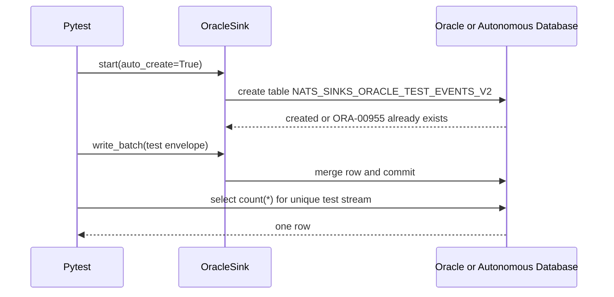
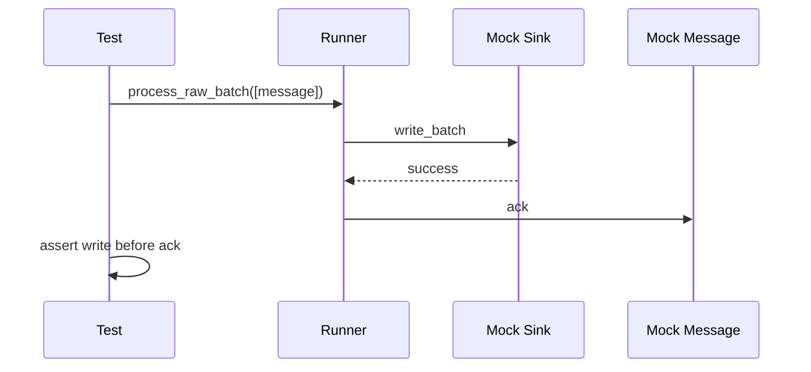
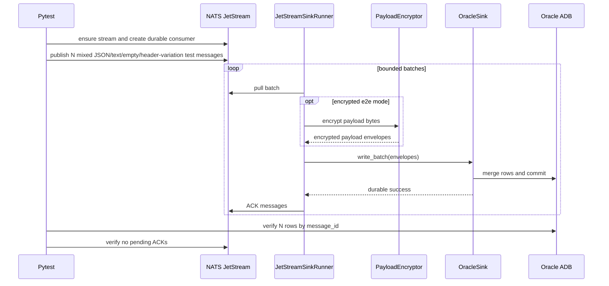

# Testing

The test suite is split between deterministic unit tests and external-service integration tests.

The latest sanitized validation summary is maintained in
[Latest Test Report](test-report.md). Keep only that single report in git and
overwrite it after new validation runs. Do not paste raw logs, server
addresses, usernames, passwords, tokens, certificate material, wallet files,
full connection strings, or sensitive payloads into test reports.

This rule matters in public repositories and it matters even more for
mission-oriented or defence-adjacent deployments. Test evidence should prove
behavior without disclosing network topology, credentials, classified labels,
operational subjects, or real payload content.

## Unit Tests

Unit tests must not make network calls and must not require NATS, Oracle, or
any other external service.

```bash
pytest -m "not integration"
```

Unit tests cover:

- envelope creation,
- idempotency key generation,
- JSON configuration loading,
- strict JSON boundary handling for configuration, automation manifests,
  payloads, mission metadata, encryption envelopes, observability policy
  files, NATS monitoring responses, and public timing evidence,
- secret redaction,
- batch creation,
- retry policy,
- sink protocol contract,
- safe registry behavior,
- file sink path mapping,
- file sink duplicate handling,
- file sink filesystem error classification,
- Oracle SQL generation,
- Oracle identifier validation,
- Oracle row mapping,
- AES-256-GCM and AES-256-CCM payload encryption,
- payload decryption verification,
- commit-then-ack ordering,
- no ACK when payload encryption fails before sink delivery,
- DLQ-before-ACK ordering,
- no ACK on sink failure,
- no payload logging by default.

Ordered-consumer support is currently documentation and backlog only. Future
ordered-inspection tests should prove that inspection tooling is read-only,
bounded, redacted by default, and unable to call sink writes. Future durable
replay-to-sinks tests should stay on the normal commit-then-acknowledge
contract and prove that replay never ACKs before durable sink success. See
[Ordered Consumer Evaluation](ordered-consumer-evaluation.md).

Push-consumer support is also documentation and backlog only. Future push-mode
tests must prove manual ACK behavior, bounded callback intake, no ACK on
temporary failures, DLQ-before-ACK behavior on permanent failures, flow-control
and heartbeat handling, graceful shutdown, and unchanged pull-mode behavior.
See [Push Consumer Evaluation](push-consumer-evaluation.md).

## Bounded Property-Style Tests

The repository uses deterministic bounded generator tests for security-sensitive
validators and normalizers. These tests provide many of the benefits of
property-based testing without adding a new dependency or introducing
non-determinism into CI. The generators are deliberately small, explicit, and
reviewable so a failing case is easy to understand.

Run the focused generator suite with:

```bash
pytest tests/unit/test_property_generators.py
```

The current generator suite covers:

- NATS subject pattern validation and wildcard matching invariants;
- payload normalization into JSON-compatible storage values;
- message metadata normalization for priority, classification, and labels;
- mission metadata JSON validation, freezing, and duplicate-key rejection;
- file sink path sanitization for traversal-like, control-character, Unicode,
  oversized, and hostile string-conversion values.

The file path generator found and now guards a real hardening case: a hostile
object whose string conversion raises must not crash path sanitization. The
sanitizer now falls back to a deterministic safe component derived from type
metadata rather than using a raw object representation.

These tests are intentionally payload-safe. Error assertions check that invalid
payload content is not echoed back in exception text. Generated values are fake
and must not include credentials, private infrastructure details, real
operational subjects, or sensitive payload fragments.

If a future maintainer adds Hypothesis or another property-based testing tool,
it must be a development-only dependency, documented in `CHANGELOG.md`, and
reflected in the generated dependency manifests.

## Oracle Benchmark Tests

Oracle benchmark tooling is split into two layers:

- unit tests for command validation, report redaction, phase rendering, and
  public-output safety;
- a live benchmark script for non-production NATS and Oracle environments.

The unit tests run in normal CI and do not connect to NATS or Oracle:

```bash
pytest tests/unit/test_oracle_benchmark.py
```

The live benchmark is opt-in and must use ignored local environment files:

```bash
scripts/run-oracle-benchmark.sh \
  --message-count 256 \
  --batch-size 64 \
  --payload-shape mixed \
  --sink-mode merge \
  --format markdown \
  --report-file .local/oracle-benchmark/report.md
```

The script reports publish, fetch, map, write, commit, ACK, retry, and shutdown
phases separately. It uses the real `OracleSink` and `JetStreamSinkRunner`, so
Oracle commit still happens before JetStream ACK. The script must not be used
against production streams or production tables unless an operator has reviewed
retention, duplicate handling, table cleanup flags, and the impact of synthetic
messages.

Benchmark reports are sanitized by default. They are suitable for summaries in
`docs/test-report.md`, but maintainers must still inspect them before copying
them into public issues or release notes.

The benchmark report helpers reject non-finite phase timings before JSON or
Markdown evidence is rendered. This keeps public reports standards-compliant
and avoids accidentally publishing `NaN` or `Infinity` in issue comments,
release notes, or retained test reports.

## Local File Sink End-To-End Test

The file sink has a deterministic local end-to-end test because it only needs a
temporary directory. This test exercises the core runner, `FileSink`, payload
normalization, metadata persistence, and ACK-after-durable-file-success
behavior without requiring a NATS server.

```bash
pytest tests/integration/test_file_sink_e2e.py
```

The test publishes fake JetStream message objects into
`JetStreamSinkRunner.process_raw_batch(...)`, writes local JSON files, verifies
JSON, text, empty, and non-UTF-8 payload handling, and confirms that every fake
message is ACKed only after the sink returns success.

The same module also covers gzip-compressed file output and verifies that one
message still maps to one durable compressed file. It also covers core payload
encryption and verifies that encrypted payloads written by the file sink can be
decrypted back to the original JSON, text, empty, and binary message bodies.
By default, any explicit file e2e output directory is deleted after the test.
To retain generated files for inspection, set:

```bash
export NATS_SINKS_FILE_E2E_DIRECTORY='.local/file-sink-e2e'
export NATS_SINKS_FILE_E2E_DELETE_AFTER=false
pytest tests/integration/test_file_sink_e2e.py
```

The test creates a unique child directory under `NATS_SINKS_FILE_E2E_DIRECTORY`
for each run. Keep that directory under `.local/` or another ignored location
when retaining files.

## Synthetic Mission Scenario Harness

The repository includes a synthetic scenario harness for repeatable
mission-style testing without real operational content. The harness generates
immutable `NatsEnvelope` objects with fake subjects, payloads, metadata, and
JetStream sequence values. It is safe for unit tests, smoke tests, release
evidence, and public issue comments because generated reports exclude payload
contents, service locators, usernames, passwords, certificates, keys, wallet
material, local paths, and private infrastructure details.

The harness currently covers these scenario cases:

- `valid_json`, a normal JSON payload that should pass through every
  JSON-capable sink.
- `malformed_json_text`, text that looks like JSON but is intentionally
  incomplete. Default payload handling wraps it as text instead of crashing.
- `duplicate`, a redelivery-style message that reuses the previous message's
  stream sequence, subject, message ID, and payload so idempotent sinks can
  treat the duplicate as already processed.
- `stale`, a message with an older event timestamp so future freshness checks
  and operators can test delayed-event behavior.
- `encrypted_marker`, a fake encrypted-payload envelope shape that proves
  sinks can persist encryption-envelope-like JSON without exposing real key
  material.
- `classified`, `priority`, and `labeled`, which exercise NATO-style
  classification values, urgency values, and semicolon-compatible labels.
- `empty`, an empty message body that must be persisted safely rather than
  causing a hard crash.

Generate a destination-neutral sanitized JSON report:

```bash
python scripts/run-synthetic-harness.py --message-count 18
```

Example output:

```json
{
  "classification_values": {
    "NATO RESTRICTED": 16,
    "NATO SECRET": 2
  },
  "duplicate_messages": 2,
  "encrypted_marker_messages": 2,
  "file_count": null,
  "generated_messages": 18,
  "malformed_json_text_messages": 2,
  "profile": "mission-smoke",
  "sink": "core",
  "stale_messages": 2,
  "unique_idempotency_keys": 16
}
```

Run the same scenario through the file sink without external services:

```bash
python scripts/run-synthetic-harness.py \
  --sink file \
  --message-count 18 \
  --output-dir .local/synthetic-file-smoke \
  --format markdown \
  --report-file .local/synthetic-file-smoke-report.md
```

By default the script deletes file-sink output after the run. Add
`--preserve-files` when you intentionally want to inspect generated records
under an ignored local directory:

```bash
python scripts/run-synthetic-harness.py \
  --sink file \
  --message-count 18 \
  --output-dir .local/synthetic-file-smoke \
  --preserve-files
```

The file-sink adapter also supports gzip output through Python's
standard-library `gzip` module:

```bash
python scripts/run-synthetic-harness.py \
  --sink file \
  --compression gzip \
  --message-count 18
```

Python projects can import the harness directly:

```python
from nats_sinks.testing import SyntheticScenarioProfile, generate_synthetic_scenario

profile = SyntheticScenarioProfile(message_count=18, seed=7)
messages = generate_synthetic_scenario(profile)

for synthetic in messages:
    envelope = synthetic.envelope
    assert envelope.subject.startswith("mission.synthetic.")
```

Future sink adapters should reuse the same generated `NatsEnvelope` objects and
produce sanitized reports with the same shape. Live NATS and Oracle execution
must remain gated behind ignored `.local/` configuration files and explicit
environment flags; the synthetic harness should never connect to live systems
unless a separate, opt-in integration wrapper is added for that purpose.

## Synthetic Load Profile Tests

Load profiles are local, deterministic pressure rehearsals for runtime behavior.
They are separate from the live Oracle benchmark and from the local file-sink
e2e test. Their job is to make normal, retry, DLQ, and shutdown behavior
repeatable without contacting private infrastructure.

Run the unit coverage for the profile API and CLI argument handling:

```bash
pytest tests/unit/test_load_profiles.py
```

Run a normal profile and write a sanitized Markdown report under an ignored
local path:

```bash
mkdir -p .local/load-profile
python scripts/run-load-profile.py \
  --profile normal \
  --message-count 256 \
  --batch-size 64 \
  --with-encryption \
  --format markdown \
  --report-file .local/load-profile/normal.md
```

Run the failure-oriented profiles:

```bash
python scripts/run-load-profile.py --profile retry --message-count 256 --batch-size 64
python scripts/run-load-profile.py --profile dlq --message-count 256 --batch-size 64
python scripts/run-load-profile.py --profile shutdown --message-count 250 --batch-size 64
```

The `shutdown` example intentionally uses a message count that is not a clean
multiple of the batch size. That keeps partial-batch behavior visible while the
profile models stop-fetch behavior and leaves unfetched messages outside the
ACK boundary.

Load-profile phase rates use phase-specific completed-work counters. For
example, fetch timing uses `messages_fetched`, backend-write timing uses
`messages_written`, DLQ timing uses `messages_dlq`, and ACK timing uses
`messages_acked`. This prevents a shutdown or DLQ rehearsal from reporting
inflated throughput by dividing every phase by the total generated message
count.

The profile output is public-safe by design. It contains only generated counts,
aggregate timings, selected retry and DLQ counters, and optional metrics
snapshot data. It must not be edited to include real subjects, server
addresses, usernames, passwords, wallet locations, certificate material, table
names, or payload bodies.

For operational interpretation guidance, see
[Performance](performance.md#synthetic-load-profiles).

## Payload Encryption Test Matrix

Payload encryption is tested as a generic core feature and through each
production sink. Use the tracked helper script:

```bash
scripts/check-encryption.sh
```

The script generates temporary AES-256 key material, exports it to the test
process as `NATS_SINKS_TEST_ENCRYPTION_KEY_B64`, and runs encryption-focused
unit and local end-to-end tests. By default, the generated key file is deleted
when the script exits.

To preserve the generated key file for local debugging:

```bash
scripts/check-encryption.sh --preserve-key-material
```

Do not commit preserved key files. Keep them under the temporary path reported
by the script or move them only to ignored local directories.

The encryption matrix covers:

- AES-256-GCM encrypt/decrypt,
- AES-256-CCM encrypt/decrypt,
- empty payload encryption,
- wrong key identifier rejection,
- redacted direct key configuration,
- subject-specific encryption rules, including matching subjects, unmatched
  subjects, disabled-rule exemptions, and first-match-wins behavior,
- runner encryption before sink writes,
- no ACK when encryption fails,
- file sink storage with and without gzip,
- file sink end-to-end decrypt verification,
- Oracle sink encrypted payload storage through mocked Oracle objects.

## Sink Release Test Matrix

Every production release should validate each production sink at the strongest
available level:

| Sink | Unit tests | Smoke tests | End-to-end tests |
| --- | --- | --- | --- |
| Oracle | SQL, mapping, routing, payload, idempotency, encrypted payload storage, and contract tests. | `nats-sink validate examples/oracle-jetstream/config.json`; live `test-sink` when Oracle env is available. | Live NATS-to-Oracle e2e when `.local` integration env is available. |
| File | Path mapping, payload, duplicate policy, compression, encryption, healthcheck, filesystem errors, and fuzz-style path safety tests. | `nats-sink validate examples/file-basic/config.json`; `nats-sink test-sink examples/file-basic/config.json`. | Local deterministic runner-to-file e2e in `tests/integration/test_file_sink_e2e.py`, with uncompressed, gzip, and encrypted output. |

If a live external-service test is not run, the latest test report must say so
explicitly. Do not imply that Oracle, NATS, or any other external service was
validated when only deterministic local tests were executed.

For mission systems, keep that distinction visible. A deterministic local test,
a mocked integration test, a lab e2e test, and a production-like acceptance run
are different levels of evidence and should not be described as if they prove
the same operational readiness.

The deterministic sink release matrix can be run with:

```bash
scripts/check-sinks.sh
```

To include live Oracle checks, source the ignored local integration environment
files first and set:

```bash
export NATS_SINKS_RUN_LIVE_ORACLE=1
export NATS_SINKS_RUN_LIVE_E2E=1
scripts/check-sinks.sh
```

## Integration Tests

Integration tests are marked:

```bash
pytest -m integration
```

They require isolated local services. Do not point integration tests at production NATS or Oracle instances.

### Oracle Integration Tests

Oracle integration tests are disabled unless explicitly enabled. This keeps the
default test suite deterministic and prevents accidental network calls.

The Oracle tests use `OracleSink(auto_create=True)`. When enabled, the sink
attempts to create the configured test table before writing. If the table
already exists, Oracle raises `ORA-00955` and the sink treats that as success.
This is a create-if-missing flow rather than a destructive schema migration.

Required environment:

```bash
export NATS_SINKS_ORACLE_INTEGRATION=1
export NATS_SINKS_ORACLE_DSN='localhost:1521/FREEPDB1'
export NATS_SINKS_ORACLE_USER='NATS_SINK_TEST'
export ORACLE_PASSWORD='replace-with-test-password'
```

Optional environment:

```bash
export NATS_SINKS_ORACLE_TABLE='NATS_SINKS_ORACLE_TEST_EVENTS_V2'
export NATS_SINKS_ORACLE_PASSWORD_ENV='ORACLE_PASSWORD'
export NATS_SINKS_ORACLE_CONFIG_DIR='.local/oracle-adb/wallet'
export NATS_SINKS_ORACLE_WALLET_LOCATION='.local/oracle-adb/wallet'
export NATS_SINKS_ORACLE_WALLET_PASSWORD_ENV='ORACLE_WALLET_PASSWORD'
export NATS_SINKS_ORACLE_SSL_SERVER_DN_MATCH='true'
export NATS_SINKS_ORACLE_RETRY_COUNT='20'
export NATS_SINKS_ORACLE_RETRY_DELAY='3'
export NATS_SINKS_ORACLE_DROP_TABLE_BEFORE='false'
export NATS_SINKS_ORACLE_DROP_TABLE_AFTER='false'
```

For Autonomous Database wallet/mTLS tests, unzip the downloaded wallet into an
ignored directory and keep both the database password and wallet password in
environment variables:

```bash
mkdir -p .local/oracle-adb/wallet
unzip Wallet_MYDB.zip -d .local/oracle-adb/wallet
export NATS_SINKS_ORACLE_DSN='mydb_low'
export NATS_SINKS_ORACLE_CONFIG_DIR='.local/oracle-adb/wallet'
export NATS_SINKS_ORACLE_WALLET_LOCATION='.local/oracle-adb/wallet'
export NATS_SINKS_ORACLE_WALLET_PASSWORD_ENV='ORACLE_WALLET_PASSWORD'
export ORACLE_WALLET_PASSWORD='replace-with-wallet-password'
```

Run only the Oracle integration test module:

```bash
pytest -m integration tests/integration/test_oracle_sink.py
```

The Oracle integration tests use a specific retained test table. The default is
`NATS_SINKS_ORACLE_TEST_EVENTS_V2`; override it with `NATS_SINKS_ORACLE_TABLE`.
The table is not dropped before or after tests unless
`NATS_SINKS_ORACLE_DROP_TABLE_BEFORE=true` or
`NATS_SINKS_ORACLE_DROP_TABLE_AFTER=true` is set. Keeping the table by default
lets operators inspect rows after a test run.

Before writing, the integration test verifies that the retained table contains
the current required columns. If it finds an older table layout, it fails with
a clear message instead of surfacing a lower-level Oracle invalid-identifier
error. Set `NATS_SINKS_ORACLE_DROP_TABLE_BEFORE=true` for the test table, or
choose a fresh table name, when you intentionally want the test to recreate the
schema.

The database user must have enough privilege to create the configured test
table when it is missing, insert or merge rows into it, optionally drop the
test table when cleanup flags are enabled, and select row counts for
assertions. Use a dedicated non-production schema.



## Manual Live NATS Probe

For a real NATS server, use the tracked manual probe script:

```text
scripts/nats-live-probe.py
```

The script is not part of the automated unit test suite because it makes a
network connection. It is useful for validating:

- TLS connection setup,
- local CA certificate trust,
- token or username/password authentication,
- subscribing to a subject,
- optionally publishing and receiving a test message.

Keep live material out of git:

```bash
mkdir -p .local/nats-live
chmod 700 .local/nats-live
$EDITOR .local/nats-live/ca.crt
cat > .local/nats-live/nats-sink.env <<'EOF'
NATS_PASSWORD=replace-with-test-password
EOF
chmod 600 .local/nats-live/ca.crt .local/nats-live/nats-sink.env
```

Subscribe-only probe:

```bash
python scripts/nats-live-probe.py \
  --server tls://nats.example.com:4222 \
  --user example_user \
  --password-env NATS_PASSWORD \
  --env-file .local/nats-live/nats-sink.env \
  --ca-file .local/nats-live/ca.crt \
  --subject example.test.subject
```

Publish-and-receive probe:

```bash
python scripts/nats-live-probe.py \
  --server tls://nats.example.com:4222 \
  --user example_user \
  --password-env NATS_PASSWORD \
  --env-file .local/nats-live/nats-sink.env \
  --ca-file .local/nats-live/ca.crt \
  --subject example.test.subject \
  --publish \
  --message '{"probe":"nats-sinks","kind":"live-test"}'
```

Only use `--publish` with an explicitly approved test subject. The probe does
not print payload contents by default.

## Ordering Tests



This style keeps the most important delivery invariant executable in CI.

## Failure Scenarios Covered

The unit and integration tests intentionally exercise common non-happy paths:

- a message without `Nats-Msg-Id` is persisted when stream-sequence
  idempotency is active,
- a message with `Nats-Expected-Stream` persists that reserved NATS header in
  `metadata_json`,
- an empty message body is wrapped and stored instead of crashing,
- malformed JSON-looking text is preserved as text unless `payload_mode` is
  explicitly `json_only`,
- non-UTF-8 bytes are base64-wrapped so opaque payloads remain durable,
- invalid mission metadata is treated as a permanent validation failure and
  follows DLQ-before-ACK behavior when DLQ is configured.

## Live NATS To Oracle End-To-End Test

The end-to-end integration test is the repeatable Oracle-backend acceptance
test. It publishes real messages to NATS JetStream, uses
`JetStreamSinkRunner` to fetch the messages, writes them through `OracleSink`,
and verifies that every row exists in Oracle. It is disabled by default and
only runs when explicitly enabled.

The default message count is 256. Override it with
`NATS_SINKS_E2E_MESSAGE_COUNT` when you want a shorter smoke test or a larger
throughput-style run. The default sink batch size is 64 and can be overridden
with `NATS_SINKS_E2E_BATCH_SIZE`.

Use a message count that is not an exact multiple of the batch size when you
want to prove final partial-batch behavior. For example, with
`NATS_SINKS_E2E_MESSAGE_COUNT=250` and `NATS_SINKS_E2E_BATCH_SIZE=64`, the test
expects four backend writes and verifies that the final batch size is 58. This
confirms that the runner does not require a full batch before writing to the
backend.

### Local Secret Layout

Place live test material under `.local/`. The repository ignores `.local/`, so
these files stay out of git:

```text
.local/
  nats-live/
    ca.crt
    nats-sink.env
  oracle-adb/
    integration.env
    wallet/
      tnsnames.ora
      sqlnet.ora
      ewallet.pem
      cwallet.sso
      ewallet.p12
      ...
  nats-oracle-e2e/
    integration.env
```

The NATS env file should contain only the NATS client secret:

```bash
mkdir -p .local/nats-live
chmod 700 .local/nats-live
$EDITOR .local/nats-live/ca.crt
cat > .local/nats-live/nats-sink.env <<'EOF'
NATS_PASSWORD=replace-with-test-password
EOF
chmod 600 .local/nats-live/ca.crt .local/nats-live/nats-sink.env
```

The Oracle ADB env file should contain the Oracle connection settings and
database or wallet secrets. For wallet/mTLS, unzip the wallet directly into
`.local/oracle-adb/wallet`.

```bash
mkdir -p .local/oracle-adb/wallet
chmod 700 .local/oracle-adb .local/oracle-adb/wallet
unzip Wallet_MYDB.zip -d .local/oracle-adb/wallet

cat > .local/oracle-adb/integration.env <<'EOF'
NATS_SINKS_ORACLE_INTEGRATION=1
NATS_SINKS_ORACLE_DSN=natstest_high
NATS_SINKS_ORACLE_USER=NATS_SINK_TEST
NATS_SINKS_ORACLE_PASSWORD_ENV=ORACLE_PASSWORD
ORACLE_PASSWORD=replace-with-database-password
NATS_SINKS_ORACLE_CONFIG_DIR=.local/oracle-adb/wallet
NATS_SINKS_ORACLE_WALLET_LOCATION=.local/oracle-adb/wallet
NATS_SINKS_ORACLE_WALLET_PASSWORD_ENV=ORACLE_WALLET_PASSWORD
ORACLE_WALLET_PASSWORD=replace-with-wallet-password
NATS_SINKS_ORACLE_TABLE=NATS_SINKS_ORACLE_TEST_EVENTS_V2
NATS_SINKS_ORACLE_SSL_SERVER_DN_MATCH=true
NATS_SINKS_ORACLE_RETRY_COUNT=20
NATS_SINKS_ORACLE_RETRY_DELAY=3
NATS_SINKS_ORACLE_DROP_TABLE_BEFORE=false
NATS_SINKS_ORACLE_DROP_TABLE_AFTER=false
EOF
chmod 600 .local/oracle-adb/integration.env
```

For walletless TLS, set `NATS_SINKS_ORACLE_DSN` to the full `tcps` connect
descriptor and omit the wallet fields.

The e2e env file should contain the NATS endpoint, the test stream/subject, and
the optional message-count controls:

```bash
mkdir -p .local/nats-oracle-e2e
chmod 700 .local/nats-oracle-e2e
cat > .local/nats-oracle-e2e/integration.env <<'EOF'
NATS_SINKS_E2E_INTEGRATION=1
NATS_SINKS_E2E_NATS_URL=tls://nats.example.com:4222
NATS_SINKS_E2E_NATS_USER=example_nats_user
NATS_SINKS_E2E_NATS_PASSWORD_ENV=NATS_PASSWORD
NATS_SINKS_E2E_NATS_TLS_CA_FILE=.local/nats-live/ca.crt
NATS_SINKS_E2E_STREAM=NATS_SINKS_E2E
NATS_SINKS_E2E_SUBJECT=example.test.*
NATS_SINKS_E2E_PUBLISH_SUBJECT=example.test.subject
NATS_SINKS_E2E_ORACLE_TABLE=NATS_SINKS_E2E_EVENTS_V2
NATS_SINKS_E2E_MESSAGE_COUNT=256
NATS_SINKS_E2E_BATCH_SIZE=64
NATS_SINKS_E2E_TEXT_PAYLOAD_INTERVAL=17
NATS_SINKS_E2E_EMPTY_PAYLOAD_INTERVAL=31
NATS_SINKS_E2E_MISSING_MESSAGE_ID_INTERVAL=23
NATS_SINKS_E2E_EXPECTED_STREAM_HEADER_INTERVAL=29
NATS_SINKS_E2E_DROP_TABLE_BEFORE=false
NATS_SINKS_E2E_DROP_TABLE_AFTER=false
NATS_SINKS_E2E_PRINT_TIMINGS=true
# Optional encrypted Oracle e2e mode:
NATS_SINKS_E2E_ENCRYPTION_ENABLED=false
NATS_SINKS_E2E_ENCRYPTION_ALGORITHM=aes-256-gcm
NATS_SINKS_E2E_ENCRYPTION_KEY_ID=nats-sinks-e2e-key
NATS_SINKS_E2E_ENCRYPTION_KEY_B64_ENV=NATS_SINKS_E2E_ENCRYPTION_KEY_B64
EOF
chmod 600 .local/nats-oracle-e2e/integration.env
```

The test creates the JetStream stream when it is missing. If the stream already
exists, it verifies that the configured subject is included in the stream
subjects. For each run, the test creates a unique durable consumer with
`DeliverPolicy.NEW`, `AckPolicy.EXPLICIT`, and `MaxAckPending` large enough for
the requested test batch. It then publishes the requested number of messages to
`NATS_SINKS_E2E_PUBLISH_SUBJECT`. Most messages are JSON objects, and every
`NATS_SINKS_E2E_TEXT_PAYLOAD_INTERVAL` message is encrypted-text-style
non-JSON text. The test runs the sink runner subscribed to
`NATS_SINKS_E2E_SUBJECT`, verifies the Oracle row count and distinct
message-ID count, verifies that messages without `Nats-Msg-Id` do not crash,
verifies that messages with `Nats-Expected-Stream` are represented in
`metadata_json`, verifies that empty message bodies do not crash and are stored
in the nats-sinks JSON payload envelope, verifies that the expected number of
text payloads were stored, confirms backend write timing metrics were captured,
confirms there are no pending ACKs on the test consumer, and deletes the test
consumer.

When `NATS_SINKS_E2E_ENCRYPTION_ENABLED=true`, the same e2e test encrypts
payloads before Oracle writes, verifies that every stored payload contains the
standard `_nats_sinks_encryption` envelope, decrypts the stored values with the
configured key, and compares them with the original JSON, text, empty, and
binary test payloads.

The e2e test uses a specific retained Oracle table. The default is
`NATS_SINKS_E2E_EVENTS_V2`; override it with `NATS_SINKS_E2E_ORACLE_TABLE`. The
table is not dropped before or after the test unless
`NATS_SINKS_E2E_DROP_TABLE_BEFORE=true` or
`NATS_SINKS_E2E_DROP_TABLE_AFTER=true` is set. This is intentional: keeping the
table lets operators inspect stored payloads, metadata, and timing columns
after the test. If the table has an older layout and you want the test to
recreate it, set `NATS_SINKS_E2E_DROP_TABLE_BEFORE=true` for that run.

### Retained Oracle Table Schema Drift

Retained test tables are useful because they let you inspect rows after a live
run, but they can outlive schema changes. When the project adds columns such as
`PRIORITY`, `CLASSIFICATION`, `LABELS`, timestamp fields, `METADATA_JSON`, or
`MISSION_METADATA_JSON`, an older retained table may no longer match the
current e2e contract.

This is handled deliberately. The e2e test checks the table shape before it
publishes messages or starts the runner. If required columns are missing, the
test fails fast with a clear schema message and does not process messages
against that table. Treat that result as a safety guard, not as a delivery
failure.

You have three safe options:

1. Choose a fresh table name for the run, letting `OracleSink.ensure_schema()`
   create the current test layout.
2. Set `NATS_SINKS_E2E_DROP_TABLE_BEFORE=true` only for an isolated test table
   that may be destroyed and recreated.
3. Migrate the retained table manually through your normal database change
   process, then rerun the e2e test.

For example, this command keeps the table after the run while avoiding any
older retained table:

```bash
scripts/run-oracle-e2e.sh --table NATS_SINKS_E2E_METRICS --message-count 256 --batch-size 64
```

Do not use `--drop-table-before` or `--drop-table-after` on a table that holds
evidence, audit records, production data, or data that another test still needs.

Set `NATS_SINKS_E2E_SUBJECT` to a wildcard such as `example.test.*` and
`NATS_SINKS_E2E_PUBLISH_SUBJECT` to a concrete matching subject such as
`example.test.subject` when you want the e2e test to prove wildcard subscription
behavior.

When `NATS_SINKS_E2E_PRINT_TIMINGS=true`, the test prints a backend write timing
summary based on the runner's `sink_batch_write_seconds` observations. This
measures the duration of `sink.write_batch(...)`, including the Oracle write
and commit. The older `batch_write_seconds` alias remains available for
compatibility with earlier local reports.

Run it with:

```bash
set -a
source .local/nats-live/nats-sink.env
source .local/oracle-adb/integration.env
source .local/nats-oracle-e2e/integration.env
set +a
pytest -m integration tests/integration/test_nats_oracle_e2e.py
```

The tracked helper script performs the same run and accepts explicit cleanup
flags. Both cleanup flags default to false:

```bash
scripts/run-oracle-e2e.sh
scripts/run-oracle-e2e.sh --drop-table-before
scripts/run-oracle-e2e.sh --drop-table-after
scripts/run-oracle-e2e.sh --table NATS_SINKS_E2E_EVENTS_V2 --message-count 256
scripts/run-oracle-e2e.sh --table NATS_SINKS_E2E_EVENTS_V2 --message-count 250 --batch-size 64
scripts/run-oracle-e2e.sh --with-encryption --message-count 64 --batch-size 16
scripts/run-oracle-e2e.sh --with-encryption --encryption-algorithm aes-256-ccm --preserve-key-material
```

`--with-encryption` generates temporary AES-256 key material when
`NATS_SINKS_E2E_ENCRYPTION_KEY_B64` is not already set. The generated key file
is deleted after the run by default. Use `--preserve-key-material` only for
local debugging, and keep preserved files out of git.


