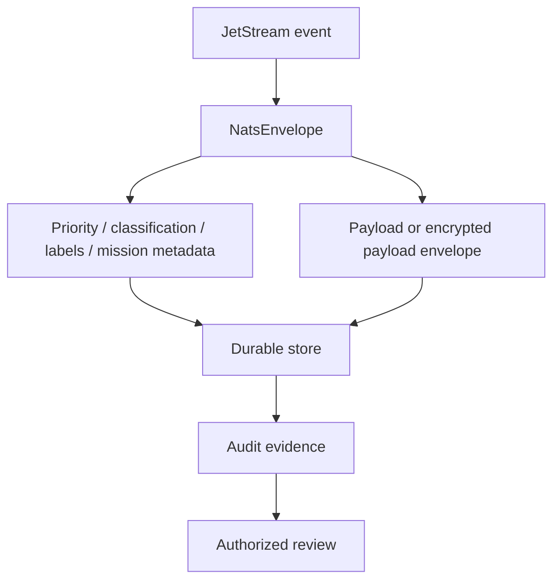

# Audit-Oriented Persistence

Audit-oriented persistence means storing events so authorized reviewers can
understand what was received, what was written, which policy metadata was
attached, and why a message was ACKed or routed to DLQ. `nats-sinks` supports
this pattern through immutable envelopes, durable sink commits, metadata
preservation, idempotency, metrics snapshots, and sanitized test reports.

This blueprint is about accountability and evidence. It does not turn
`nats-sinks` into a targeting system, fire-control system, weapons-release
mechanism, rules-of-engagement engine, or autonomous decision platform.



## Audit Questions

A good audit record should help answer:

- Which JetStream stream and sequence produced the stored record?
- Which subject carried the event?
- Which idempotency key protected the destination write?
- Was the payload stored as JSON, wrapped text, wrapped bytes, or encrypted
  payload?
- Which priority, classification, and labels were attached?
- Which mission metadata profile, if any, was stored?
- Was the record written normally or did it reach a DLQ?
- Which release and test evidence supported the sink behavior?

## Oracle Pattern

Oracle can support audit-oriented retention through stable columns plus JSON
context:

```sql
select
    subject,
    stream_name,
    stream_sequence,
    message_id,
    priority,
    classification,
    labels,
    mission_metadata_json
from mission_event_inbox
where classification = :classification
order by stream_sequence
```

Use bind variables for all values. Keep payload access restricted separately
from metadata queries when payloads contain sensitive content.

## File Pattern

For file-sink records, the same concepts appear in JSON:

```json
{
  "subject": "mission.synthetic.gateway.report.0001",
  "priority": "routine",
  "classification": "NATO RESTRICTED",
  "labels_list": ["audit", "mission-test"],
  "mission_metadata": {
    "profile": "audit-oriented-persistence",
    "profile_version": 1
  },
  "payload": {
    "payload_format": "json",
    "data": {
      "event_id": "SYN-AUDIT-0001"
    }
  }
}
```

## Metrics And Reports

Metrics and test reports help operators prove behavior without exposing
payloads:

- `messages_written_total` proves sink write success count.
- `messages_acked_total` proves ACK count after success.
- `messages_dlq_total` proves DLQ routing count.
- `sink_write_errors_total` proves write failures were observed.
- Oracle duplicate/conflict counters show idempotent duplicate handling.

Metrics must not include payloads, credentials, private keys, full connection
strings, or sensitive operational details.

## Operational Guidance

- Keep audit schemas stable and document migrations.
- Separate metadata search permissions from payload read permissions where
  possible.
- Use encrypted payloads when audit metadata may be searchable but payload
  access must be restricted.
- Keep release evidence sanitized and repeatable.
- Validate retained e2e tables for schema drift before relying on them.
