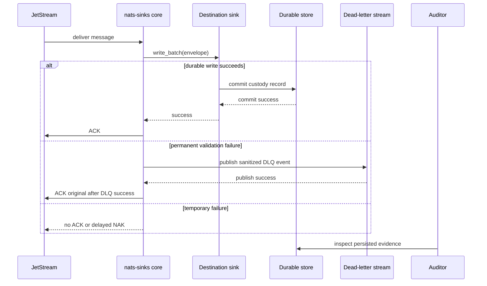

# Chain Of Custody

Chain of custody is the ability to explain how an event moved from JetStream to
a durable destination and which evidence proves that the sink committed it
before acknowledging it. In `nats-sinks`, this evidence comes from the
commit-then-acknowledge invariant, immutable envelope metadata, idempotent sink
writes, and optional DLQ records.

This blueprint supports audit and replay analysis. It does not turn
`nats-sinks` into a targeting system, fire-control system, weapons-release
mechanism, rules-of-engagement engine, or autonomous decision platform.



## Evidence Fields

Useful chain-of-custody evidence includes:

- subject;
- stream name and stream sequence;
- consumer name and consumer sequence;
- NATS message ID when provided;
- idempotency key used by the sink;
- event creation timestamp when available;
- receive timestamp;
- store timestamp or database default timestamp;
- sink mode and duplicate handling policy;
- DLQ subject and error category when a permanent failure occurred;
- metrics snapshot around the run.

These fields should be captured without logging full payloads by default.

## Idempotency Is Part Of Custody

At-least-once delivery means duplicates are normal. Chain-of-custody evidence
should show how duplicates are handled:

- Oracle `merge` can make the stream and sequence key authoritative.
- Oracle `insert_ignore` can treat duplicate-key conflicts as success.
- File sink `skip_existing` can preserve the first written file for a stable
  idempotency key.

The custody goal is not "no duplicates ever." The goal is "duplicates do not
corrupt the durable record, and ACKs are never sent before durable success."

## Example Audit Query Shape

An Oracle audit query commonly filters by stable metadata instead of payload
content:

```sql
select
    stream_name,
    stream_sequence,
    subject,
    message_id,
    priority,
    classification,
    labels,
    stored_at_epoch_ms
from mission_event_inbox
where stream_name = :stream_name
  and stream_sequence = :stream_sequence
```

The values are bound parameters. Do not concatenate operator-provided values
into SQL.

## File Evidence Shape

For file-sink deployments, the file name can be deterministic and the record
contains both sink metadata and framework metadata:

```json
{
  "subject": "mission.synthetic.sensor.track.0001",
  "idempotency_key": "MISSION_SYNTHETIC:42",
  "priority": "urgent",
  "classification": "NATO SECRET",
  "metadata": {
    "stream": "MISSION_SYNTHETIC",
    "stream_sequence": 42,
    "received_at_epoch_ms": 1767273600000,
    "stored_at_epoch_ms": 1767273600100
  }
}
```

## Operational Guidance

- Keep clocks synchronized where timestamps are used for audit ordering.
- Prefer database constraints over in-memory duplicate tracking.
- Keep DLQ records sanitized but detailed enough to diagnose permanent
  failures.
- Keep release test reports sanitized and avoid pasting raw operational logs
  into GitHub Issues.
