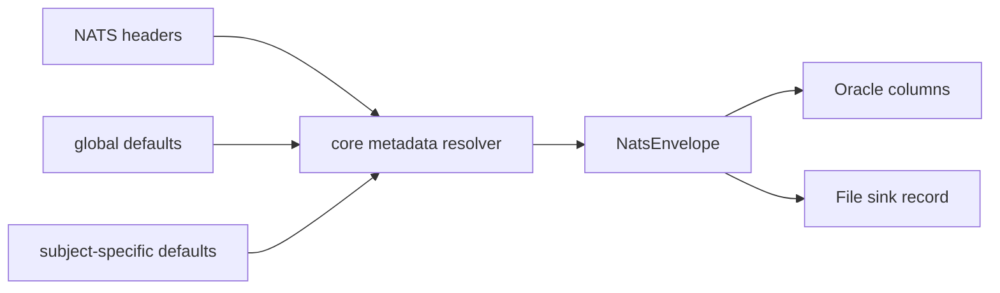

# Classification And Labels

`nats-sinks` provides three generic handling fields on every `NatsEnvelope`:
`priority`, `classification`, and `labels`. Defence and mission-support users
can map these fields to operational handling concepts, while commercial and
public-sector users can map the same fields to urgency, privacy, tenant, audit,
or workflow tags.

This blueprint describes metadata handling only. It does not turn `nats-sinks`
into a targeting system, fire-control system, weapons-release mechanism,
rules-of-engagement engine, or autonomous decision platform.



## Field Meanings

| Field | Purpose | Example Values |
| --- | --- | --- |
| `priority` | Handling urgency for operators and downstream systems. | `routine`, `priority`, `urgent`, `immediate` |
| `classification` | Handling domain or sensitivity label. | `NATO UNCLASSIFIED`, `NATO RESTRICTED`, `NATO CONFIDENTIAL`, `NATO SECRET` |
| `labels` | Semicolon-compatible tags for routing, search, audit, and scenario context. | `sensor;track;mission-test` |

These fields are not authorization decisions. Access control must be enforced by
the systems that store, expose, export, or analyze the records.

The fields also do not change delivery semantics. A message with `immediate`
priority or `NATO SECRET` classification is still written through the sink
first, committed durably, and ACKed only after the sink returns success.

## Resolution Order

The core resolves each field from the first available source:

1. explicit NATS headers;
2. matching subject-specific defaults;
3. global defaults;
4. `null` when no value is configured.

Subject-specific defaults are useful when a family of subjects needs a default
handling profile without requiring every publisher to set headers.

## Configuration Example

```json
{
  "message_metadata": {
    "priority": {
      "default": "routine",
      "rules": [
        {
          "subject": "mission.synthetic.sensor.>",
          "default": "urgent"
        }
      ]
    },
    "classification": {
      "default": "NATO RESTRICTED",
      "rules": [
        {
          "subject": "mission.synthetic.sensor.>",
          "default": "NATO SECRET"
        }
      ]
    },
    "labels": {
      "default": "mission-test",
      "rules": [
        {
          "subject": "mission.synthetic.sensor.>",
          "default": "sensor;mission-test"
        }
      ]
    }
  }
}
```

## Oracle Record Shape

Oracle stores the fields in dedicated columns so operators can index and query
common handling metadata without parsing a JSON document:

```json
{
  "PRIORITY": "urgent",
  "CLASSIFICATION": "NATO SECRET",
  "LABELS": "sensor;mission-test",
  "MISSION_METADATA_JSON": {
    "profile": "sensor-event-custody",
    "profile_version": 1
  }
}
```

Use `MISSION_METADATA_JSON` for richer, profile-specific context. Avoid adding
new fixed columns for every mission concept unless the value is stable,
cross-cutting, and genuinely useful for indexing.

## File Record Shape

The file sink stores both the scalar `labels` value and a parsed `labels_list`
for convenience:

```json
{
  "priority": "urgent",
  "classification": "NATO SECRET",
  "labels": "sensor;mission-test",
  "labels_list": ["sensor", "mission-test"],
  "mission_metadata": {
    "profile": "sensor-event-custody",
    "profile_version": 1
  }
}
```

`labels` is the original semicolon-separated storage value. `labels_list` is a
derived array intended for readers that prefer structured JSON.

## Security Guidance

- Do not place credentials, coordinates, live service locations, or secret
  operational details in labels.
- Treat classification values as handling metadata, not as proof that a record
  has been authorized for a reader.
- Keep label vocabularies bounded and documented.
- Avoid high-cardinality labels in metrics and Prometheus exports.
- Use public examples only with fake values.
