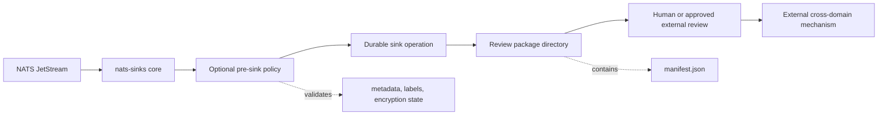
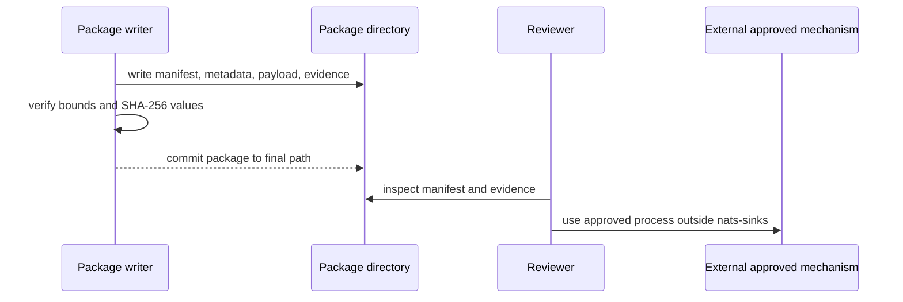

# Cross-Domain Handoff Package Blueprint

A cross-domain handoff package is a reviewable bundle of event data prepared
for a controlled review or transfer process. In `nats-sinks`, the package
blueprint is a documentation and schema pattern for preserving payload
references, normalized metadata, hashes, timestamps, labels, classification,
encryption state, and sink evidence in one bounded artifact.

This page is deliberately careful about scope. `nats-sinks` is not a
cross-domain guard, certification boundary, data diode, release authority,
sanitizer, targeting system, fire-control system, weapons-release mechanism,
rules-of-engagement engine, or autonomous decision platform. A package created
with this blueprint is evidence for review. It is not approval to transfer
data across a boundary.



## Current Scope

The current project scope is a public blueprint with a validated example. It
defines a safe package shape that operators and future sink authors can use
when they need a reviewable local artifact. It does not yet add a dedicated
runtime package writer.

The recommended current shape is a directory package rather than a compressed
archive. A directory package is easier to inspect, avoids archive extraction
risks, and keeps path-safety validation straightforward. If archive output is
added later, it should be implemented as a separate reviewed feature with
strict limits for file count, uncompressed size, compression ratio, path
normalization, and cleanup after failure.

## Delivery Boundary

The ACK boundary depends on how the package is produced:

- If package creation is the configured durable sink operation, the core must
  ACK only after the package is fully written, flushed according to the sink
  policy, and committed to its final durable location.
- If a package is generated later from an already committed Oracle row, file
  record, or spool record, it is a separate export workflow. It does not change
  the original JetStream ACK decision that already happened.
- If package creation fails before its durable boundary, the message should
  remain eligible for redelivery or follow the configured DLQ path.

This preserves the project rule:

> Commit first. ACK last. Design for redelivery.

## Package Layout

A package directory should contain only bounded, reviewable files:

```text
synthetic-review-package-00042/
  manifest.json
  metadata.json
  payload.encrypted.json
  evidence.json
```

The directory name and every file name must be generated by the sink or export
tooling. Do not use publisher-provided subjects, labels, message IDs, filenames,
or mission fields directly as path components without normalization and
allow-list validation.

## Manifest Schema

The proposed manifest schema is:

```json
{
  "schema": "nats_sinks.cross_domain_handoff_package.v1",
  "package_id": "synthetic-review-package-00042",
  "package_format": "directory",
  "created_epoch_ns": 1770000005000000000,
  "source": {
    "stream": "SYNTHETIC_EVENTS",
    "subject": "mission.sensor.synthetic",
    "consumer": "review-worker"
  },
  "message": {
    "stream_sequence": 42,
    "consumer_sequence": 7,
    "message_id": "synthetic-message-00042"
  },
  "metadata": {
    "priority": "high",
    "classification": "NATO SECRET",
    "labels": "review-candidate;mission-test",
    "labels_list": ["review-candidate", "mission-test"]
  },
  "payload": {
    "mode": "encrypted_reference",
    "path": "payload.encrypted.json",
    "encrypted": true,
    "algorithm": "AES-256-GCM",
    "key_id": "synthetic-key-version-001"
  },
  "review": {
    "purpose": "controlled-review-preparation",
    "candidate_domain": "synthetic-review-domain",
    "release_required": true,
    "approval_state": "pending_review"
  }
}
```

The tracked example under
`examples/use-cases/defence/cross-domain-handoff-package/` includes the full
manifest, including size limits and SHA-256 values for each package file.

## File Roles

| File | Purpose | Safety guidance |
| --- | --- | --- |
| `manifest.json` | Package index, schema version, metadata summary, payload reference, review state, and limits. | Keep it small, UTF-8 JSON, and free of secrets. |
| `metadata.json` | Normalized nats-sinks metadata that reviewers can inspect without parsing the full persisted sink record. | Treat subjects, labels, mission metadata, and timestamps as sensitive operational data. |
| `payload.encrypted.json` | Optional encrypted payload envelope or opaque payload reference. | Keep encryption keys outside the package. A key ID may be included only when it is not secret. |
| `evidence.json` | Hashes, sink commit evidence, and validation summary. | Hashes are evidence, not encryption or release approval. |

## Safety Constraints

Implementations that produce this package shape should enforce these rules:

- Reject absolute paths, parent-directory traversal, path separators in
  generated package IDs, empty file names, control characters, and hidden
  operating-system path tricks.
- Bound the number of files, manifest size, metadata size, payload size, and
  total package size before writing.
- Parse manifest and metadata with standards-compliant JSON parsers and reject
  malformed input early.
- Store hashes as lowercase SHA-256 hexadecimal strings when using this schema
  version.
- Keep passwords, tokens, private keys, seed material, certificates, wallet
  files, connection strings, private endpoints, and operator identities out of
  packages, examples, issue comments, logs, and release notes.
- Treat gzip compression as storage optimization only. Compression is not
  encryption and does not reduce classification handling requirements.
- Write to temporary files first and move files atomically into the final
  package directory when implementing a runtime package writer.

## Example Package

The public example uses synthetic values only:

- `classification`: `NATO SECRET`
- `priority`: `high`
- `labels`: `review-candidate;mission-test`
- `approval_state`: `pending_review`
- `payload.encrypted`: `true`

The encrypted payload values are intentionally synthetic and are used only to
show the envelope shape. They are not operational cryptographic material.



## Future Runtime Packaging

A future implementation could add a first-party package writer or an extension
to the file sink. That feature should be handled as separate implementation
work and should include:

- configuration that is disabled by default;
- deterministic package IDs for redelivery safety;
- strict path and size validation;
- cleanup after partial failure;
- sink certification tests proving ACK happens only after the package reaches
  its durable boundary;
- documentation that repeats the non-goal: this is not a cross-domain guard or
  certification boundary.
