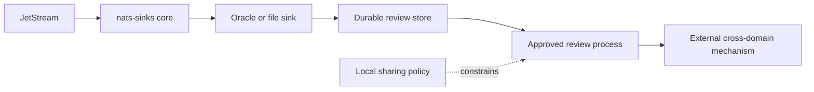

# Cross-Domain Handoff Preparation

Cross-domain handoff preparation is the practice of creating durable,
well-labeled, policy-reviewable event records that can later be assessed by an
approved cross-domain transfer process. `nats-sinks` can help prepare records
for that review by preserving payloads, metadata, classification, labels,
mission context, and chain-of-custody evidence.

`nats-sinks` is not a cross-domain guard, release authority, data diode,
sanitizer, targeting system, fire-control system, weapons-release mechanism,
rules-of-engagement engine, or autonomous decision platform.

When a review team needs a bounded bundle rather than a single database row or
file record, use the
[Cross-Domain Handoff Package](cross-domain-handoff-package.md) blueprint. The
package blueprint defines a manifest, file roles, hashes, and path-safety
constraints while keeping transfer approval outside `nats-sinks`.



## What nats-sinks Can Do

`nats-sinks` can:

- persist the original payload or an encrypted payload envelope;
- preserve classification, priority, labels, and mission metadata;
- maintain commit-then-ACK delivery evidence;
- write to Oracle for query-driven review;
- write to local files for controlled offline inspection or transfer staging;
- send permanently invalid records to DLQ before ACK.

## What nats-sinks Does Not Do

`nats-sinks` does not:

- decide whether data may cross a domain boundary;
- downgrade, sanitize, or redact content automatically;
- enforce release authority;
- implement guard protocols;
- bypass local accreditation or policy review;
- expose payloads to Prometheus or metrics outputs.

## Recommended Metadata

Use `mission_metadata` for review context and keep it bounded:

```json
{
  "mission_metadata": {
    "schema": "nats_sinks.use_case.mission_metadata.v1",
    "profile": "cross-domain-handoff-preparation",
    "profile_version": 1,
    "handoff": {
      "candidate_domain": "synthetic-review-domain",
      "review_reason": "audit-export",
      "release_required": true
    }
  },
  "classification": "NATO SECRET",
  "labels": "review-candidate;mission-test"
}
```

The values above are examples. Real deployments should use their own approved
vocabularies and review processes.

## Storage Pattern

Oracle is often useful when reviewers need indexed queries:

```json
{
  "CLASSIFICATION": "NATO SECRET",
  "LABELS": "review-candidate;mission-test",
  "MISSION_METADATA_JSON": {
    "profile": "cross-domain-handoff-preparation",
    "handoff": {
      "candidate_domain": "synthetic-review-domain",
      "release_required": true
    }
  }
}
```

The file sink is useful when a controlled local artifact is required:

```json
{
  "classification": "NATO SECRET",
  "labels_list": ["review-candidate", "mission-test"],
  "mission_metadata": {
    "profile": "cross-domain-handoff-preparation",
    "handoff": {
      "release_required": true
    }
  },
  "payload": {
    "encrypted": true,
    "algorithm": "AES-256-GCM"
  }
}
```

## Security Guidance

- Default to not exporting observability data and enable only approved metric
  names.
- Treat subjects, labels, and mission metadata as potentially sensitive.
- Keep encrypted payload keys outside the persisted event record.
- Do not store transfer decisions in public issue comments or release notes.
- Keep cross-domain decisions in approved systems outside `nats-sinks`.
- Use the package blueprint only as review evidence. It is not a guard,
  certification boundary, or transfer approval.
