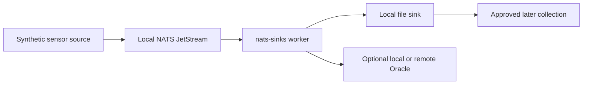
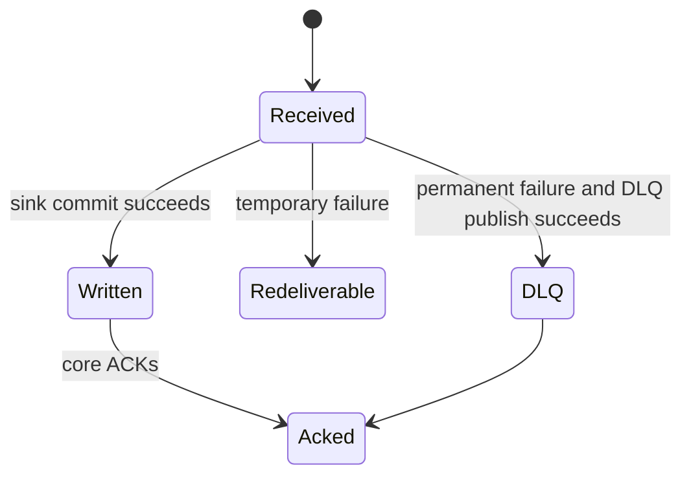

# Edge Operation

Edge operation describes deployments where a sink runs close to a sensor,
platform, gateway, or disconnected environment. The goal is to preserve events
durably when central services may be slow, intermittently reachable, or
intentionally isolated.

This blueprint is about resilient persistence. It does not turn `nats-sinks`
into a targeting system, fire-control system, weapons-release mechanism,
rules-of-engagement engine, or autonomous decision platform.



## Recommended Pattern

For constrained or intermittently connected environments:

1. Keep JetStream local to the site when possible.
2. Use bounded pull batches so memory growth is controlled.
3. Use idempotent sink modes.
4. Use payload encryption when stored payloads are sensitive.
5. Prefer the file sink when a lightweight local artifact is sufficient.
6. Use Oracle when local query, relational retention, or downstream reporting is
   required.
7. Keep observability export disabled until a sharing policy has been approved.

## File Sink Example

The local file sink can write deterministic records with optional gzip
compression:

```json
{
  "sink": {
    "type": "file",
    "directory": "/var/lib/nats-sinks/events",
    "filename_strategy": "idempotency_key",
    "duplicate_policy": "skip_existing",
    "compression": "gzip",
    "fsync": true
  }
}
```

The installer documentation shows how to run the sink as a Linux service on
Debian-family systems and Oracle Linux. Keep writable directories explicit and
owned by the service user.

## Failure Behavior

Edge environments should assume partial failure:

- if the sink cannot commit, the core does not ACK;
- if the process crashes after commit but before ACK, JetStream may redeliver;
- if a message is permanently invalid and DLQ is configured, the original is
  ACKed only after DLQ publication succeeds;
- if DLQ publication fails, the original remains eligible for redelivery.



## Operational Guidance

- Size local storage for backlog growth during communication outages.
- Monitor queue lag, file count, disk usage, and last success timestamp.
- Keep local service accounts least-privileged.
- Avoid embedding operational identifiers in file paths.
- Keep local test artifacts under ignored paths such as `.local/`.
- Do not rely on metrics export for payload inspection; metrics should stay
  payload-free.
