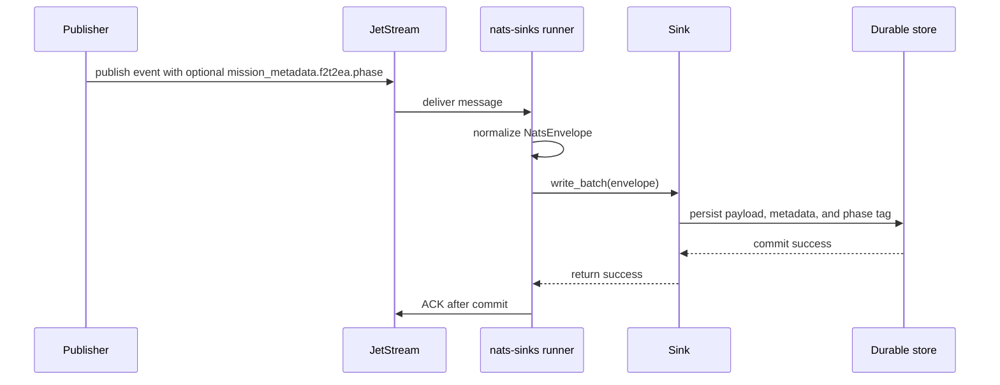

# F2T2EA Event Phase Tagging

F2T2EA is often used as shorthand for a lifecycle model containing find, fix,
track, target, engage, and assess phases. In `nats-sinks`, F2T2EA phase tagging
is documented only as optional metadata for event custody, audit, routing,
search, and later analysis. It is not workflow automation.

This blueprint does not turn `nats-sinks` into a targeting system,
fire-control system, weapons-release mechanism, rules-of-engagement engine, or
autonomous decision mechanism. The core runtime still performs the same narrow
job: receive a JetStream message, write it durably through a sink, and ACK only
after durable success.



## Metadata-Only Scope

Treat F2T2EA phase as an operator-defined metadata value. It can help humans
and downstream authorized systems understand where an event claimed to sit in a
larger lifecycle, but it must not:

- select targets,
- approve actions,
- trigger an engagement,
- encode rules of engagement,
- bypass policy gates,
- change ACK order,
- change idempotency behavior,
- make an invalid message look valid,
- cause sink-specific shortcuts.

If a strict deployment validates the phase value and the value is invalid, that
failure should be handled like any other permanent validation failure: publish
to DLQ when configured, and ACK the original only after DLQ publication
succeeds.

## Recommended Metadata Shape

Use the generic core `mission_metadata` feature for F2T2EA phase tagging. The
publisher can send the object in the `Nats-Sinks-Mission-Metadata` header, or
operators can provide subject-aware defaults in the `mission_metadata` config
section. The same validated object is then available as
`NatsEnvelope.mission_metadata`, in Oracle `MISSION_METADATA_JSON`, and in the
file sink's top-level `mission_metadata` field.

```json
{
  "mission_metadata": {
    "schema": "nats_sinks.use_case.mission_metadata.v1",
    "profile": "f2t2ea-event-phase-tagging",
    "profile_version": 1,
    "f2t2ea": {
      "phase": "track",
      "phase_label": "Track",
      "phase_source": "publisher",
      "phase_asserted_at": "2026-01-01T12:00:00Z"
    }
  }
}
```

The tracked example payload is available at
`examples/use-cases/defence/f2t2ea-message.json`.

Example NATS publish command:

```bash
nats pub mission.synthetic.sensor.track.0001 '{"event_id":"SYN-F2T2EA-0001"}' \
  -H 'Nats-Sinks-Priority: immediate' \
  -H 'Nats-Sinks-Classification: NATO SECRET' \
  -H 'Nats-Sinks-Labels: synthetic;mission-test;f2t2ea-example' \
  -H 'Nats-Sinks-Mission-Metadata: {"profile":"f2t2ea-event-phase-tagging","profile_version":1,"f2t2ea":{"phase":"track","phase_label":"Track","phase_source":"publisher","phase_asserted_at":"2026-01-01T12:00:00Z"}}'
```

## Example Phase Values

The following values are examples for documentation and tests. Your
organization may use a different vocabulary, a stricter policy vocabulary, or a
different phase model. Keep the values explicit and allow-listed when strict
validation is enabled.

| Value | Meaning In This Blueprint | Safe Use Guidance |
| --- | --- | --- |
| `find` | The event is associated with discovery, detection, cueing, or initial observation. | Use for custody and search. Do not treat it as validated intelligence by itself. |
| `fix` | The event is associated with refinement or narrowing of context. | Use as metadata only; do not infer authorization or confidence from the label alone. |
| `track` | The event is associated with continued tracking or state updates. | Useful for correlation and replay evidence. |
| `target_review` | The event is associated with a review-stage lifecycle claim. | This deliberately avoids a bare `target` value so examples do not imply automated target selection. |
| `engage_report` | The event reports engagement-related context from an upstream authorized system. | This is reporting metadata, not an instruction to engage. |
| `assess` | The event is associated with assessment, outcome review, or post-event analysis. | Useful for audit and after-action analytics. |
| `unknown` | The publisher could not assert a phase. | Prefer explicit `unknown` over guessing when the phase is unclear. |

## Oracle Storage Pattern

Oracle stores the validated object in `MISSION_METADATA_JSON` by default. Keep
`PRIORITY`, `CLASSIFICATION`, and `LABELS` in their existing columns and use
`MISSION_METADATA_JSON` for richer profile-specific context. The same object is
also present in `METADATA_JSON.mission_metadata` as part of the full framework
metadata snapshot.

The tracked example row is available at
`examples/use-cases/defence/f2t2ea-oracle-row.json`.

Example table column:

```sql
alter table mission_event_inbox add (
    mission_metadata_json json
);
```

For Oracle versions that use JSON-in-CLOB rather than the native JSON type,
use your normal database standard for JSON storage, for example a CLOB with an
`IS JSON` check constraint.

Example stored value:

```json
{
  "schema": "nats_sinks.use_case.mission_metadata.v1",
  "profile": "f2t2ea-event-phase-tagging",
  "profile_version": 1,
  "f2t2ea": {
    "phase": "track",
    "phase_label": "Track",
    "phase_source": "publisher",
    "phase_asserted_at": "2026-01-01T12:00:00Z"
  },
  "handling": {
    "priority": "immediate",
    "classification": "NATO SECRET",
    "labels": ["synthetic", "mission-test", "f2t2ea-example"]
  }
}
```

The Oracle sink stores the mission metadata object without interpreting the
domain-specific fields. It does not change ACK behavior, idempotency behavior,
or write ordering based on `f2t2ea.phase`.

## File Sink Storage Pattern

The file sink writes the validated object as top-level `mission_metadata` and
also includes it in `metadata.mission_metadata`:

```json
{
  "schema": "nats_sinks.file.message.v1",
  "subject": "mission.synthetic.sensor.track.0001",
  "priority": "immediate",
  "classification": "NATO SECRET",
  "labels": "synthetic;mission-test;f2t2ea-example",
  "labels_list": ["synthetic", "mission-test", "f2t2ea-example"],
  "mission_metadata": {
    "profile": "f2t2ea-event-phase-tagging",
    "profile_version": 1,
    "f2t2ea": {
      "phase": "track",
      "phase_label": "Track"
    }
  },
  "payload": {
    "event_id": "SYN-F2T2EA-0001"
  }
}
```

The tracked file record example is available at
`examples/use-cases/defence/f2t2ea-file-record.json`.

## Validation Guidance

Strict deployments should validate the phase value before relying on it. A
good validation profile should check:

- `mission_metadata.schema` is present and recognized,
- `mission_metadata.profile` equals `f2t2ea-event-phase-tagging`,
- `profile_version` is an integer supported by the deployment,
- `f2t2ea.phase` is one of the approved values,
- string lengths are bounded,
- timestamps are valid ISO 8601 UTC values when present,
- lists such as labels have bounded length,
- no credentials, private keys, live network locators, or sensitive payload
  fragments are placed in metadata.

The core enforces generic JSON safety, size limits, duplicate-key rejection,
secret-looking key rejection, and optional `allowed_profiles`. Domain-specific
rules such as the exact F2T2EA phase vocabulary remain deployment policy. If a
publisher sends malformed mission metadata, the runner treats it as a
permanent validation failure and follows DLQ-before-ACK behavior when DLQ is
configured.

## Security Notes

F2T2EA phase metadata can reveal operational tempo, workflow stage, or the kind
of downstream analysis being performed. Treat it as potentially sensitive even
when the payload is encrypted.

Public examples should remain synthetic:

- use fake subjects such as `mission.synthetic.sensor.track.0001`,
- use fake IDs such as `SYN-F2T2EA-0001`,
- avoid real unit names, platform names, coordinates, target descriptions,
  network locators, usernames, credentials, certificates, keys, or classified
  content,
- do not paste live payloads into issues, documentation, test reports, or
  release evidence.

The safest default is to store enough metadata for custody and audit while
keeping high-risk operational detail in approved classified systems and
approved access-controlled stores.
