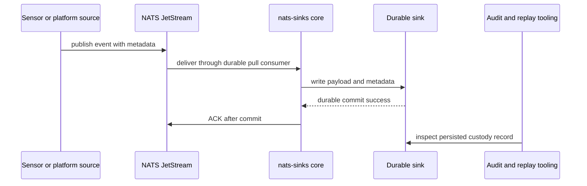

# Defence And Mission Support

`nats-sinks` is a generic NATS JetStream sink framework. It is not a targeting
system, fire-control system, weapons-release mechanism, rules-of-engagement
engine, or lethal decision-making platform. In defence and mission-support
contexts, its role is narrower and safer: preserve events durably after they
leave a JetStream stream, maintain clear commit-then-ACK custody, and keep
metadata available for later audit, triage, replay, and analytics.

The same core behavior can support many mission-oriented data flows:

- sensor-fusion event persistence,
- platform telemetry archival,
- command-and-control data fabric handoff,
- sensor-to-shooter workflow evidence,
- kill-chain or kill-mesh coordination-event custody,
- F2T2EA phase tagging in metadata,
- disconnected file handoff in constrained networks,
- DLQ triage for malformed or policy-rejected messages.

## Keep The Platform Generic

Mission terminology belongs in configuration, metadata profiles, and
documentation examples. The core package should remain reusable for commercial,
public-sector, industrial, and research workloads. Avoid building one-off
military concepts into the framework when a generic metadata JSON object,
labels field, classification field, priority field, or sink extension point can
represent the same need.

## Current Building Blocks

- Commit-then-acknowledge processing for at-least-once delivery.
- Oracle and file sinks as production sinks.
- Priority, classification, and labels as core-normalized metadata fields.
- Mission metadata as a validated JSON context object for mission, operation,
  platform, source-system, track, confidence, releasability, and lifecycle
  metadata.
- Optional pre-sink policy enforcement for requiring classification, labels,
  mission metadata, encrypted payloads, and size limits before destination
  writes.
- Payload wrapping for non-JSON text and bytes.
- Optional payload encryption before sink delivery.
- Local file output for disconnected handoff and evidence capture.
- Metrics snapshots and optional observability connectors.
- Synthetic mission scenario testing for release evidence and future sink
  certification.

## Use-Case Pages

- [Mission Metadata](../../mission-metadata.md)
- [F2T2EA Event Phase Tagging](f2t2ea-event-phase-tagging.md)
- [Sensor Event Custody](sensor-event-custody.md)
- [Classification And Labels](classification-and-labels.md)
- [Chain Of Custody](chain-of-custody.md)
- [Cross-Domain Handoff Preparation](cross-domain-handoff-preparation.md)
- [Edge Operation](edge-operation.md)
- [Audit-Oriented Persistence](audit-oriented-persistence.md)
- [Synthetic Mission Testing](synthetic-mission-testing.md)

## Blueprint Boundaries

The pages in this section deliberately keep mission concepts in metadata,
configuration, and documentation. The generic core still owns delivery
semantics, and sinks still own durable destination writes. This keeps
`nats-sinks` usable for defence, public-sector, commercial, industrial, and
research teams without creating a one-use-case platform.
