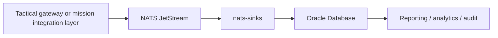

# Persisting Link 16 / TADIL-J J-Series Messages To Oracle Database

## Context

Link 16 / TADIL-J is used as a tactical data link for exchanging J-series
messages between authorized defence and mission systems. In this use case,
`nats-sinks` does not implement Link 16 radio functions, cryptography, network
participation, terminal behavior, tactical command logic, message exploitation,
or classified message semantics.

The role of `nats-sinks` is narrower: persist already-authorized,
already-ingested, and normalized tactical message events from NATS JetStream
into Oracle Database with commit-then-acknowledge delivery behavior.



## Problem Statement

Mission systems often need to persist tactical message observations for audit,
replay, analytics, operational reporting, correlation, and downstream
integration. These streams can be high-volume and time-sensitive, and records
must not be silently lost.

Persistence should support:

- at-least-once delivery;
- safe retry and redelivery;
- idempotent writes;
- dead-letter handling for poison messages;
- clear operational traceability for audit and recovery.

## Proposed Architecture

A typical architecture keeps tactical responsibilities outside `nats-sinks`:

1. An authorized tactical gateway or mission integration layer receives Link 16
   / TADIL-J messages.
2. The gateway validates its own authorization boundary and normalizes approved
   J-series content into an internal event envelope.
3. The event is published to NATS JetStream.
4. `nats-sinks` consumes from JetStream and writes the normalized event to
   Oracle Database.
5. Oracle Database acts as the durable system of record for message metadata,
   payload references, normalized attributes, processing state, and audit
   history.

The gateway owns tactical network behavior. `nats-sinks` owns durable
persistence after the event has entered the mission data fabric.

## Processing Model

`nats-sinks` follows commit-then-acknowledge processing:

1. receive a JetStream message;
2. validate and normalize the envelope;
3. execute Oracle Database persistence logic;
4. durably commit the Oracle transaction;
5. ACK the JetStream message only after successful commit.

Assume at-least-once delivery. A duplicate message is safer than silent loss,
so the database write path should be idempotent. Use a deterministic identity
derived from approved metadata, for example:

- event ID;
- source system identifier;
- source gateway identifier;
- message timestamp;
- source sequence number;
- correlation ID;
- payload hash.

Duplicate delivery should result in an update or no-op rather than duplicate
mission records. Oracle uniqueness constraints, `merge` patterns, or
application-managed idempotency keys are suitable mechanisms when designed and
tested for the deployment.

## Example Event Model

The following example is illustrative and unclassified. It does not contain
real tactical values, cryptographic material, frequencies, network parameters,
keys, mission tactics, target data, or classified message semantics.

```json
{
  "event_id": "example-link16-event-0001",
  "source_system": "authorized-mission-integration-service",
  "source_gateway": "gateway-placeholder",
  "message_family": "TADIL-J",
  "message_type": "J-series",
  "message_name": "Jx.x",
  "message_timestamp": "2026-05-29T10:15:30Z",
  "received_timestamp": "2026-05-29T10:15:31Z",
  "track_id": "track-placeholder-001",
  "correlation_id": "correlation-placeholder-001",
  "classification_label": "NATO UNCLASSIFIED",
  "payload_version": 1,
  "normalized_payload": {
    "schema": "example.tadil_j.normalized.v1",
    "message_category": "placeholder",
    "message_status": "observed",
    "source_quality": "example",
    "attributes": {
      "field_a": "placeholder",
      "field_b": "placeholder"
    }
  },
  "raw_payload_reference": "archive-reference:link16-event-0001",
  "payload_hash": "sha256:placeholder-hex-digest",
  "processing_metadata": {
    "ingest_profile": "link16-j-series-oracle",
    "normalizer_version": "example-1",
    "idempotency_key": "authorized-mission-integration-service:example-link16-event-0001"
  }
}
```

When using the Oracle sink, deployment teams can store this content as payload
JSON, as `mission_metadata`, or across a small set of stable Oracle columns plus
a JSON column for profile-specific content. Keep the mapping explicit and
reviewed by the authorized programme team.

## Oracle Database Persistence

Oracle Database can provide the durable system of record for normalized tactical
message events. A production schema should be owned by the deployment, but the
responsibilities often separate into a few high-level tables:

| Responsibility | Example Table | Purpose |
| --- | --- | --- |
| Immutable event metadata | `message_event` | Event ID, source system, source gateway, message family, timestamps, classification label, idempotency key, and correlation fields. |
| Payload or payload reference | `message_payload` | Normalized payload JSON, encrypted payload envelope, or reference to an approved raw-payload archive. |
| Processing state | `message_processing_state` | Sink status, last write attempt, retry count, DLQ state, and recovery markers. |
| Audit history | `message_audit` | Retry events, duplicate detection, permanent failures, operator notes, and release evidence references. |

This is non-normative. Some deployments may prefer one append-only event table
with JSON columns; others may split metadata, payload, and audit state for
access-control and retention reasons. Use bind variables for queries and keep
payload read access separate from metadata search access where possible.

## Operational Considerations

- **Idempotency:** choose a deterministic key that remains stable across
  redelivery and normalizer retries.
- **Retry and DLQ handling:** temporary Oracle or network failures should allow
  redelivery. Poison messages should be routed to a DLQ only when configured,
  and the original message should be ACKed only after DLQ publication succeeds.
- **Schema evolution:** version the normalized payload and keep backward
  compatible readers where practical.
- **Ordering caveats:** JetStream and database commits can preserve useful
  sequencing metadata, but distributed gateways and retries can still produce
  out-of-order arrival. Query by explicit timestamps and source sequence fields
  when ordering matters.
- **Observability and audit logging:** collect safe counters, retry evidence,
  duplicate counts, and DLQ counts without logging payloads or sensitive
  metadata by default.
- **Security labelling and data handling:** treat classification and labels as
  handling metadata. They do not replace authorization, release approval, or
  database access control.
- **Responsibility separation:** the tactical gateway owns Link 16 / TADIL-J
  participation and normalization. `nats-sinks` owns persistence after
  authorized events are published to JetStream.
- **Deployment posture:** deploy into an isolated defence cloud or mission
  support environment when required. Prefer containerized by default packaging
  with least-privilege database users.
- **Secrets:** use a dedicated secret store such as HashiCorp Vault where
  applicable. Do not place Oracle credentials, NATS credentials, keys, or
  wallet material in documentation examples, GitHub Issues, or logs.
- **Service registration and discovery:** use Consul or an equivalent approved
  service registry where applicable, while keeping sink configuration explicit
  and reviewable.
- **Kafka interoperability:** where Kafka is used as an inter-node or wider
  enterprise transport layer, keep Kafka integration outside this persistence
  boundary unless a reviewed bridge publishes normalized events into
  JetStream.

## Benefits

- Durable mission data capture in Oracle Database.
- Replay and reconstruction support for authorized audit and analysis.
- Improved operational reporting and correlation.
- Safer failure handling through commit-then-acknowledge persistence.
- Decoupling of tactical ingestion from persistence, analytics, and reporting.
- A stable data foundation for Python or Java downstream consumers where
  relevant.

## Boundaries

This page is conceptual and intended only for authorized environments. It does
not provide implementation details for Link 16 radio operation, cryptography,
terminal behavior, message exploitation, tactical procedures, weapons
employment, or classified J-series semantics. Actual mappings, labels,
retention rules, security controls, and database schemas must be defined by
authorized programme teams.
