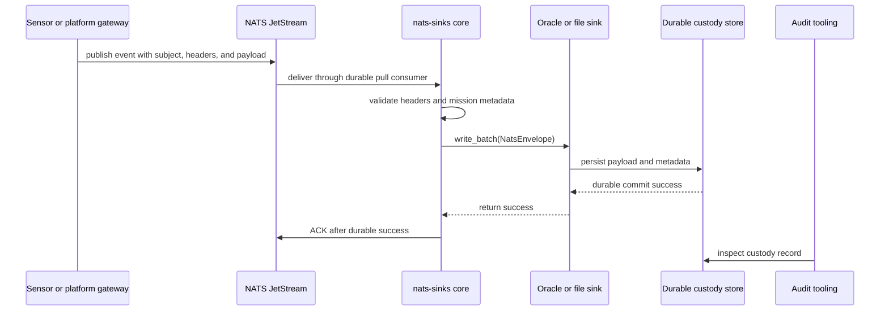

# Sensor Event Custody

Sensor event custody is the practice of preserving a clear record of an event
after it leaves a sensor, platform, gateway, or fusion service. In
`nats-sinks`, custody means the event is received from JetStream, normalized
into a `NatsEnvelope`, written to a durable destination, and acknowledged only
after the destination reports durable success.

This blueprint is about persistence and auditability. It does not turn
`nats-sinks` into a targeting system, fire-control system, weapons-release
mechanism, rules-of-engagement engine, or autonomous decision platform.



## What To Preserve

A custody record should preserve enough context to prove what was handled,
where it came from, and how it moved through the sink:

- subject name;
- stream and consumer names when available;
- stream and consumer sequence numbers when available;
- message ID when the publisher supplied one;
- creation, receive, and store timestamps when available;
- priority, classification, and labels;
- validated `mission_metadata`;
- payload or encrypted payload envelope;
- DLQ context when the message could not be processed.

The payload may be plain JSON, wrapped text, wrapped bytes, or an encrypted
payload envelope. Payload content should not be logged by default.

## Recommended Subject Pattern

Use subjects that describe the event domain without embedding secret content.
Subjects are operational metadata and may appear in logs, metrics, durable
stores, and observability policies.

```text
mission.synthetic.sensor.track.0001
mission.synthetic.platform.telemetry.0001
mission.synthetic.gateway.report.0001
```

Avoid live location identifiers, sensitive unit names, credentials, coordinates,
or platform identifiers in public examples and issue comments.

## Oracle Storage Pattern

Oracle deployments should keep stable handling fields in columns and richer
profile-specific context in `MISSION_METADATA_JSON`.

```json
{
  "SUBJECT": "mission.synthetic.sensor.track.0001",
  "STREAM_NAME": "MISSION_SYNTHETIC",
  "STREAM_SEQUENCE": 42,
  "MESSAGE_ID": "synthetic-00000042",
  "PRIORITY": "urgent",
  "CLASSIFICATION": "NATO SECRET",
  "LABELS": "sensor;track;mission-test",
  "MISSION_METADATA_JSON": {
    "schema": "nats_sinks.use_case.mission_metadata.v1",
    "profile": "sensor-event-custody",
    "profile_version": 1,
    "source": {
      "source_system": "synthetic-sensor-gateway",
      "sensor_family": "synthetic-radar",
      "confidence": 0.87
    }
  }
}
```

The Oracle sink does not interpret the mission fields. It stores the validated
object and commits the transaction before the core ACKs JetStream.

## File Sink Storage Pattern

The file sink writes one JSON record per message. Sensor custody fields appear
as normal top-level and metadata fields:

```json
{
  "schema": "nats_sinks.file.message.v1",
  "subject": "mission.synthetic.sensor.track.0001",
  "priority": "urgent",
  "classification": "NATO SECRET",
  "labels": "sensor;track;mission-test",
  "labels_list": ["sensor", "track", "mission-test"],
  "mission_metadata": {
    "profile": "sensor-event-custody",
    "profile_version": 1,
    "source": {
      "source_system": "synthetic-sensor-gateway",
      "confidence": 0.87
    }
  },
  "payload": {
    "event_id": "SYN-SENSOR-0042"
  }
}
```

## Operational Guidance

- Use idempotent sink modes so redelivery does not create duplicate custody
  records.
- Prefer encrypted payloads when sensor content is sensitive, while keeping
  routing metadata minimal and non-secret.
- Send malformed or policy-rejected records to a DLQ when configured, and ACK
  the original only after DLQ publication succeeds.
- Keep examples synthetic in documentation and GitHub Issues.
- Treat custody metadata as sensitive when it reveals mission tempo, platform
  behavior, or sensor coverage.
