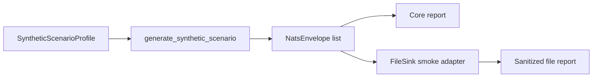

# Synthetic Mission Testing

The synthetic mission test harness gives maintainers a repeatable way to test
mission-style metadata and non-happy-path payloads without using live sensors,
real operational subjects, classified content, credentials, or infrastructure
locators. It is designed as a safety tool for development and release evidence,
not as a simulator of operational behavior.

The harness is implemented in `nats_sinks.testing` and can be used from Python
or from `scripts/run-synthetic-harness.py`.



## What It Generates

The default profile cycles through a fixed set of cases:

| Case | Purpose |
| --- | --- |
| `valid_json` | Normal JSON payload for baseline sink persistence. |
| `malformed_json_text` | Incomplete JSON-like text that should be wrapped safely by default payload handling. |
| `duplicate` | Redelivery-style duplicate that reuses the previous message's idempotency key. |
| `stale` | Older event timestamp for delayed-event and freshness testing. |
| `encrypted_marker` | Fake encrypted payload envelope shape without real key material. |
| `classified` | NATO-style classification value such as `NATO SECRET`. |
| `priority` | Urgency value such as `urgent`. |
| `labeled` | Semicolon-compatible labels including mission-test and F2T2EA example labels. |
| `empty` | Empty message body that must not crash the sink. |

For lifecycle phase examples such as `find`, `fix`, `track`, `target_review`,
`engage_report`, and `assess`, use the dedicated
[F2T2EA Event Phase Tagging](f2t2ea-event-phase-tagging.md) blueprint. The
synthetic harness provides fake event data; the blueprint explains the
metadata-only phase-tagging pattern and non-goals.

The generated data is intentionally fake. A typical generated envelope has a
subject like `mission.synthetic.sensor.valid-json.0001`, a stream like
`MISSION_SYNTHETIC`, a message ID like `synthetic-00000001`, and metadata such
as priority `routine`, classification `NATO RESTRICTED`, and labels
`synthetic;mission-test`.

## Command-Line Examples

Generate a destination-neutral report:

```bash
python scripts/run-synthetic-harness.py --message-count 18
```

Generate a Markdown report:

```bash
python scripts/run-synthetic-harness.py \
  --message-count 18 \
  --format markdown \
  --report-file .local/synthetic-report.md
```

Run through the local file sink without keeping files:

```bash
python scripts/run-synthetic-harness.py \
  --sink file \
  --message-count 18 \
  --output-dir .local/synthetic-file-smoke
```

Run through the local file sink and keep output for inspection:

```bash
python scripts/run-synthetic-harness.py \
  --sink file \
  --message-count 18 \
  --output-dir .local/synthetic-file-smoke \
  --preserve-files
```

Run the file sink with gzip compression:

```bash
python scripts/run-synthetic-harness.py \
  --sink file \
  --compression gzip \
  --message-count 18
```

Example sanitized JSON output:

```json
{
  "duplicate_messages": 2,
  "encrypted_marker_messages": 2,
  "file_count": 16,
  "generated_messages": 18,
  "malformed_json_text_messages": 2,
  "profile": "mission-smoke",
  "sink": "file",
  "stale_messages": 2,
  "unique_idempotency_keys": 16
}
```

The report intentionally does not include payloads, output directories, live
service names, IP addresses, usernames, passwords, tokens, certificates, keys,
or wallet material.

## Python Example

```python
from nats_sinks.testing import (
    SyntheticScenarioProfile,
    generate_synthetic_scenario,
    synthetic_report,
)

profile = SyntheticScenarioProfile(message_count=18, seed=7)
messages = generate_synthetic_scenario(profile)
report = synthetic_report(messages, profile_name=profile.name)

assert report.duplicate_messages == 2
assert any(message.envelope.classification == "NATO SECRET" for message in messages)
```

## Future Sink Profiles

Future sink adapters should accept the same generated `NatsEnvelope` objects and
produce a sanitized `SyntheticScenarioReport`. Do not create destination-specific
payload generators unless the destination has a unique storage contract that
cannot be represented by the common envelope.

For a new sink:

1. Add a small adapter that writes the generated envelopes to the sink.
2. Keep live services disabled by default.
3. Store local test configuration under ignored `.local/` paths.
4. Return sanitized counts and capability evidence.
5. Add unit or smoke coverage that does not make network calls.
6. Add an integration wrapper only when the required service can be explicitly
   enabled and isolated.

This keeps the framework reusable while still supporting mission-oriented
testing and future sink certification.
