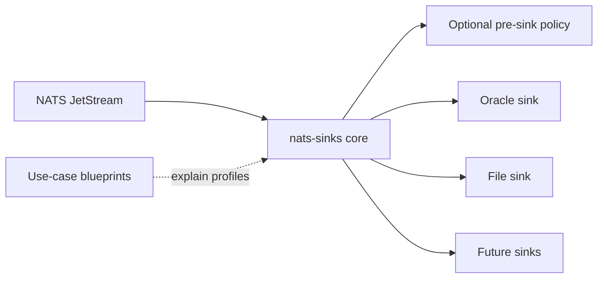

# Use Cases

This section collects implementation blueprints for users who want to apply
`nats-sinks` in a specific operational context while keeping the core package
generic. The main documentation explains the framework, configuration, sinks,
and delivery guarantees. Use-case pages show how those generic capabilities can
be assembled for a particular domain.

Current use-case material includes a defence and mission-support family because
those environments often need strict event custody, metadata discipline,
redaction, idempotency, and auditable delivery behavior. The patterns remain
generic: the same ideas apply to public-sector telemetry, industrial control
reporting, regulated operations, and any system where premature ACKs or unclear
persistence evidence are unacceptable.

## Available Blueprints

- [Mission-Support Operational Examples](mission-support/index.md)
- [Restricted Event Storage](mission-support/restricted-event-storage.md)
- [Disconnected File Handoff](mission-support/disconnected-file-handoff.md)
- [DLQ Triage And Replay Preparation](mission-support/dlq-triage-and-replay.md)
- [Destination Outage Recovery](mission-support/destination-outage-recovery.md)
- [Defence And Mission Support](defence/index.md)
- [F2T2EA Event Phase Tagging](defence/f2t2ea-event-phase-tagging.md)
- [Sensor Event Custody](defence/sensor-event-custody.md)
- [Classification And Labels](defence/classification-and-labels.md)
- [Chain Of Custody](defence/chain-of-custody.md)
- [Cross-Domain Handoff Preparation](defence/cross-domain-handoff-preparation.md)
- [Edge Operation](defence/edge-operation.md)
- [Audit-Oriented Persistence](defence/audit-oriented-persistence.md)
- [Synthetic Mission Testing](defence/synthetic-mission-testing.md)

The mission-support operational examples show complete patterns such as
restricted event storage, disconnected file handoff, DLQ triage, and outage
recovery. The defence pages then add domain-specific blueprint language on top
of the same generic features. None of these pages define separate product
modes, and they do not make nats-sinks a targeting, fire-control,
weapons-release, or autonomous decision platform.

Many of these blueprints can use the optional pre-sink policy gate to require
classification, labels, mission metadata, encrypted payloads, or payload-size
limits before data reaches Oracle, file, or future sinks. The policy remains a
generic core feature; the use-case pages simply show how an organization might
apply it.

## Contribution Guidance

When adding a new use-case page:

1. Keep the feature generic in code and domain-specific in documentation.
2. Use fake subjects, payloads, classifications, and labels.
3. Avoid live service names, IP addresses, connection strings, credentials,
   certificates, keys, and real operational terminology that could reveal
   private deployments.
4. Explain which parts are implemented today and which parts are future
   patterns.
5. Use [Mission Metadata](../mission-metadata.md) for richer structured
   context instead of adding domain-specific fixed fields to the core.
6. Link back to the generic framework documentation whenever possible.
