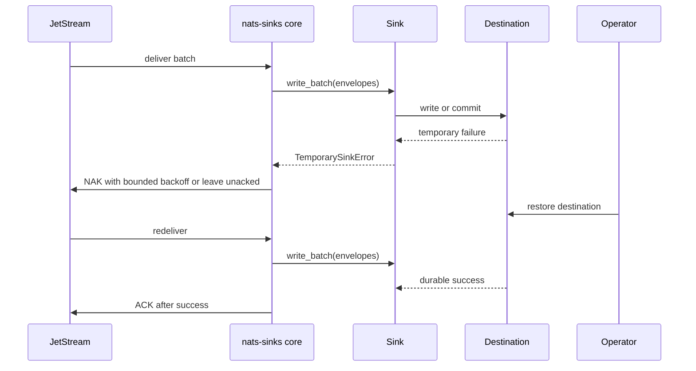

# Destination Outage Recovery

Destination outage recovery is the pattern for handling temporary sink
failures without silently losing JetStream messages. Examples include an
Oracle maintenance window, a full local filesystem, a transient permission
problem, or a network path that is temporarily unavailable.

`nats-sinks` does not treat an outage as success. If the sink does not complete
the configured durable side effect, the core does not ACK the message.



## Generic Framework Behavior

Temporary failures are retryable. The delivery configuration controls bounded
retry attempts, backoff mode, delay caps, and jitter. When the active retry
budget is exhausted, the runner still must not ACK a failed message. JetStream
consumer policy remains the final redelivery authority.

The core can record metrics for failed batches, retry delay observations,
NAKs, and ACK errors. Those metrics are local unless an explicit observability
policy allows export.

## Configuration

```json
{
  "delivery": {
    "batch_size": 64,
    "batch_timeout_ms": 1000,
    "max_retries": 5,
    "retry_backoff_ms": 1000,
    "retry_backoff_mode": "exponential",
    "retry_backoff_max_ms": 30000,
    "retry_jitter": "full",
    "prefer_safe_duplication": true
  },
  "metrics": {
    "enabled": true,
    "snapshot_file": ".local/nats-sinks/metrics.json"
  }
}
```

## Sink-Specific Choices

Oracle recovery guidance:

- use `merge` or `insert_ignore` for idempotency,
- treat commit failures as unsuccessful batches,
- keep connection pool sizing conservative until the database is stable,
- use the Oracle benchmark script only after the destination is healthy.

File sink recovery guidance:

- monitor free space and inode availability,
- keep the destination directory on a reliable filesystem,
- use deterministic names so redelivery after a failed write does not create
  duplicate custody records,
- avoid placing the directory under temporary cleanup paths.

## Operational Flow

1. A destination failure occurs.
2. The sink raises a temporary framework error.
3. The core NAKs with configured delay or leaves the message unacked according
   to policy.
4. Metrics and logs describe the category without printing payloads or
   credentials.
5. Operators restore the destination.
6. JetStream redelivers according to consumer policy.
7. The sink writes successfully and the core ACKs after durable success.

## Failure Behavior

- A failed write or failed commit is never ACKed.
- A retry budget does not convert failure into success.
- If the destination committed but the process exits before ACK, duplicate
  redelivery may occur. Idempotency must handle this case.
- If an error is permanent rather than temporary, DLQ policy should decide
  whether the message is published to a DLQ before ACK.

## Test Guidance

- Run retry-focused unit tests:

```bash
pytest tests/unit/test_retry.py tests/unit/test_commit_then_ack_contract.py
```

- Use `nats-sink test-sink` before starting the service after maintenance.
- Use `nats-sink-metrics show` to inspect local retry and failure counters
  from the metrics snapshot.
- For Oracle performance checks after recovery, use the benchmark script in a
  non-production environment and record only sanitized timing observations.
