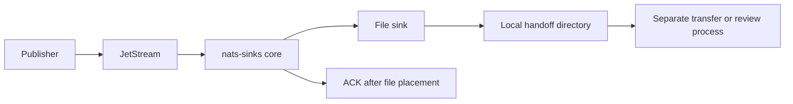

# Disconnected File Handoff

Disconnected file handoff is the pattern for writing JetStream messages to
local JSON files when a network boundary, remote site, evidence collection
process, or controlled transfer workflow cannot depend on immediate database
connectivity.

The file sink is a good fit for edge locations and constrained deployments
because it writes one durable record per message, can use deterministic file
names, and can optionally gzip-compress records using the Python standard
library.



## Generic Framework Behavior

The core still owns delivery semantics. It pulls bounded batches, normalizes
each message, applies optional encryption and metadata defaults, calls the file
sink, and ACKs only after the file sink reports durable placement.

The transfer process that later copies files elsewhere is outside the
commit-then-ACK boundary. If that transfer fails, the JetStream message may
already be ACKed because the durable side effect configured for this sink was
the local file write.

## Configuration

```json
{
  "nats": {
    "url": "nats://localhost:4222",
    "stream": "EDGE_EVENTS",
    "consumer": "edge-file-handoff",
    "subject": "mission.synthetic.edge.>"
  },
  "delivery": {
    "batch_size": 32,
    "batch_timeout_ms": 750,
    "ack_policy": "after_sink_commit"
  },
  "sink": {
    "type": "file",
    "directory": ".local/file-sink/handoff",
    "filename_strategy": "idempotency_key",
    "duplicate_policy": "ignore",
    "fsync": true,
    "compression": {
      "enabled": true,
      "algorithm": "gzip",
      "level": 6
    }
  }
}
```

## Sink-Specific Choices

File sink choices matter because the filesystem is the durable destination:

- `filename_strategy=idempotency_key` makes redelivery deterministic.
- `duplicate_policy=ignore` treats an already-written file as success.
- `fsync=true` is safer for evidence handoff but slower.
- gzip compression reduces storage and transfer size but adds CPU work.
- the destination directory should be owned by the service account and not be
  executable.

Oracle is not part of this pattern unless a later independent process imports
the handoff files. Do not describe a downstream import as part of the original
JetStream ACK unless that import is the configured sink operation.

## Operational Flow

1. Edge service publishes messages to JetStream.
2. `nats-sinks` pulls a bounded batch.
3. The core normalizes payload and metadata.
4. The file sink writes a temporary file in the destination directory.
5. The file sink flushes and optionally `fsync`s the file.
6. The file sink atomically places the final file.
7. The core ACKs JetStream after placement succeeds.
8. A separate process can review, package, move, or import files later.

## Failure Behavior

- If the directory is missing, not writable, or resolves outside the configured
  root, the file sink raises a clear sink error.
- If final placement fails, the message is not ACKed.
- If a duplicate file exists and policy is `ignore`, redelivery is treated as
  safe success.
- If the host loses storage after ACK, JetStream will not redeliver because
  the configured durable side effect had already completed. Use filesystem
  backups, monitored storage, and operational transfer controls.

## Test Guidance

- Validate configuration:

```bash
nats-sink validate examples/file-basic/config.json
```

- Run the file sink smoke check:

```bash
nats-sink test-sink examples/file-basic/config.json
```

- Run deterministic synthetic file output:

```bash
python scripts/run-synthetic-harness.py --sink file --message-count 18 --compression gzip --format markdown
```

- Inspect only synthetic files in ignored `.local/` paths.
- Do not include real handoff filenames, subjects, or payloads in public
  reports.
