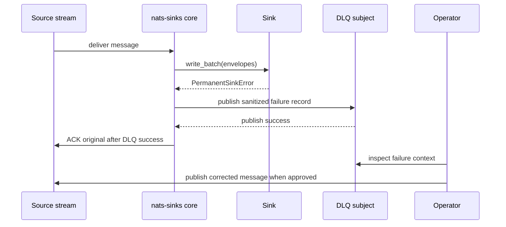

# DLQ Triage And Replay Preparation

DLQ triage is the pattern for preserving messages that cannot be processed in
their current form while keeping the main event flow moving. It is useful when
payloads are malformed, required metadata is missing, a schema rule rejects the
message, or the destination reports a permanent failure.

Replay preparation means documenting how operators inspect DLQ records,
understand why they failed, repair or supersede the input, and publish a new
message through the normal path. `nats-sinks` does not silently repair failed
messages and does not ACK originals until DLQ publication succeeds.



## Generic Framework Behavior

The DLQ flow is part of the core runtime. Sinks raise framework errors, and the
core decides whether to leave the message redeliverable, NAK it, or publish to
the configured DLQ. The original message is ACKed only after DLQ publication
succeeds.

This pattern reinforces two rules:

- prefer safe duplication or DLQ evidence over silent loss,
- never ACK a message before durable sink success or successful DLQ custody.

## Configuration

```json
{
  "nats": {
    "url": "nats://localhost:4222",
    "stream": "MISSION_EVENTS",
    "consumer": "mission-storage",
    "subject": "mission.synthetic.>"
  },
  "dead_letter": {
    "enabled": true,
    "subject": "mission.synthetic.dlq",
    "include_payload": false,
    "include_headers": true,
    "include_error": true
  },
  "delivery": {
    "batch_size": 64,
    "max_retries": 5,
    "retry_backoff_ms": 1000,
    "retry_backoff_mode": "exponential",
    "retry_jitter": "full"
  }
}
```

## Sink-Specific Choices

Oracle deployments should use idempotent modes such as `merge` or
`insert_ignore` so a corrected replay does not corrupt the destination if the
same source event appears again.

File sink deployments should use deterministic filenames when replay can
redeliver the same idempotency key. `duplicate_policy=ignore` is usually safer
for custody records than overwrite behavior.

## Operational Flow

1. A message reaches the runner and fails permanently.
2. The core builds a DLQ record with subject, stream metadata, idempotency key,
   error type, and selected headers.
3. The core publishes the DLQ record.
4. The core ACKs the original only after DLQ publish success.
5. Operators inspect the DLQ record and source retention policy.
6. A corrected or superseding message is published through the normal subject
   path when approved.

## Failure Behavior

- If DLQ publication fails, the original message is not ACKed.
- If payload inclusion is disabled, operators must use metadata and source
  retention to investigate the original.
- If the failure is temporary, the message should remain eligible for retry
  rather than going immediately to DLQ.
- If a replay uses the same idempotency key, the destination policy determines
  whether it is ignored, merged, or rejected.

## Test Guidance

- Use unit tests for DLQ-before-ACK ordering:

```bash
pytest tests/unit/test_commit_then_ack_contract.py
```

- Validate NATS permissions so the runtime account can publish only to the
  configured DLQ subject.
- In a private non-production environment, publish one deliberately malformed
  synthetic message and verify the original is ACKed only after the DLQ record
  is present.
- Public test reports should summarize counts and behavior, not payloads or
  private subjects.
