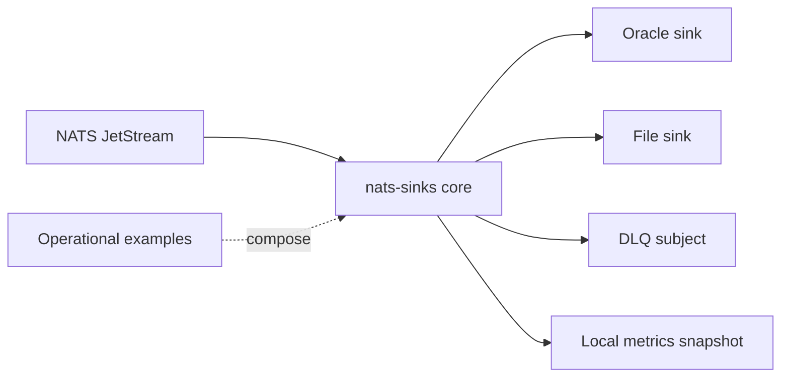

# Mission-Support Operational Examples

This section shows how to assemble existing `nats-sinks` features into
complete operational patterns. The examples are written for mission-support,
public-sector, defence, industrial, and regulated environments where message
loss, unclear custody, and premature acknowledgement are operational risks.

The examples are not new runtime modes. They use the generic framework,
Oracle sink, file sink, DLQ, payload encryption, message metadata, mission
metadata, metrics, and service deployment features that already exist in the
package. This keeps `nats-sinks` useful for many domains instead of turning it
into a one-purpose product.

## Available Examples

- [Restricted Event Storage](restricted-event-storage.md)
- [Disconnected File Handoff](disconnected-file-handoff.md)
- [DLQ Triage And Replay Preparation](dlq-triage-and-replay.md)
- [Destination Outage Recovery](destination-outage-recovery.md)

## Common Principles

All examples share the same foundation:

- JetStream messages are received through a bounded pull consumer.
- The core normalizes messages into immutable `NatsEnvelope` objects.
- Optional payload encryption happens before sink delivery.
- Sinks write payloads and metadata durably.
- The core ACKs only after the sink reports durable success.
- Permanent failures go to a DLQ only when DLQ publication succeeds.
- Redelivery is normal, so destination writes must be idempotent.

## Public Example Safety

The examples deliberately use synthetic subjects, fake classifications, fake
labels, and placeholder environment-variable names. Do not copy live hostnames,
IP addresses, credentials, wallet files, certificates, mission names, unit
names, sensor identifiers, platform identifiers, payloads, or operational
locations into documentation, GitHub Issues, test reports, or public comments.

## How To Use These Pages

1. Start with the generic behavior section on each page.
2. Choose the sink-specific implementation that fits the deployment.
3. Copy the configuration shape into a private, ignored configuration file.
4. Replace fake subjects and paths with local values.
5. Run `nats-sink validate`, sink health checks, and the relevant smoke tests.
6. Record only sanitized outcomes in public release evidence.
