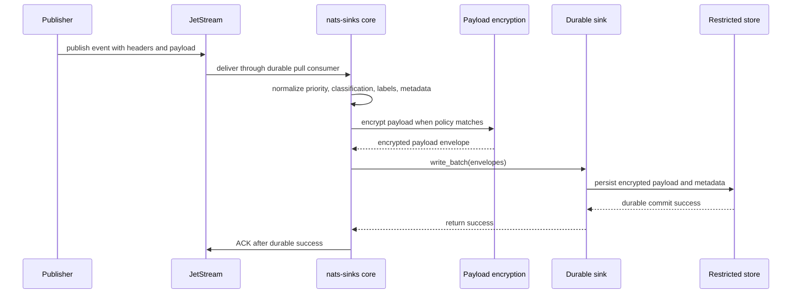

# Restricted Event Storage

Restricted event storage is the pattern for preserving sensitive operational
events in a durable store while keeping routing metadata, payload handling, and
observability under explicit control. Use this when messages may contain
restricted payloads, classification labels, mission context, or audit-relevant
facts that must not be acknowledged before persistence.

The pattern is generic. It can support defence mission telemetry, public-sector
case events, regulated industrial operations, or any environment where stored
payloads and metadata require disciplined handling.



## Generic Framework Behavior

`nats-sinks` treats restricted content as untrusted input. The core validates
configuration, normalizes message metadata, optionally encrypts payload bytes,
passes `NatsEnvelope` objects to the sink, and ACKs JetStream only after the
sink returns success.

Generic controls used by this pattern:

- `message_metadata.priority` for handling urgency,
- `message_metadata.classification` for handling domain or classification,
- `message_metadata.labels` for semicolon-separated operational tags,
- `mission_metadata` for validated JSON context,
- `payload_encryption` for AES-256-GCM or AES-256-CCM payload protection,
- `logging.payload_logging=false` so payloads are not logged by default,
- `metrics.snapshot_file` for local-only operational status.

## Configuration

The example below uses fake values. Store real values in an ignored local file
and load secrets through environment variables.

```json
{
  "nats": {
    "url": "nats://localhost:4222",
    "stream": "MISSION_EVENTS",
    "consumer": "restricted-storage",
    "subject": "mission.synthetic.restricted.>"
  },
  "delivery": {
    "batch_size": 64,
    "batch_timeout_ms": 1000,
    "ack_policy": "after_sink_commit"
  },
  "message_metadata": {
    "priority": {
      "default": "routine",
      "headers": ["Nats-Sinks-Priority"]
    },
    "classification": {
      "default": "NATO RESTRICTED",
      "headers": ["Nats-Sinks-Classification"]
    },
    "labels": {
      "default": ["restricted", "custody"],
      "headers": ["Nats-Sinks-Labels"]
    }
  },
  "payload_encryption": {
    "enabled": true,
    "algorithm": "aes-256-gcm",
    "key_env": "NATS_SINKS_PAYLOAD_KEY"
  },
  "logging": {
    "level": "INFO",
    "payload_logging": false
  }
}
```

## Sink-Specific Choices

Oracle deployments usually store fixed handling fields in columns and richer
context in `MISSION_METADATA_JSON`.

```json
{
  "sink": {
    "type": "oracle",
    "dsn": "example_service",
    "user": "app_user",
    "password_env": "ORACLE_PASSWORD",
    "table": "NATS_SINK_RESTRICTED_EVENTS",
    "mode": "merge",
    "payload_column": "PAYLOAD_JSON",
    "mission_metadata_column": "MISSION_METADATA_JSON"
  }
}
```

File deployments usually store one encrypted JSON record per message in a
controlled directory.

```json
{
  "sink": {
    "type": "file",
    "directory": ".local/file-sink/restricted-events",
    "filename_strategy": "idempotency_key",
    "duplicate_policy": "ignore",
    "compression": {
      "enabled": true,
      "algorithm": "gzip"
    }
  }
}
```

## Operational Flow

1. Publisher sends an event to a restricted subject.
2. JetStream stores the message and delivers it to the durable consumer.
3. The core normalizes metadata and encrypts the payload if policy matches.
4. The selected sink writes the encrypted payload envelope and metadata.
5. The destination commits or atomically places the file.
6. The core ACKs JetStream only after durable success.

## Failure Behavior

- If payload encryption fails, the sink is not called and the message is not
  ACKed.
- If Oracle write or commit fails, the message is not ACKed.
- If file placement fails, the message is not ACKed.
- If a permanent validation error occurs and DLQ is enabled, the original is
  ACKed only after DLQ publication succeeds.
- If the process exits after destination commit but before ACK, JetStream may
  redeliver. Use idempotent Oracle modes or deterministic file duplicate
  policies to handle that safely.

## Test Guidance

- Run `nats-sink validate` against the private JSON configuration.
- Run `nats-sink test-sink` to check destination reachability without starting
  the consumer loop.
- Use the synthetic harness for local file-sink verification:

```bash
python scripts/run-synthetic-harness.py --sink file --message-count 18 --compression gzip
```

- Use live NATS-to-Oracle tests only with ignored local environment files.
- Verify public reports contain only sanitized timing and result summaries.
