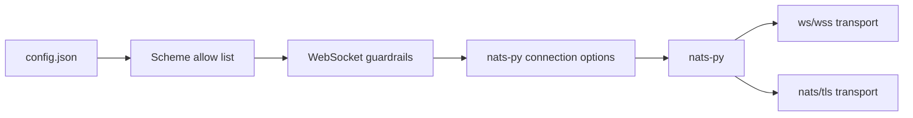
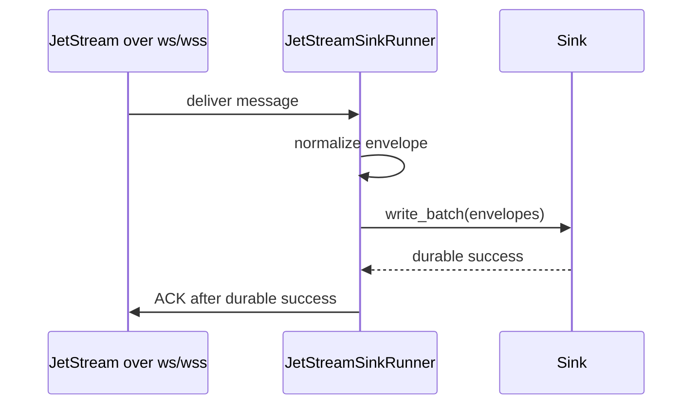

# WebSocket Connection Evaluation

This page records the evaluation for NATS WebSocket connection support in
`nats-sinks`. It is written for operators who run in constrained network
environments where direct NATS TCP connectivity is not always available, for
example behind controlled proxies, demilitarized network segments, or platform
boundaries where WebSocket transport is already approved.

The conclusion is deliberately cautious and operationally focused:

- NATS and `nats-py` support WebSocket-style connection URLs.
- `nats-sinks` validates `ws://` and `wss://` URL schemes and rejects
  credentials embedded in URLs.
- WebSocket seed URL lists must not mix WebSocket and non-WebSocket transports.
- `wss://` uses the same verified TLS context and private CA support as
  `tls://`.
- Optional WebSocket connection headers are disabled by default, bounded,
  validated, redacted, and limited to WebSocket transports.
- The repository includes a collision-safe local WebSocket certification
  harness for maintainers who have `nats-server` installed.
- Transport choice must never change the commit-then-acknowledge invariant.

## What NATS Supports

NATS documents WebSocket support as a server feature available since NATS
Server 2.2. The server can run WebSocket connections alongside traditional TCP
connections and can support TLS, compression, and Origin header checking. NATS
also documents that WebSocket clients must use binary frames and that WebSocket
frames must still be parsed as a stream because a single frame is not
guaranteed to contain a full NATS protocol operation. See the official
[NATS WebSocket documentation](https://docs.nats.io/running-a-nats-service/configuration/websocket).

NATS connection documentation also treats `ws://` as a NATS URL form, alongside
`nats://` and `tls://`. See
[NATS Connecting](https://docs.nats.io/using-nats/developer/connecting).

The NATS server WebSocket configuration documentation describes WebSocket
authentication options including username/password, token, NKEYs, client
certificates, and JWTs. It also describes `allowed_connection_types`, which can
restrict a user to connection types such as `WEBSOCKET`. See
[NATS WebSocket Configuration](https://docs.nats.io/running-a-nats-service/configuration/websocket/websocket_conf).

## What nats.py Supports

The current `nats-py` client exposes normal connection options such as
`servers`, reconnect settings, TLS context, user/password, token, credentials,
NKEY seed, pending buffer size, and drain timeout. The local installed client
also includes a `WebSocketTransport`, rejects mixing WebSocket and non-WebSocket
URLs in one server list, and supports optional `ws_connection_headers`.

The upstream `nats.py` release notes for v2.12.0 mention custom WebSocket
headers through `ws_connection_headers`. See
[nats.py releases](https://github.com/nats-io/nats.py/releases).

This means the building blocks exist, and `nats-sinks` now places a small,
reviewable policy layer in front of them.

## Current nats-sinks State

The current configuration model allows the following URL schemes:

- `nats`
- `tls`
- `ws`
- `wss`

This validation prevents arbitrary URL schemes from reaching `nats-py`. The
current project also adds WebSocket-specific checks for mixed seed lists,
URL-embedded credentials, `wss://` TLS context construction, and optional
header safety.



## Security Considerations

WebSocket transport can be useful, but it changes the network shape. It may
introduce HTTP-aware proxies, TLS termination points, Origin checks, custom
headers, and additional access logs. These are operational controls, not merely
client flags.

Production guidance should require:

- prefer `wss://` over `ws://` outside isolated local labs;
- verify TLS certificates and hostnames by default;
- support local CA trust for private or self-signed server certificates;
- avoid embedding credentials in URLs or WebSocket headers;
- pass sensitive proxy or authorization header values through environment
  variables or approved secret stores only when explicitly supported;
- redact WebSocket URLs and headers in diagnostics;
- document that proxy logs may capture paths, headers, and client identities;
- ensure NATS users can be restricted to `WEBSOCKET` or `STANDARD` connection
  types where server policy requires it.

## Configuration Guardrails

`nats-sinks` applies these WebSocket-specific guardrails before opening a
connection:

| Guardrail | Purpose |
| --- | --- |
| Reject credentials in NATS URLs. | Prevent passwords, tokens, and bearer material from appearing in config files, process listings, logs, or issue comments. |
| Reject mixed WebSocket and non-WebSocket seed lists. | Avoid late transport-selection failures in `nats-py` and keep connection behavior predictable. |
| Build a TLS context for `wss://`. | Ensure private CA files, client certificates, and `tls_verify` are applied consistently for TLS and WebSocket TLS. |
| Validate WebSocket header names and values. | Prevent protocol-owned headers, control characters, oversized values, and ambiguous duplicate names. |
| Require environment variables for sensitive header values. | Keep sensitive proxy or gateway material out of JSON configuration and redacted output. |

Example `wss://` configuration:

```json
{
  "nats": {
    "url": "wss://nats.example.com:8443",
    "stream": "ORDERS",
    "consumer": "orders-sink",
    "subject": "orders.*",
    "tls_ca_file": "/etc/nats/certs/private-ca.crt",
    "websocket_headers": {
      "X-Route-Hint": "approved-edge"
    },
    "websocket_headers_env": {
      "Authorization": "NATS_WS_AUTHORIZATION"
    }
  },
  "sink": {
    "type": "file",
    "directory": ".local/file-sink/events"
  }
}
```

`websocket_headers` should contain only non-sensitive routing hints.
`websocket_headers_env` maps header names to environment variable names and is
the required path for `Authorization`, `Cookie`, `Proxy-Authorization`,
`X-Api-Key`, and `X-Auth-Token` style headers.

## Delivery Semantics

WebSocket transport is only a connection transport. It must not change the
delivery contract.



The same failure rules apply:

- if the sink fails before durable success, do not ACK;
- if DLQ publication is required, ACK or Term only after DLQ publication
  succeeds;
- reconnect behavior must not create early ACKs;
- proxy or WebSocket close events should be observed as connection events, not
  destination success.

## Local Certification Harness

The repository includes an optional local live test for WebSocket transport:

```bash
scripts/run-websocket-e2e.sh --message-count 16 --batch-size 8
```

The harness:

- checks whether the normal local NATS, monitoring, and WebSocket ports are
  already in use;
- selects free loopback alternatives when necessary;
- writes a temporary NATS config under `.local/websocket-e2e`;
- starts only the NATS process it owns;
- publishes synthetic messages over WebSocket;
- consumes them through the existing `JetStreamSinkRunner`;
- writes them to the file sink; and
- verifies ACK-after-sink-success by using the same runner processing path as
  normal sink operation.

Example sanitized output:

```json
{"monitoring_port": 8222, "nats_port": 4222, "transport": "websocket", "websocket_port": 8080}
{"commit_then_ack": "verified by JetStreamSinkRunner.process_raw_batch", "files_written": 16, "messages_processed": 16, "messages_published": 16}
{"status": "passed"}
```

If `nats-server` is not installed, the script exits with a clear message and no
test server is started. Use `--preserve-work-dir` when you need to inspect the
generated local config and output files. Do not copy preserved `.local`
material into public issues unless it has been reviewed for secrets and private
infrastructure details.

## Manual `wss://` Certification

The local live script uses plaintext `ws://` because it generates no
certificate material and must remain dependency-light. To certify `wss://` in a
specific lab, configure a NATS server WebSocket listener with TLS, store the
local CA certificate under an ignored directory, and run `nats-sink validate`
and a normal sink test with:

```json
{
  "nats": {
    "url": "wss://127.0.0.1:8443",
    "tls_ca_file": ".local/nats-websocket/ca.crt",
    "stream": "ORDERS",
    "consumer": "file-orders-sink",
    "subject": "orders.*"
  },
  "sink": {
    "type": "file",
    "directory": ".local/websocket-wss/events"
  }
}
```

The expected security posture is the same as `tls://`: keep `tls_verify` true,
trust only the intended local CA, and avoid credentials in URLs.

## Current Status

This release provides WebSocket guardrails, optional WebSocket header support,
and a collision-safe local certification harness. Operators still need to
validate their own reverse proxies, TLS termination, NATS server authorization,
and log-retention controls before approving WebSocket transport for production
event custody.
