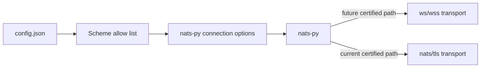
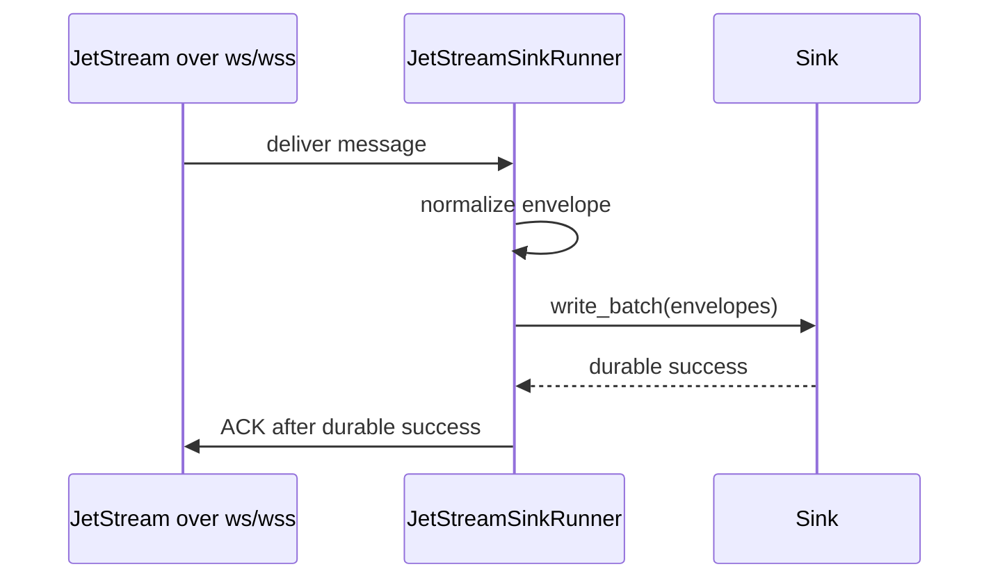

# WebSocket Connection Evaluation

This page records the evaluation for NATS WebSocket connection support in
`nats-sinks`. It is written for operators who run in constrained network
environments where direct NATS TCP connectivity is not always available, for
example behind controlled proxies, demilitarized network segments, or platform
boundaries where WebSocket transport is already approved.

The conclusion is deliberately cautious:

- NATS and `nats-py` support WebSocket-style connection URLs.
- `nats-sinks` already validates `ws://` and `wss://` URL schemes.
- Current `nats-sinks` releases should treat WebSocket transport as accepted
  by configuration validation but not yet production-certified.
- Production certification should be added through separate follow-up work for
  configuration guardrails, optional WebSocket headers, and an integration test
  harness.
- Transport choice must never change the commit-then-acknowledge invariant.

## What NATS Supports

NATS documents WebSocket support as a server feature available since NATS
Server 2.2. The server can run WebSocket connections alongside traditional TCP
connections and can support TLS, compression, and Origin header checking. NATS
also documents that WebSocket clients must use binary frames and that WebSocket
frames must still be parsed as a stream because a single frame is not
guaranteed to contain a full NATS protocol operation. See the official
[NATS WebSocket documentation](https://docs.nats.io/running-a-nats-service/configuration/websocket).

NATS connection documentation also treats `ws://` as a NATS URL form, alongside
`nats://` and `tls://`. See
[NATS Connecting](https://docs.nats.io/using-nats/developer/connecting).

The NATS server WebSocket configuration documentation describes WebSocket
authentication options including username/password, token, NKEYs, client
certificates, and JWTs. It also describes `allowed_connection_types`, which can
restrict a user to connection types such as `WEBSOCKET`. See
[NATS WebSocket Configuration](https://docs.nats.io/running-a-nats-service/configuration/websocket/websocket_conf).

## What nats.py Supports

The current `nats-py` client exposes normal connection options such as
`servers`, reconnect settings, TLS context, user/password, token, credentials,
NKEY seed, pending buffer size, and drain timeout. The local installed client
also includes a `WebSocketTransport`, rejects mixing WebSocket and non-WebSocket
URLs in one server list, and supports optional `ws_connection_headers`.

The upstream `nats.py` release notes for v2.12.0 mention custom WebSocket
headers through `ws_connection_headers`. See
[nats.py releases](https://github.com/nats-io/nats.py/releases).

This means the building blocks exist, but `nats-sinks` still needs a certified
project-level policy before documenting WebSocket transport as production-ready.

## Current nats-sinks State

The current configuration model allows the following URL schemes:

- `nats`
- `tls`
- `ws`
- `wss`

This validation is useful because it prevents arbitrary URL schemes from
reaching `nats-py`. However, the current project has not yet added
WebSocket-specific certification tests, proxy guidance, or optional header
configuration. Operators should therefore treat WebSocket transport as an
evaluated future capability rather than a certified production path.

## Security Considerations

WebSocket transport can be useful, but it changes the network shape. It may
introduce HTTP-aware proxies, TLS termination points, Origin checks, custom
headers, and additional access logs. These are operational controls, not merely
client flags.

Production guidance should require:

- prefer `wss://` over `ws://` outside isolated local labs;
- verify TLS certificates and hostnames by default;
- support local CA trust for private or self-signed server certificates;
- avoid embedding credentials in URLs or WebSocket headers;
- pass sensitive proxy or authorization header values through environment
  variables or approved secret stores only when explicitly supported;
- redact WebSocket URLs and headers in diagnostics;
- document that proxy logs may capture paths, headers, and client identities;
- ensure NATS users can be restricted to `WEBSOCKET` or `STANDARD` connection
  types where server policy requires it.

## Delivery Semantics

WebSocket transport is only a connection transport. It must not change the
delivery contract.

The same failure rules apply:

- if the sink fails before durable success, do not ACK;
- if DLQ publication is required, ACK or Term only after DLQ publication
  succeeds;
- reconnect behavior must not create early ACKs;
- proxy or WebSocket close events should be observed as connection events, not
  destination success.

## Recommended Implementation Split

The evaluation recommends three follow-up feature requests:

1. Add explicit WebSocket connection configuration guardrails.
2. Add optional WebSocket connection header support with safe secret handling.
3. Add a WebSocket integration certification harness and operator runbook.

This keeps configuration, header/proxy behavior, and certification evidence
reviewable as separate changes.

## Current Status

This release documents the evaluation and creates follow-up feature requests.
It does not certify WebSocket transport for production use yet.
